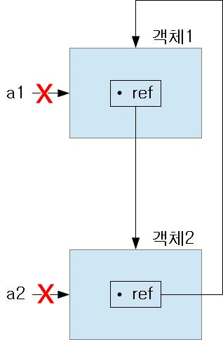
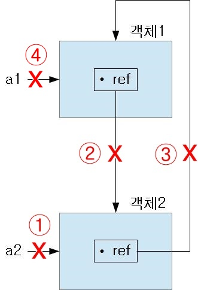

# 클래스

[클래스](https://docs.python.org/3/tutorial/classes.html)는 데이터와 기능을 함께 묶는 방법을 제공한다. 새로운 클래스를 정의하는 것은 새로운 데이터 형을 만든다는 것이다. 앞에서 배운 `int, float, list, tuple` 등도 모두 클래스이고 거북이(`turtle`)도 클래스이다. 클래스를 이용해서 인스턴스들을 만들어 낼 수 있다. 인스턴스는 상태를 나타내는 **필드**(field)들과 인스턴스의 상태를 변경할 수 있는 **메소드**를 가질 수 있다. 클래스는 붕어빵을 만들어내는 붕어빵 틀과 같은 것이고 인스턴스란 붕어빵 틀에서 나온 붕어빵들을 의미한다고 볼 수 있다. 붕어빵을 만들 때 속재료에 해당하는 것이 인스턴스의 상태를 나타낸다고 할 수 있다. 속재료의 내용을 변경하려고 할 때 사용하는 동작에 해당하는 것이 메소드라고 할 수 있다.

## 클래스와 객체

객체는 우리 주위에 일어나는 실제 현상들을 대표하는 개념이다. 예를 들어 온라인 쇼핑 시스템은 쇼핑 카트, 고객, 제품등의 객체들을 가지고 있다. 그래픽 프로그램은 원, 사각형, 메뉴와 같은 객체들을 가질 수 있다. 추상적으로는 열린 파일 객체, 단위 변환 계산기 객체등도 있을 수 있다.

- 클래스: 표현하고자 하는 개념에 대한 정의. 자동차를 예를 들어보자. 자동차를 구성하는 것으로 차의 색상, 바퀴, 차체, 유리, 핸들, 전조등, 음향 기기, 계기판 등이 필요할 것이다. 또한 그러한 것들을 움직이게 하도록 하는 기능들이 필요할 것이다. 예를 들면, 전조등 및 라디오를 켜고 끄는 동작, 와이퍼 작동, 속력을 높이고 낮추고 하는 등의 기능들이 필요하다. 여기서 자동차를 구성하는 것들 즉, 색상, 바퀴, 차체 등을 데이터라 하고, 그것을 움직이게 하는 필요한 기능들을 메소드라고 한다.
- 객체(object): 클래스로부터 만들어진 인스턴스(instance). 자동차라는 공통 개념(클래스)이 만들어 지면 개개의 자동차(객체)는 빨간차, 파란차 등 색상이 다르게 만들어 질 것이다. 자동차라는 공통 개념을 클래스라하고 실제로 만들어진 각각의 자동차가 객체가 된다.

사람이라는 클래스가 정의되면 지구 상의 모든 사람들 하나 하나가 객체가 되는 것이다. 사람이 공통적으로 가지고 있는 것들(필드), 예를 들면 피부색, 키, 나이, 눈색깔등을 정의하고 각 사람마다 다른 값이 필드에 할당이 되는 것이다.

이와 같이 객체 개념을 이용해서 프로그래밍하는 것을 [객체 지향 프로그래밍(**O**bject **O**riented **P**rogramming)](https://namu.wiki/w/%EA%B0%9D%EC%B2%B4%20%EC%A7%80%ED%96%A5%20%ED%94%84%EB%A1%9C%EA%B7%B8%EB%9E%98%EB%B0%8D)이라고 한다.

## 클래스 정의와 인스턴스

클래스는 `class` 예약어 뒤에 클래스 이름을 적고 콜론으로 마치고, 다음 줄에 들여쓰기 하면서 클래스 몸통을 시작한다.

```python
class <클래스 이름>:
    <클래스 몸통>
```

가장 간단한 클래스를 만들어 보자.


```python
class 붕어빵:
    pass

붕 = 붕어빵() # 인스턴스 객체 만들기
print(붕)
```

    <__main__.붕어빵 object at 0x000002186E149080>
    

붕어빵이란 이름의 클래스를 만들었고 몸통은 비워두었다. 클래스의 인스턴스를 만들기 위해서는 클래스 이름에 이어 소괄호를 열고 닫으면 된다. 즉 `<클래스이름>()`과 같이 하면된다. 위에서 `붕 = 붕어빵()` 부분에서 붕어빵 인스턴스 객체를 만들어 `붕`이란 변수에 할당한 것이다. `붕`을 출력해보면 `붕`이 참조하고 있는 인스턴스 객체의 저장위치 주소가 출력되는 것을 알 수 있다.

** 직접하기 **

- `사람` 클래스를 만들고 필요한 필드들에 대해서 이야기하고 구현해보자.
- `사람` 클래스로부터 본인의 인스턴스를 만들어보자.
- `강아지` 클래스를 만들고 `강아지` 인스턴스를 만드시오.
- `강아지` 클래스에 필요한 필드를 말해보고 필드를 추가하자.

## 메소드(method)

위 붕어빵 클래스에 기능을 추가해 보자. 기능을 추가하기 위해서는 클래스의 메소드를 이용하면 된다. 메소드란 앞에서 배운 함수와 같은 역할을 하는 것으로 특별히 클래스에서는 함수대신 메소드라고 불린다. 메소드 정의는 함수 정의할 때와 마찬가지로 `def` 예약어를 사용한다. 다음 예제를 보자.


```python
class 붕어빵:
    
    def 난누굴까(self):
        print("난 붕어빵 클래스의 인스턴스야!")

붕 = 붕어빵() # 인스턴스 객체 만들기
붕.난누굴까() # 메소드 부르기
```

    난 붕어빵 클래스의 인스턴스야!
    

- 3줄, `난누굴까()`가 메소드가 된다.
- 6줄, 메소드를 부르기 위해서는 먼저 인스턴스 객체를 만들어야 한다.
- 7줄, 그리고 인스턴스 객체 바로 뒤에 점을 찍고 메소드 이름을 적어 사용한다.
- 3줄, 여기서 주목해야할 것은 `self`라는 매개변수이다. `self`란 인스턴스 객체를 의미하는 것으로 메소드를 호출할 때 자동으로 첫번째 인자로 파이썬이 넘겨준다. 따라서 인스턴스 메소드를 정의할 때는 반드시 첫번째 매개변수로 `self`를 입력해야한다. `self` 대신 다른 이름을 사용할 수 있지만 관례적으로 사용하는 이름이므로 그대로 사용하자.

메소드 매개변수로 `self`가 들어 있는 것을 볼 수 있다. `self`는 인스턴스 객체를 의미하는 것으로 인스턴스 메소드를 실행할 때 자동으로 넘겨주기 때문에 사용자가 인자로 넣어 줄 필요가 없다.

### 메소드 매개변수

메소드에 넘겨줄 인자가 필요할 때는 메소드 괄호 안에 self 다음으로 매개변수를 설정하면 된다.


```python
class 붕어빵:
    
    def 난누굴까(self):
        print("난 붕어빵 클래스의 인스턴스야!")
        
    def 속채우기(self, 속재료):
        self.속재료 = 속재료
        
    def 상태(self):
        print("속재료:", self.속재료)

붕 = 붕어빵() # 인스턴스 객체 만들기
붕.속채우기("팥")
print("붕의 속재료:", 붕.속재료)
```

    붕의 속재료: 팥
    

** 직접하기 **

- `강아지` 클래스에 기능을 추가하자. `먹다`. `달리다`등의 메소드를 만들자.
- 위에서 만든 메소드에 매개변수를 추가하여 실행해보자.

### `__init__` 메소드

`__init__()` 메소드는 인스턴스를 만들 때 인스턴스의 초기 상태를 설정하기 위해 사용된다. `init` 앞 뒤로 두겹 밑줄을 이용하여 만든다. 인스턴스를 만들 때 즉, `<클래스이름>()`을 실행할 때 자동으로 `__init__()` 메소드를 실행하며 만들어진 인스턴스 객체를 인자로 넘겨준다.

붕어빵 클래스의 예를 들어 보자.


```python
class 붕어빵: # 클래스 이름은 붕어빵
    """붕어빵 클래스.
    
    """
    
    def __init__(self, 소=None):
        if 소 == None:
            self.속재료 = '팥'
        else:
            self.속재료 = 소
        
        
    def 채우자(self, 소=None):
        if 소 == None:
            self.속재료 = '팥'
        else:
            self.속재료 = 소
        
    def 뭐가들었니(self):
        print(self.속재료)
        
붕 = 붕어빵()
붕.뭐가들었니()

어 = 붕어빵('붕어')
어.뭐가들었니()
```

    팥
    붕어
    

`__init__()`, `채우자()`, `뭐가들었니()`가 붕어빵 클래스의 인스턴스 메소드들이다.

** 직접하기 **

- 위에서 만든 `사람` 클래스에 `__init__()` 메소드를 구현해보자.
- `강아지` 클래스에 `__init__()` 메소드를 구현해보자.

클래스의 메소드에는 인스턴스 메소드(instance method), 클래스 메소드(class method), 정적 메소드(static method)로 나눌 수 있다. 인스턴스 메소드는 메소드 정의시 반드시 `self` 매개변수가 맨 먼저 와야하며 인스턴스의 상태를 변경하거나 반영할 수 있다. 클래스 메소드는 클래스의 상태와 관련된 메소드로 메소드 정의시 `cls`라는 이름의 매개변수가 맨 먼저 와야 하며 `cls`는 클래스 객체를 가리키는 변수다. 여기서 `cls`는 변수 이름이며 다른 이름을 사용해도 된다. 정적 메소드는 클래스와 상관없이 정의되는 것으로 클래스의 문맥상 클래스 안에 정의할 뿐이다. 모듈의 함수와 같다고 볼 수 있다.

## 클래스 객체(class object), 인스턴스 객체(instance object)

파이썬 클래스와 관련된 객체는 클래스 객체와 인스턴스 객체로 나눌 수 있다. [클래스 객체](https://docs.python.org/3.6/tutorial/classes.html#class-objects)는 클래스 정의가 되자마자 만들어진다.


```python
class 클래스:
    변수 = "클래스 변수"
    
    def 메소드(self):
        print("메소드입니다.")

print(클래스)
print(클래스.변수)
print(클래스.메소드)
```

    <class '__main__.클래스'>
    클래스 변수
    <function 클래스.메소드 at 0x000001F7110A1730>
    

클래스에 정의된 메소드를 클래스 객체를 이용해서 접근할 수 있다. 그러기 위해서는 인스턴스 객체가 먼저 만들어져 있어서 그것을 첫번째 인자로 넘겨 주어야 한다.


```python
class 클래스:
    변수 = "클래스 변수"
    
    def 메소드(self):
        print("메소드입니다.")
    
    def 인자메소드(self, 매개):
        print("인자는:", 매개)

클 = 클래스()
클래스.인자메소드(클, "클래스 인자")
```

    인자는: 클래스 인자
    

반면에 [인스턴스 객체](https://docs.python.org/3.6/tutorial/classes.html#instance-objects)는 위에서 본 바와 같이 `<클래스 이름>()`을 통하여 만든다. 인스턴스 객체가 생성되면서 자동적으로 `__init__`메소드가 실행이 된다. 인스턴스 객체의 변수가 설정이 되면 언제든지 `인스턴스.변수`를 통하여 접근하고 변경할 수 있다.


```python
class 클래스:
    변수 = "클래스 변수"
    
    def __init__(self, 매개):
        self.초기값 = 매개
        print("__init__메소드 실행됨. self.초기값=", self.초기값)
        
    def 메소드(self):
        print("메소드입니다.")
    
    def 인자메소드(self, 매개):
        print("인자는:", 매개)
        
클 = 클래스("초기값에 대응되는 값")
클.인자메소드("안녕하세요")
print(클.초기값)

클.초기값 = "새롭게 변경된 값"
print(클.초기값)
```

    __init__메소드 실행됨. self.초기값= 초기값에 대응되는 값
    인자는: 안녕하세요
    초기값에 대응되는 값
    새롭게 변경된 값
    

### 클래스 변수, 인스턴스 변수

[클래스 변수](https://docs.python.org/3.6/tutorial/classes.html#class-and-instance-variables)는 모든 인스턴스가 공유하는 속성과 메소드를 의미한다. 클래스 변수 접근은 `클래스이름.변수`를 이용한다.


```python
class 클래스:
    변수 = '클래스 변수'
    
    def __init__(self, 이름):
        self.이름 = 이름 # self.이름은 인스턴스 변수

print(클래스.변수)
```

    클래스 변수
    

[인스턴스 변수](https://docs.python.org/3.6/tutorial/classes.html#class-and-instance-variables)는 인스턴스에 종속되어 변하는 데이터에 연결된 변수를 의미하고 인스턴스 변수 접근은 `인스턴스객체변수.변수`와 같이 한다.


```python
클 = 클래스("객체이름")
print(클.이름)
```

    객체이름
    

### 유효범위(scope)

클래스의 메소드에서 사용되는 식별자는 그 식별자가 인스턴스에 속한 것인지 클래스에 속한 것인지 아니면 지역에 속한 것인지 전역에 속한 것인지를 명확하게 구분해줘야 한다. 인스턴스 객체의 메소드 식별자 검색 순서는 먼저 지역 변수인지 확인하고 다음으로 인스턴스 객체 변수인지 확인하고 다음은 클래스 객체 변수인지 확인하고 마지막으로 전역변수인지를 확인해서 없으면 `NameError`를 발생시킨다.


```python
변수 = "전역 변수"

class 클래스:
    변수 = '클래스 변수'
    
    def __init__(self, 이름):
        self.이름 = 이름 # self.이름은 인스턴스 변수
        
    def 메소드(self):
        변수 = "어디에 속할까?"
        self.변수 = "인스턴스 변수"
        
    def 상태(self):
        print("변수는:", 변수)
        print("self.변수는:", self.변수)

print(변수)
클 = 클래스("클래스 이름")
클.상태()
```

    전역 변수
    변수는: 전역 변수
    self.변수는: 클래스 변수
    

위에서 `self.변수`의 값이 `클래스 변수`로 나온 것을 볼 수 있다. 이것은 `self.변수` 식별자를 지역, 인스턴스, 클래스, 전역 순서로 찾기때문이다. 지역에도 없고 인스턴스에도 정의가 되어 있지 않으므로 클래스 객체의 값을 참조하게되는 것이다.

메소드에서 클래스 변수의 값을 변경하기 위해서는 `인스턴스객체.__class__`를 이용한다. `인스턴스객체.__class__`는 인스턴스 객체가 속한 클래스 객체의 참조이다.


```python
변수 = "전역 변수"

class 클래스:
    변수 = '클래스 변수'
    
    def __init__(self, 이름):
        self.이름 = 이름 # self.이름은 인스턴스 변수
        
    def 메소드(self):
        변수 = "어디에 속할까?"
        self.변수 = "인스턴스 변수"
        
    def 클래스변수값변경(self):
        self.__class__.변수 = "클래스 변수값이 변경되었습니다."
        
    def 상태(self):
        print("변수는:", 변수)
        print("클래스 변수는:", self.__class__.변수)
        
클 = 클래스("클래스 이름")
클.클래스변수값변경()
클.상태()
```

    변수는: 전역 변수
    self.변수는: 클래스 변수값이 변경되었습니다.
    클래스 변수는: 클래스 변수값이 변경되었습니다.
    

메소드 안에서 다른 메소드를 부를 때도 인스턴의 메소드인지 클래스의 메소드인지를 명확하게 해주어야 한다.


```python
변수 = "전역 변수"

class 클래스:
    변수 = '클래스 변수'
    
    def __init__(self, 이름):
        self.이름 = 이름 # self.이름은 인스턴스 변수
        
    def 메소드(self):
        변수 = "어디에 속할까?"
        self.변수 = "인스턴스 변수"
        
    def 클래스변수값변경(self):
        메소드()
        self.__class__.변수 = "클래스 변수값이 변경되었습니다."
        
    def 상태(self):
        print("변수는:", 변수)
        print("클래스 변수는:", self.__class__.변수)
        
클 = 클래스("클래스 이름")
클.클래스변수값변경()
```


    ---------------------------------------------------------------------------

    NameError                                 Traceback (most recent call last)

    <ipython-input-27-9e1bc4ee1b53> in <module>()
         20 
         21 클 = 클래스("클래스 이름")
    ---> 22 클.클래스변수값변경()
    

    <ipython-input-27-9e1bc4ee1b53> in 클래스변수값변경(self)
         12 
         13     def 클래스변수값변경(self):
    ---> 14         메소드()
         15         self.__class__.변수 = "클래스 변수값이 변경되었습니다."
         16 
    

    NameError: name '메소드' is not defined


14줄에서 `메소드()`라는 이름을 찾을 수 없다는 에러를 발생하는 것을 볼 수 있다. 이 메소드를 전역에서 찾기때문이다. 인스턴스의 메소드로 사용하기 위해서는 `self.메소드()`와 같이 `메소드`가 어디에 속했는지를 밝혀서 사용해야 한다.

## 가변/불변 객체(Object)

모든 [객체](https://docs.python.org/3/reference/datamodel.html)는 고유성(identity)를 가지고 있다. 고유성은 형(type)과 값(value)로 구성된다. 값이 변할 수 있는 객체를 가변 객체(mutable object)라고 하고 값이 변하지 않는 객체를 불변 객체(immutable object)라고 한다. 불변 객체로는 숫자형(int, float, complex), 문자열(str), 튜플(tuple)등이 있다. 객체의 고유성은 객체가 일단 한 번 생성되면 절대 변하지 않는다. 고유성은 객체의 메모리 주소라고 생각할 수 있다. `id()` 함수를 이용해 고유성을 나타내는 정수를 확인할 수 있다. `is` 연산자를 이용하여 두 객체가 같은 고유성을 갖는지를 알 수 있다. [`is`](https://docs.python.org/3/reference/expressions.html#is)는 두 객체의 `id()` 값이 같으면 `True`를 다르면 `False`를 반환한다. `is not`은 그 반대로 작동한다.

불변 객체라고 해도 불변 객체를 이루고 있는 성분이 가변 객체라면 가변 객체의 내용이 변함에 따라 불변 객체에 대응되는 가변 객체 성분이 변할 수 있다. 예를 들어 보자.


```python
clist = [1, 2, 3]
x = (1, "a", clist)
print("변경 전 clist:", clist)
print("clist 변경 전 x:", x)

print('clist 변경 전 id(x):',id(x))

clist[0] = 100
print("\n변경된 clist:", clist)

print("clist 변경 후 x:", x)
print('clist 변경 후 id(x):',id(x))
```

    변경 전 clist: [1, 2, 3]
    clist 변경 전 x: (1, 'a', [1, 2, 3])
    clist 변경 전 id(x): 2016126060728
    
    변경된 clist: [100, 2, 3]
    clist 변경 후 x: (1, 'a', [100, 2, 3])
    clist 변경 후 id(x): 2016126060728
    

불변 객체 튜플 `x = (1, "a", clist)`의 3번째 성분이 가변 객체 리스트 `clist`이다. `clist[0] = 100`으로 변경하면 x의 3번째 성분도 함께 변경된다. 하지만 `x`의 `id`는 변하지 않는다.

## 상속(inheritance)

상속은 기존 클래스의 성질을 이어 받아 새로운 클래스를 만드는 방법이다. 기존 클래스를 기반 클래스(base class) 또는 상위 클래스(superclass) 또는 부모 클래스라고 하고 새로운 클래스를 파생 클래스(derived class) 또는 하위 클래스(subclass) 또는 자식 클래스라고 한다. 자식이 부모로부터 재산을 상속받듯이 자식 클래스도 부모 클래스가 가지고 있는 속성(데이터, 메소드)들을 물려받는다. 구현하려고 하는 여러 클래스들의 공통된 속성을 부모클래스에 정의하고, 상속받는 클래스들에서는 자신들만의 특성에 맞는 데이터와 메소드들을 구현한다. 예를 들면, 학생이라는 클래스가 있으면 학생은 사람이므로 사람이 가지는 공통 속성들, 이름, 성별, 나이등을 상속을 받고 학생 객체의 특징인 소속학과, 학번등을 새롭게 추가하여 사용한다. 이렇게하면 사람 클래스를 이용해서 중복 사용되는 부분을 줄일 수 있다. 만일 교직원 클래스를 만들려고 할 때도 마찬가지로 사람 클래스로부터 상속받으면 공통된 부분에 대해서 중복을 피할 수 있는 것이다.

### 상속 만들기

`<자식클래스이름>(부모클래스)`와 같이 자식클래스와 괄호 안에 부모클래스를 적어서 상속을 받는다. `사람` 클래스를 부모클래스로 하고 `학생` 클래스를 자식클래스로하는 예를 들면 다음과 같다.


```python
class 사람:
    
    def __init__(self, 이름, 나이, 성별):
        self.이름 = 이름
        self.나이 = 나이
        self.성별 = 성별
        
    def 누구(self):
        print("이름: {}, 나이: {}, 성별: {}".format(self.이름, self.나이, self.성별))
        
class 학생(사람):
    
    def __init__(self, 이름, 나이, 성별, 학과, 학번):
        self.이름 = 이름
        self.나이 = 나이
        self.성별 = 성별
        self.학과 = 학과
        self.학번 = 학번
        
길동 = 학생("홍길동", 28, "남", "수학과", 20171101)
길동.누구()
```

    이름: 홍길동, 나이: 28, 성별: 남
    

[상속](https://docs.python.org/3/tutorial/classes.html#inheritance) 리스트가 없는 클래스는 기본으로 [object](https://docs.python.org/3/library/functions.html#object) 클래스를 상속받는다.

### 부모클래스 생성자 부르기

위에서 `학생` 클래스에서 이름, 나이, 성별은 `사람` 클래스와 중복되는 속성이다. 이 부분을 부모클래스의 생성자를 호출함으로 중복 코드를 제거한다. 부모클래스의 생성자를 부르는 방법은 `부모클래스이름.__init__()` 메소드를 부르든지 `super().__init_()` 부르면 된다. 여기서 `super()`는 부모클래스의 객체를 의미한다.


```python
class 사람:
    
    def __init__(self, 이름, 나이, 성별):
        self.이름 = 이름
        self.나이 = 나이
        self.성별 = 성별
        
    def 누구(self):
        print("이름: {}, 나이: {}, 성별: {}".format(self.이름, self.나이, self.성별))
        
class 학생(사람):
    
    def __init__(self, 이름, 나이, 성별, 학과, 학번):
        사람.__init__(self, 이름, 나이, 성별)
        self.학과 = 학과
        self.학번 = 학번
        
길동 = 학생("홍길동", 28, "남", "수학과", 20171101)
길동.누구()
```

    이름: 홍길동, 나이: 28, 성별: 남
    

** 직접하기 **

- `super()` 함수를 이용해서 부모클래스의 생성자를 불러보자.

### 메소드 추가하기

부모클래스를 상속하면 자식클래스는 부모의 변수와 메소드를 모두 사용할 수 있게 된다. 자식클래스가 부모클래스에 없는 기능이 필요하면 메소드를 추가할 수 있다.


```python
class 학생(사람):
    
    def __init__(self, 이름, 나이, 성별, 학과, 학번):
        사람.__init__(self, 이름, 나이, 성별)
        self.학과 = 학과
        self.학번 = 학번
        
    def 정보(self):
        print("학과: {}, 학번: {}".format(self.학과, self.학번))
        
길동 = 학생("홍길동", 28, "남", "수학과", 20171101)
길동.정보()
```

    학과: 수학과, 학번: 20171101
    

### 메소드 재정의(overriding)

부모클래스의 메소드가 적당치 않으면 자식클래스에서 같은 이름으로 다르게 정의해서 사용할 수 있다.


```python
class 학생(사람):
    
    def __init__(self, 이름, 나이, 성별, 학과, 학번):
        사람.__init__(self, 이름, 나이, 성별)
        self.학과 = 학과
        self.학번 = 학번
        
    def 정보(self):
        print("학과: {}, 학번: {}".format(self.학과, self.학번))
        
    def 누구(self):
        print("이름: {}, 나이: {}, 성별: {}, 학과: {}, 학번: {}".format(self.이름, self.나이, self.성별, self.학과, self.학번))
        
길동 = 학생("홍길동", 28, "남", "수학과", 20171101)
길동.누구()
```

    이름: 홍길동, 나이: 28, 성별: 남, 학과: 수학과, 학번: 20171101
    내가 사람
    

C++, Java에서 메소드 재정의(method overriding)는 메소드 이름과 매개변수, 반환값이 모두 같아야하지만 파이썬은 이름만 같아도 된다.

** 직접하기 **

- `사람` 클래스에 메소드를 추가하고 `학생` 클래스에서 메소드 재정의를 해서 사용해보자.
- `학생` 클래스 재정의된 메소드의 매개변수를 바꿔서 실행해보자.

### 상속과 이름공간

위에서 인스턴스 객체를 통해 변수나 함수의 이름을 찾는 규칙은 `인스턴스 객체 영역 > 클래스 객체 영역 > 전역 영역` 순서였다. 상속 관계에 있는 클래스의 인스턴스 객체의 이름 규칙은 `인스턴스 객체 영역 > 자식 클래스 객체 영역 > 부모 클래스 객체 영역 > 전역 영역` 순이다.


```python
변수 = "전역 변수"

class 부모:
    변수 = "부모변수"
    
    def __init__(self):
        pass
    
    def 메소드(self):
        print("부모 메소드")
    
class 자식(부모):
    변수 = "자식 변수"
    
    def __init__(self):
        pass

    def 메소드(self):
        print("자식 메소드")
    
자 = 자식()
자.메소드()
```

    자식 메소드
    부모변수
    

** 직접하기 **

- 위 `자식` 클래스의 `메소드()`에서 `부모` 클래스의 `메소드()`를 불러보자.
- `자식` 클래스의 `메소드()` 안에 다음 문장을 넣고 실행해보고 이야기해보자.
```python
print(변수)
print(self.변수)
```
- `자식` 클래스의 `메소드()` 안에서 `부모` 클래스의 `변수`를 출력해보자.

## 참조

파이썬 객체는 내부적으로 객체를 참조하는 갯수를 세고 있다가 참조수(reference count)가 `0`이 되면 객체를 삭제한다. `__del__()` 메소드를 이용하여 객체가 삭제될 때 작업을 할 수 있다.


```python
class A:
    
    def __init__(self, name):
        self.name = name
        print("{}가 만들어졌습니다.".format(self.name))
        
    def __del__(self):
        print("{}가 삭제되었습니다.".format(self.name))

a1 = A("객체")
del a1
```

    객체가 만들어졌습니다.
    객체가 삭제되었습니다.
    

- 10줄: 객체가 만들어져서 `a1`이라는 변수가 객체를 참조하고 있다.
- 11줄: 참조를 삭제하면 `객체가 삭제되었습니다`라는 메시지를 볼 수 있다.


```python
a1 = A("객체1")
a2 = A("객체2")
del a1, a2
```

    객체1가 만들어졌습니다.
    객체2가 만들어졌습니다.
    객체1가 삭제되었습니다.
    객체2가 삭제되었습니다.
    

아래의 경우는 `a`, `b` 변수가 동시에 하나의 객체를 참조하고 있다.


```python
a = A("객체")
b = a
del a
```

    객체가 만들어졌습니다.
    

- 3줄: `a`를 제거하고 있지만 `b`라는 변수가 여전히 `객체`를 참조하고 있기 때문에 삭제되지 않는다.


```python
a = A("객체")
b = a
del a
del b
```

    객체가 만들어졌습니다.
    객체가 삭제되었습니다.
    

- 4줄: `a`와 `b`를 삭제해야만 객체가 제거되는 것을 볼 수 있다.

### 순환참조(cycle reference)

다음과 같이 순환참조를 할 경우 객체 참조를 제거해도 객체는 계속 남아있게 된다.


```python
class A:
    
    def __init__(self, name):
        self.name = name
        print("{}가 만들어졌습니다.".format(self.name))
    
    def __del__(self):
        print("{}가 삭제되었습니다.".format(self.name))
        
a1 = A("객체1")
a2 = A("객체2")

a1.ref = a2
a2.ref = a1

del a1, a2
```

    객체1가 만들어졌습니다.
    객체2가 만들어졌습니다.
    

- 13, 14줄: `a1.ref = a2`를 통해서 `객체1` 안의 변수 `ref`가 `객체2`를 참조하고 반대로 `a2.ref = a1`을 통해 `객체2` 안의 변수 `ref`가 `객체1`을 참조하고 있다.
- 16줄: `a1`, `a2` 참조를 제거해도 `a1.ref`, `a2.ref` 참조가 각각의 객체를 참조하고 있기 때문에 `객체1`, `객체2`는 제거되지 않는다.

아래 그림을 참조 하자.



만일 `객체2`를 제거하기 원한다면 먼저 `객체2`의 참조들을 삭제해야 한다.


```python
a1 = A("객체1")
a2 = A("객체2")

a1.ref = a2
a2.ref = a1

del a2, a1.ref
del a1
```

    객체1가 만들어졌습니다.
    객체2가 만들어졌습니다.
    객체2가 삭제되었습니다.
    객체1가 삭제되었습니다.
    



- 7줄: `a2` 참조와, `a1.ref` 참조를 차례로 제거하면 더이상 `객체2`에 대한 참조는 존재하지 않으므로 `객체2`가 삭제가 된다.
- 그러면 `a2.ref` 참조도 자동적으로 삭제가 된다.
- 8줄: `a1`을 삭제하면 `객체1` 참조들도 모두 사라져서 `객체1`이 제거된다.
