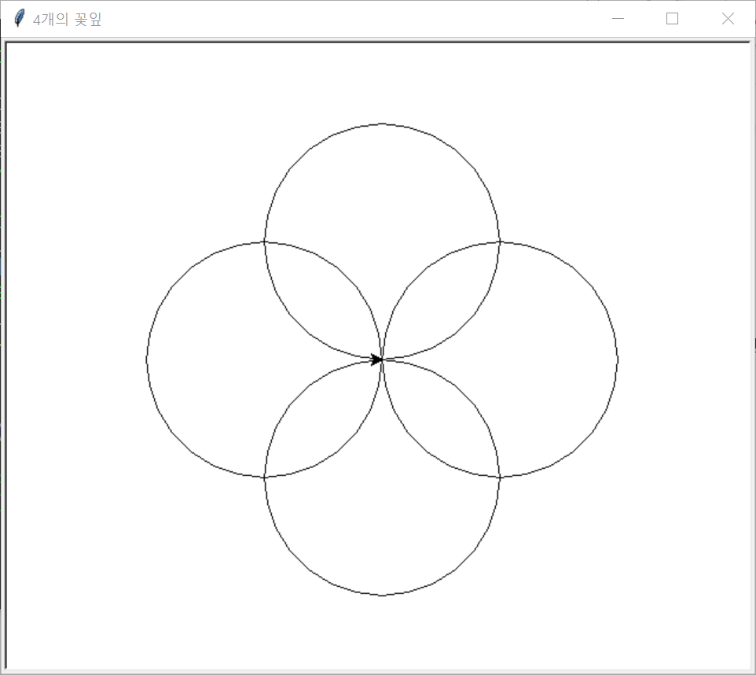

# 흐름 제어

이 장에서는 거북이(`turtle`), `if`, `while`, `for`, `break`, `continue`문에 대해서 알아본다.

## 거북이(turtle) 소개

[거북이](https://docs.python.org/3.6/library/turtle.html)는 파이썬 모듈 중의 하나로 도형 또는 패턴을 그리기 편리하고 사용하기 쉽다.

### 첫 거북이 프로그램

간단한 거북이 프로그램을 실행해보자.

```python
import turtle # turtle 모듈 사용

window = turtle.Screen() # 거북이 창 만들기

jiwon = turtle.Turtle() # 거북이 객체 생성해서 jiwon에게 할당

jiwon.forward(100) # 지원에게 앞으로 100 움직이라고 시킴
jiwon.left(90) # 지원에게 왼쪽으로 90도 회전하라고 시킴
jiwon.forward(50) # 그 상태에서 앞으로 50 이동

window.mainloop() # 거북이를 끝내기까지 기다림
```


1. `import turtle` 문장을 이용하여 거북이(turtle)를 사용할 수 있게 불러 온다.
1. `window = turtle.Screen()`을 이용하여 거북이창을 만든다.
1. `turtle.Turtle()`를 이용하여 새로운 거북이를 만들어 이름을 지원(jiwon)이라고 짓는다.
1. 지원 거북이에게 `forward(거리)`를 이용하여 거리만큼 앞으로 움직이라고 시킨다.
1. `left(각도)` 각도 만큼 왼쪽으로 회전하라고 시킨다.
1. 마지막 상태에서 다시 앞으로 50만큼 움직인다.
1. `window.mainloop()` 메소드를 이용하여 사용자가 프로그램을 끝낼 때까지 기다린다.

거북이를 사용하기 위해서는 `import turtle`이라는 문장을 통하여 거북이를 사용할 수 있는 상태로 만들어야 한다. `import`는 "불러오다, 가져오다, 수입하다"라는 뜻으로 `turtle`이름을 갖고 있는 모듈을 불러오겠다는 뜻이다. 모듈은 특별한 용도로 사용될 함수들과 속성(attributes)들을 정의한 파일이다. 자세한 내용은 나중에 설명할 모듈부분에서 다루게 된다. `window = turtle.Screen()`은 `Screen()`이란 함수를 이용하여 거북이가 활동할 창을 하나 만들어 `window`변수에 할당하라는 뜻이다. `turtle.Turtle()`이란 `turtle` 모듈 안에 정의된 `Turtle()` 이란 함수를 실행한다는 뜻으로 `turtle.Turtle`이란 객체를 반환한다. 아무튼 거북이를 만들어서 반환한다. 이 반환된 거북이를 `jiwon = turtle.Turtle()`를 이용해서 지원이란 변수 이름에 할당한 것이다. 거북이에게 주어진 기능(함수)들을 이용해서 거북이를 조정할 수 있게 한다. 여기서는 간단하게 `forward()`, `left()` 메소드만을 이용했지만 그 외에도 선의 굵기, 색깔 및 거북이 이동 등의 다양한 기능들이 있다. 거북이에 대한 기능들을 사용하려면 지원(`jiwon`) 거북이에게 명령을 내려야 한다. 즉, `jiwon.명령함수()`와 같이 거북이 이름(jiwon) 바로 뒤에 점(`.`)을 찍고 명령함수(`forward()`, `left()`)들을 사용해야 한다. 거북이가 가지고 있는 모든 기능들에 대해서 알려면 거북이 매뉴얼 페이지 https://docs.python.org/3.6/library/turtle.html를 확인해본다.

거북이 창 정중앙의 좌표는 (0,0)이고 수학에서 사용하는 좌표계를 따른다. 거북이 창이 실행이 되면 거북이가 처음 위치하는 좌표는 (0,0)이고 방향은 오른쪽(동쪽)을 향하고 있다. 거북이 방향은 육십분법 각도를 사용하며 현재 거북이가 향하고 있는 방향을 기준으로 `left(각도)` 메소드를 이용하여 왼쪽(시계반대 방향)으로 주어진 각도만큼 회전하거나 `right(각도)` 메소드를 이용하여 오른쪽(시계방향)으로 주어진 각도만큼 회전한다. `forward(거리)` 메소드는 거북이가 향하고 있는 방향으로 주어진 거리만큼 움직이고 `backward(거리)` 메소드는 현위치에서 뒤쪽으로 주어진 거리만큼 움직인다. 이 때 방향은 변하지 않는다. 선을 그리지 않고 움직이려면 `penup()` 메소드를 이용하면 되고 다시 선을 그리고 싶으면 `pendown()` 메소드를 이용하면 된다.

거북이 모듈은 창(Screen)과 거북이(Turtle)로 구분해서 명령을 내릴 수 있다. 창과 관련해서는 창 제목(`title`), 창의 배경색(`bgcolor`), 창 끝내기(`mainloop`)등에 관련된 기능을 담당하고 있고 거북이는 그림 그리는 활동에 관련되 기능들, 앞으로 가기(`forward`), 뒤로 가기(`backward`), 연필 두께(`pensize`), 연필 색(`pencolor`), 거북이 방향(`left`, `right`)등이 있다.

** 직접 하기 **

- 거북이를 이용하여 가로 길이가 100, 세로의 길이가 300인 직사각형을 만들자.
- 거북이를 이용하여 한 변의 길이가 200인 정삼각형을 만들자.
- 거북이를 이용하여 반지름이 100인 원을 만들자.(`turtle.circle(반지름)` 메소드를 이용하자)
- 거북이를 이용하여 같은 점에서 접하는 반지름 50, 100, 150인 원들을 만들자.


### 거북이 설정 변경

```python
import turtle

window = turtle.Screen() # 창 만들기

window.bgcolor("lightgreen") # 창 배경색 설정
window.title("지수 안녕!") # 창 제목 설정

jisoo = turtle.Turtle() # 새로운 거북이 만들기
jisoo.color("blue") # 지수 거북이 펜색깔 변경
jisoo.pensize(3) # 지수 거북이 펜굵기  변경

jisoo.forward(50)
jisoo.left(120)
jisoo.forward(50)

window.mainloop()
```


- `bgcolor(색)`을 이용하여 거북이 창의 배경색을 변경한다. 색깔 이름은 https://www.tcl.tk/man/tcl8.6/TkCmd/colors.htm 사이트를 참조한다.
- `title(제목)`을 이용하여 창의 제목을 설정할 수 있다.
- `color(색)`을 이용하여 거북이 연필 색깔을 변경한다. 거북이는 연필(pen)이라고 부른다.
- `pensize(두께)`를 이용하여 연필의 두께를 변경한다.

** 직접 하기 **

- (100, 100) 위치로 이동하여 거기서 반지름이 100인 원을 그려보자. 지정된 좌표로 이동하는 함수는 `goto(x,y)`를 이용하면 된다.
- 위의 문제에서 (100, 100)으로 이동할 때 그리지 않고 이동해서 원을 그려보자. `penup()`, `pendown()`함수를 이용하면 된다.
- 거북이를 이용하여 오륜기를 그려보자.

### 여러 마리의 거북이들

```python
import turtle

window = turtle.Screen()
window.bgcolor("lightgreen")
window.title("지원 & 지수")

jiwon = turtle.Turtle() # 지원 거북이 만들기
jiwon.color("hotpink") # 지원 거북이 색깔
jiwon.pensize(3) # 지원 거북이 굵기

jisoo = turtle.Turtle() # 지수 거북이 만들기

jiwon.forward(80) # 지원 거북이 삼각형 만들기
jiwon.left(120)
jiwon.forward(80)
jiwon.left(120)
jiwon.forward(80)
jiwon.left(120) # 삼각형 완성

jiwon.right(180) # 지원 거북이 반대 방향으로 회전
jiwon.forward(80) # 80만큼 이동
jiwon.write("지원") # 이름 쓰기

jisoo.forward(50) # 지수 그리기
jisoo.left(90)
jisoo.forward(50)
jisoo.left(90)
jisoo.forward(50)
jisoo.right(90)
jisoo.forward(50)
jisoo.write("지수") # 지수 이름 쓰기

window.mainloop()
```


## if 문

실내 온도가 24도를 넘어가면 에어컨을 켜고 그렇지 않으면 꺼지게 할 필요가 있을 때 조건문을 사용할 수 있다. 알람을 맞춘 시간이 되면 알람이 울리게 하고 싶을 때도 조건문을 사용할 수 있다. 조건문은 주어진 조건이 참이면 주어진 구역이 실행되고 그렇지 않으면 다른 구역이 실행될 수 있게 하는 문장이다. 예를 들면,

```python
if x % 2 == 0:
    print(x, "는 짝수이다.")
else:
    print(x, "는 홀수이다.")
```

위 문장이 실행되기 위해서는 `x` 변수에 정수값이 먼저 정의되어 있어야 한다. `if`문장의 사용법은 `if` 예약어 뒤에 참, 거짓을 판별할 수 있는 문장이 나오고 이어서 콜론 `:`이 나온다. 새로운 줄부터는 `if` 조건문이 참일 때 실행되는 구역이 시작된다. 이 구역은 들여쓰기를 시작하면서 시작되고 들여쓰기가 끝나는 첫번째 문장 앞에서 구역이 끝난다. 조건문이 참이면 구역에 있는 문장들이 차례로 실행이 되고, 거짓이면 `else` 절이 실행이 된다. `else` 절은 `if` 조건문이 거짓일 때 실행되는 부분으로 `else`에 이어서 콜론 `:`을 입력하고 구역이 시작된다. 마찬가지로 들여쓰기로 같은 구역임을 나타낸다.

```python
if <참, 거짓을 판별할 수 있는 조건 수식>:
    참일때 실행되는 구역
    들여쓰기 공간이 같으면 같은 구역으로 간주한다.
    ...
else:
    거짓일 때 실행되는 구역
    마찬가지로 들여쓰기로 같은 구역임을 나타낸다.
```

### pass 문

각 구역에는 적어도 하나의 문장이 존재해야 한다.

```python
if True:
    pass
else:
    pass
```

코드가 아직 완성되지 않았을 때 실행되지 않는 문장을 나타내는 `pass` 예약어를 사용하면 편리하다. `pass`는 아무것도 실행되지 않으면서 문장이 존재하는 것을 나타낸다.

### else 없이 사용

`if` 문장에서 `else` 절이 없이 사용할 수 있다. `if` 조건문장이 참이면 `if` 절이 실행되고 거짓이면 `if` 문장 다음이 차례대로 실행된다.

```python
x = -21

if x < 0:
    print("음수", x, "는 여기서 사용할 수 없습니다.")
    x = 21
    print("대신에", x, "로 대체하겠습니다.")
print(x, "의 제곱근은", x ** 0.5, "입니다.")
```

** 직접 하기 **

- 15세 이상만 볼 수 있는 영화가 있다고 하자. 사용자의 나이를 물어봐서 영화를 볼 수 있는지 없는지를 출력하는 프로그램을 작성하자.

거북이를 이용하여 입력받은 수가 양수이면 왼쪽으로 100만큼, 그렇지 않으면 오른쪽으로 100만큼 진행하는 프로그램을 만들어 보자.

```python
import turtle

jisoo = turtle.Turtle() # jisoo 거북이 만들기
jisoo.shape('turtle') # 거북이 모양 변경

x = turtle.numinput("좌, 우회전", "숫자를 입력하시오:") # 팝업창을 이용하여 숫자를 입력받는다.
if x > 0:
    jisoo.left(90) # 양수이면 왼쪽으로 회전
    jisoo.forward(100) # 100만큼 거북이 움직이기
else:
    jisoo.right(90) # 양수가 아니면 오른쪽으로 회전
    jisoo.forward(100) # 100만큼 거북이 움직이기

turtle.mainloop()
```

`jisoo = turtle.Turtle()` 거북이 객체를 만들어 `jisoo`라는 이름을 할당한다. `shape(name)`을 통하여 거북이 모양을 변경할 수 있다. 인자 `name`은 거북이 모양 이름이 올 수 있고 `arrow`, `turtle`, `circle`, `square`, `triangle`, `classic`등이 있다. `turtle.numinput(title, prompt)`는 팝업창을 띄워 숫자를 입력받을 수 있게 한다. 첫번째 인자는 팝업창의 제목을 설정하고 두번째 인자는 메시지를 설정한다. 입력받은 값을 `x`에 할당한다. `if` 문장을 이용하여 `x`가 양수이면 왼쪽으로 90도 회전하고 100만큼 이동한다. 그렇지 않으면 오른쪽으로 90도 회전하고 100만큼 이동한다.

** 직접 하기 **

- 위 문제에서 펜 두께는 3, 펜 색깔은 왼쪽은 빨간색, 그렇지 않으면 파란색으로 움직이는 프로그램을 만드시오. 펜색깔을 바꾸려면 `jisoo.color("color_name")` 메소드를 이용하면 된다. [`color_name`](https://www.tcl.tk/man/tcl8.6/TkCmd/colors.htm)은 `red`, `blue`를 사용하면 된다. 

### 연결된 if문

조건을 판단할 때, 3가지 이상으로 분류해야 할 필요가 있을 경우가 있다. 가령 숫자 `x`가 음수인가 아니면 `0`인가 아니면 양수인가를 판단하고 싶을 때가 있을 것이다. 이럴 때는 다음과 같은 문장을 이용한다.

```python
if <판별 수식1>:
    구역1
elif <판별 수식2>:
    구역2
else:
    구역3
```

순서도로 표현하면 다음과 같다.


양수, 음수, 0을 판별하는 코드는 다음과 같다.

```python
if x < 0:
    print(x, "는 음수입니다.")
elif x > 0:
    print(x, "는 양수입니다.")
else:
    print(x, "는 영(0)입니다.")
```

`if` 조건문이 참이면 `if` 절을 실행한 후 `if` 문장을 끝내고 그렇지 않고 거짓이면 바로 밑에 있는 `elif` 절의 조건문을 판단해서 참이면 `elif` 절을 실행한 후 끝내고 `elif` 조건문이 거짓이면 `else` 절을 실행한 후 `if` 문장을 끝낸다. `elif`는 else if의 준임말이며 `elif` 대신 사용할 수는 없다.

** 직접 하기 **

- 거북이를 이용하여 사용자로부터 숫자를 입력받아 양수이면 왼쪽, 0이면 직진, 음수이면 오른쪽으로 회전하면서 100만큼 움직이는 프로그램을 만드시오.
- 거북이를 이용하여 사용자로부터 0부터 90까지 숫자를 입력받아 30보다 작거나 같으면 30도, 30보다 크고 60보다 작거나 같으면 60도, 60보다 크고 90보다 작거나 같으면 90도 회전하고 각각 100만큼 움직이는 프로그램을 만드시오.

### 중첩 if문

`if`문 안에 `if`문을 중첩으로 사용할 수 있다. 위의 양, 음, 0을 판별하는 예제는 다음과 같이 바꿀 수 있다.

```python
if x < 0:
    print(x, "는 음수입니다.")
else:
    if x > 0:
        print(x, "는 양수입니다.")
    else:
        print(x, "는 영(0)입니다.")
```

`else` 절 안에서 `if`문을 다시 사용할 수 있다. 물론 안에 있는 `if`문에서 다시 `if`문을 사용할 수 있다. 중첩문을 사용하면 들여쓰기때문에 한 눈에 알아보기는 편하지만 논리를 이해하는데는 어려울 수가 있다. 논리 연산자를 이용하면 중첩문을 사용하는 것보다 간단하게 표현할 수 있다. 다음 중첩문은 논리 연산자를 이용하면 하나의 `if`문으로 표현할 수 있다.

```python
if 0 < x: # Assume x is an int here
    if x < 10:
        print("x is a positive single digit.")
```

위 식에서 `if`문을 동시에 만족해야 하므로 논리 연산자 `and`를 이용하여 다음과 같이 바꿀 수 있다.

```python
if 0 < x and x < 10:
    print("x is a positive single digit.")
```

더 간단하게 다음과 같이 쓸 수 있다.

```python
if 0 < x < 10:
    print("x is a positive single digit.")
```

### 논리 연산자

논리 연산자를 표로 나타내면 다음과 같다.

| `x` | `not x` |
| --- | --- |
| `True` | `False`|
| `False` | `True`|

| `x` | `y` | `x and y` | `x or y` |
| --- | --- | --- | --- |
| `True` | `True`| `True` | `True` |
| `True` | `False`| `False` | `True` |
| `False` | `True`| `False` | `True` |
| `False` | `False`| `False` | `False` |

** 부정 연산자(`not`) **

`not x`는 `x`가 `True`이면, `False` 를 반환하고 `x`가 `False`이면 `True`를 반환한다.


```python
x = True
print(not x)
```

    False
    

** 논리곱 연산자(`and`) **

`x and y`를 계산할 경우, `x` 가 `False` 이면 `False`를 반환하며 `True` 이면 `y`와의 `and` 연산값을 반환한다. `x = False; y = True; x and y`를 계산할 경우, `x` 가 `False` 이므로 `y`값에 관계없이 `x and y` 의 값은 `False` 임이 자명하므로, `x`의 값이 `False`임이 확인되는 즉시 곧바로 결과값 `False` 가 반환되며 이때 `y`의 값은 계산되지 않는다. 이것을 단축 계산(short-circuit evalulation)이라고 부른다.


```python
print(1 < 2 and 2 < 3) # 참 and 참이므로 참을 출력
```

    True
    


```python
print(2 < 1 and 2 < 3) # 거짓 and 참이므로 거짓을 출력
```

    False
    

더 일반적으로 `x and y` 연산을 할 때 `x`가 `False`에 해당되는 객체면 `x` 객체를 반환하고 그렇지 않으면 `y` 객체를 반환한다. 파이썬 숫자는 논리 연산을 할 때 `0`은 거짓, `0`이 아닌 모든 수는 참으로 간주한다. 또한 문자열형에서도 문자가 없는 빈 문자열 `""`은 거짓, 그렇지 않으면 참으로 간주한다. 문자열 중에 공백문자도 문자로 인식하기 때문에 `" "`와 같이 따옴표 사이에 공백을 사용하면 참으로 인식한다.


```python
print("문자가 하나라도 존재하면 참" and 1) # and 앞 수식이 참이므로 and 뒤 수식인 숫자 1을 반환한다.
```

    1
    


```python
print(0 and "문자") # and 앞 수식이 0, 즉 거짓이므로 and 뒤에 있는 수식을 평가하지 않고 앞 수식 0을 반환한다.
```

    0
    

** 논리합 연산자(`or`) **

`x` 가 `True` 이면 `True` 가 반환되며, `False`이면 `y` 와의 `or` 연산값을 반환한다. `x = True; y = False; x or y` 는 `True`가 반환된다. 여기서도 논리곱에서와 같이 단축 계산이 적용된다.

## for 문

거북이를 이용하여 정사각형을 그리는 프로그램을 생각해보자.

```python
import turtle

angela = turtle.Turtle() # angela 거북이 만들기

angela.forward(100)
angela.left(90)
angela.forward(100)
angela.left(90)
angela.forward(100)
angela.left(90)
angela.forward(100)
angela.left(90)

turtle.mainloop()
```

앞으로 이동과 왼쪽으로 회전을 4번 반복하면 정사각형을 그릴 수 있다. 이러한 반복을 할 수 있게 하는 것이 `for`문이다. 위의 반복된 문장을 간단히 다음과 같이 사용할 수 있다.

```python
import turtle

angela = turtle.Turtle() # angela 거북이 만들기

for i in [0, 1, 2, 3]: # for 반복문 선언
    angela.forward(100) # 들여쓰기로 for 구역 선언
    angela.left(90)

turtle.mainloop()
```
`for`라는 예약어로 시작하며 다음은 반복 변수 `i`가 나오고 예약어 `in` 다음에 리스트 `[0, 1, 2, 3]`(반복가능한 객체)가 나오고 콜론 `:`으로 머리부분을 끝내고 다음 줄로 가서 들여쓰기로 반복문 몸통부분이 선언된다.

```python
for 반복변수이름 in 반복가능객체:
    반복문 몸통 # 들여쓰기로 구분한다.
```

`for`문이 시작되면 리스트(반복가능한 객체) 안에 있는 항목을 반복 변수 `i`에게 넘겨주고 반복문 몸통 부분을 실행한다. 반복문 몸통부분 끝에 다다르면 다시 리스트에 있는 다음 항목을 반복 변수에게 넘겨주고 몸통 부분을 끝까지 실행한다. 이러한 반복은 리스트에 있는 항목들을 모두 한번씩 거치면 끝이나고 `for`문 다음 문장을 실행하게 된다. 위 예제에서 `for`문이 실행되면 리스트 `[0, 1, 2, 3]`에서 첫번째 항목 `0`이 변수 `i`에 할당되어 `angela.forward(100)`과 `angela.left(90)`이 차례대로 실행되고 다시 `for`문으로 가서 리스트 안에 있는 다음 항목 `1`이 변수에 할당되고 마찬가지로 몸통부분인 `angela.forward(100)`과 `angela.left(90)`이 실행된다. 이런식으로 리스트 마지막 항목 `3`이 `i`에 할당된 후 몸통 부분이 실행되면 더 이상 리스트 항목을 거칠 것이 없으므로 `for`문을 끝내고 다음 문장인 `turtle.mainloop()`를 실행하게 된다.

리스트 `[0, 1, 2, 3]`을 사용하지 않고 `range(4)` 함수를 이용할 수 있다. `range(n)` 은 0부터 n-1까지 정수를 하나씩 차례로 반환한다.

```python
for i in range(4):
    print(i) # i=0, 1, 2, 3을 차례로 출력한다.
```

정사각형 그리는 프로그램에서 `for`문장을 다음과 같이 변경한다면 어떤 도형이 그려질지 생각해보자.

```python
for color_ in ["yellow", "red", "purple", "blue"]:
    angela.color(color_) # 거북이 펜색깔 변경
    angela.forward(100) # 들여쓰기로 for 구역 선언
    angela.left(90)
```

### 리스트(list) 맛보기

리스트는 여러 가지 객체들을 하나의 묶음으로 담아 놓는 객체이다. 리스트를 만드는 간단한 방법은 대괄호 `[]` 안에 담고 싶은 객체들을 쉼표로 나열하면 된다.

```python
x = [1, 'a', "안녕", 3.4] # 리스트
```

리스트 `[1, 'a', "안녕", 3.4]`를 변수 `x`에 할당한다. 리스트 안에 있는 원소들을 접근하기 위해서는 인덱스를 이용한다. 인덱스란 리스트 안의 원소들의 위치를 0보다 크거나 같은 정수로 표현한 것을 말한다. 위 리스트 `x`에서 원소 `1`은 인덱스가 `0`이고 `'a'`는 인덱스가 1이고 `"안녕"`은 2, `3.4`은 인덱스가 3이다. 따라서 리스트 안의 첫번째 원소를 접근하고 싶으면 `x[0]`이라고 하면된다.


```python
x = [1, 'a', "안녕", 3.4]
x[0]
```


    1


리스트가 포함하고 있는 원소의 갯수를 알고 싶으면 내장함수 `len()`를 이용하면 된다.


```python
len(x)
```


    4


리스트에 관해서는 앞으로 나올 데이터 형에서 자세히 다룬다.

** 직접 하기 **

- `for`문을 이용하여 리스트 `x = [1, 'a', "안녕", 3.4]`의 원소들을 한 줄에 하나씩 출력해보자.
- 거북이와 `for`문을 이용하여 4개의 원을 꽃잎 모양으로 만들어 보자.

- 거북이와 `for`문을 이용하여 한 변의 길이가 300인 별을 만들어 보자.


### 나선형 문자 출력

거북이를 이용하여 나선형으로 문자를 출력하는 프로그램을 작성하자.

```python
import turtle

창 = turtle.Screen()
창.bgcolor("black")

연필 = turtle.Pen()
색깔들 = ["red", "yellow", "blue"]

문자열 = ["한반도", "평화", "통일"]

for x in range(1, 60):
    연필.pencolor(색깔들[x % len(문자열)])
    연필.penup()
    연필.forward(x * 5)
    연필.pendown()
    연필.write(문자열[x % len(문자열)], font=("Arial", int((x + 4) / 4), "bold"))
    연필.left(360 / len(문자열) + 5)
창.mainloop()
```


- `창 = turtle.Screen()`과 같이 변수 이름(`창`)으로 한글을 사용할 수 있다.
- `창.bgcolor("black")`을 이용하여 배경색을 검은색으로 만든다.
- `turtle.Pen()`을 이용하여 `연필` 객체를 만든다. `Pen()`은 앞에서 사용했던 `Turtle()`과 같은 명령어이다.
- `색깔들 = ["red", "yellow", "blue"]`를 이용해 색깔 리스트를 만든다.
- `문자열 = ["한민족", "평화", "통일"]`을 이용해 문자열들을 담을 변수 `문자열`을 만든다.
- `for` 문을 이용해 `x`가 1부터 59까지 반복하게 한다.
- `색깔들[x % len(문자열)]`을 분석해보자. `len(문자열)`은 `문자열` 리스트가 가지고 있는 항목들의 갯수, 즉 `3`을 반환한다. 그리고 `x % len(문자열)`은 `x % 3`이고 이것은 `x`를 3으로 나눴을 때 나머지를 뜻하는 것이므로 0, 1, 2중의 하나가 된다.
- `font = (폰트이름, 폰트크기, 폰트타입)`

거북이를 이용하여 임의로 만든 수가 양수이면 왼쪽으로 50만큼, 그렇지 않으면 오른쪽으로 50만큼 이동하는 것을 30번 반복하는 프로그램을 만들어 보자.

```python
import random
import turtle

rdg = random.Random() # 임의의 수를 만들 객체 만들기

jisoo = turtle.Turtle() # jisoo 거북이 만들기

for _ in range(30):
    jisoo.forward(50) # 50만큼 거북이 움직이기
    
    x = rdg.randint(-1, 1) # -1보다 크거나 같고 1보다 작거나 같은 임의의 정수
    if x > 0:
        jisoo.left(90) # 양수이면 왼쪽으로 회전
    else:
        jisoo.right(90) # 양수가 아니면 오른쪽으로 회전

turtle.mainloop()
```

`import random`을 이용하여 임의의 수를 만들 수 있는 모듈 `random`을 불러온다. `rdg = random.Random()` 함수를 이용하여 임의의 수를 만들 수 있는 객체(random generator)를 만들어 `rdg` 변수에 할당한다. 현재 위치에서 50만큼 앞으로 움직인다. `x = rdg.randint(-1, 1)`은 `-1`과 `1`사이의 정수 중 임의의 정수를 하나 만들어 `x` 변수에 할당한다. `if` 문장을 이용하여 만들어진 임의의 수 `x`가 양수이면 왼쪽으로 90도 회전하고, 그렇지 않으면 오른쪽으로 90도 회전한다. `for _ in range(30):`을 이용하여 30번 반복한다.

거북이를 이용하여 원 위에 일정한 간격으로 거북이 발자국을 찍는 프로그램을 만들어보자.

```python
import turtle

angela = turtle.Turtle() # angela 거북이 만들기

r = 100 # 반지름 100인 원
n = 10 # n개의 발자국

angela.shape('turtle') # 거북이 모양
angela.penup() # 선을 그리지 않는다.
angela.sety(-r) # 처음 시작하는 y 좌표를 -r로 설정

for i in range(n): # n번 반복
    angela.stamp() # 발자국 찍기
    angela.circle(r, 360 / n) # 반지름 r인 원 위에서 360/n도 회전
turtle.mainloop()
```


- 원의 반지름 `r`과 원 위에 찍을 발자국의 개수 `n`을 설정한다.
- `turtle.shape('turtle')`를 이용하여 거북이 모양으로 모양을 변경한다.
- `penup()`을 이용하여 움직일 때 선을 그리지 않게 설정한다.
- `sety(y좌표값)`는 거북이가 위치하는 y좌표를 설정한다.
- `stamp()`를 이용하여 현재 거북이 모양을 남긴다.
- `circle(r, t)` 반지름 `r`인 원에서 각도 `t` 만큼 회전이동한다. 여기서는 `r=100`이고 `360/10=36`도 만큼 회전하게 된다.
- `for i in range(n):`문을 이용해서 `n`번 반복한다.

## while 문

리스트에 있는 항목들을 하나씩 모두 살펴보면서 반복을 하는 `for`문과 다르게 `while` 문은 조건문이 참인 동안 반복을 하는 문장이다. `while` 문은 다음과 같이 사용한다.

```python
while <조건문>:
    <조건문이 참인 동안 실행되는 문장>
```

다음은 0부터 5까지 더하는 프로그램이다.

```python
n = 5
sum_ = 0
i = 0

while i <= n:
    sum_ += i
    i += 1
print(sum_)
```

- `while` 조건문 `i <= n`이 거짓이면 `while`문을 마치고, 다음 문장 `print(sum_)`이 실행이 된다.
- 조건문이 참이면 몸통(들여쓰기 구역)이 한 줄씩 실행된 후 다시 조건문을 실행하여 거짓이면 `while`문을 끝내고 다음 문장이 실행이 되고 참이면 반복을 계속하게 된다.

`while` 문을 사용할 때는 `while` 몸통 구역에 `while` 조건문이 거짓이 되도록 하는 문장을 만들어야 한다. 그렇지 않으면 무한히 `while`문을 반복하게 되어 프로그램이 종료되지 않게 된다. 무한 반복을 끝내는 방법으로 조건문을 거짓으로 만드는 것 외에 `break` 예약어를 이용하여 반복을 끝낼 수도 있다.

## break 문

반복문 안에서 `break`문을 만나면 즉시 반복문을 끝내고 다음 문장을 실행한다. 0부터 5까지 더하는 프로그램은 `break`문을 이용하여 다음과 같이 바꿀 수 있다.

```python
n = 5
sum_ = 0
i = 0

while True:
    if i > n:
        break
    sum_ += i
    i += 1
print(sum_)
```

`for` 반복문에서도 `break` 문을 사용할 수 있다.

```python
for i in [12, 16, 17, 24, 29]:
    if i % 2 == 1: # 홀수이면
        break # 반복문을 끝낸다.
    print(i) # 짝수 출력
print("반복문 종료")
```

리스트 안에 있는 숫자들이 홀수이면 반복문을 즉시 끝내고, 그렇지 않으면 숫자를 출력하게 된다.

** 직접 하기 **

- 거북이를 이용하여 사용자로부터 영문자 `ㅣ`을 누르고 엔터치면 왼쪽으로 100만큼, `r`을 누르고 엔터치면 오른쪽으로 100만큼, `q`를 누르고 엔터치면 그리기를 멈추도록 하는 프로그램을 작성하자. 

다음은 숫자를 맞추는 프로그램이다.

```python
import random # 임의의 숫자 만드는 모듈 불러오기

rng = random.Random() # 임의의 숫자 만드는 객체 rng 만들기
number = rng.randrange(1, 1000) # 1보다 크거나 같고 1000보다 작은 임의의 수를 number에 할당.

guesses = 0 # 시도한 횟수
message = ""

while True:
    guess = int(input(message + "\n1보다 크거나 같고 1000보다 작은 수를 입력하세요: "))
    guesses += 1
    if guess > number:
        message += str(guess) + "은(는) 너무 크네요.\n"
    elif guess < number:
        message += str(guess) + "은(는) 너무 작아요.\n"
    else:
        break

print("\n\n축하합니다. "+str(guesses)+"번만에 맞췄습니다! \n\n")
```

## continue 문

반복문 중에서 `continue` 문을 만나면 `continue`문 아래에 있는 문장은 실행되지 않고 다음 반복을 실행한다. 다음은 리스트에서 짝수만 출력하는 프로그램이다.

```python
for i in [12, 16, 17, 24, 29, 30]:
    if i % 2 == 1: # 홀수이면
        continue # 아래 반복문 문장들은 무시하고 다음 반복을 실행한다.
    print(i)
print("반복문 끝.")
```

홀수이면 `continue`문을 만나게 되어 아래에 있는 `print(i)`를 실행하지 않고 다음 반복 항목을 실행하게 된다.

## 연습

1. 일요일부터 토요일까지를 0,1,2,3,4,5,6 숫자로 대신한다고 할 때, 숫자를 입력받아 요일을 출력하는 프로그램을 작성하시오.
1. 수요일 낮에 휴가를 출발하여 137밤 자고 돌아올 때, 돌아오는 요일을 출력하는 프로그램을 작성하시오.
1. 사용자에게 숫자를 입력받아 거북이와 for문을 이용하여 정다각형을 그리는 프로그램을 작성하시오.
1. 거북이를 이용해 다음 그림을 그리시오.

1. 사용자로부터 숫자를 입력받아 숫자를 구성하는 수중에서 짝수의 갯수를 세는 프로그램을 작성하시오. 예를 들면 입력받은 수가 `12345`이면 짝수는 `2`, `4` 두 개이다.
1. 임의의 두 수를 만들고 그 두 수의 뺄셈 문제를 내고 사용자에게 답을 적게 만들고 답이 올바른지 검사하는 프로그램을 작성하시오.
1. 리스트 `numbers = [12, 10, 32, 3, 66, 17, 42, 99, 20]` 가 주어질 때 각 숫자를 한 줄에 하나씩 출력하는 프로그램을 작성하시오.
1. 위 문제에서 리스트에 있는 모든 숫자의 합을 계산해서 출력하는 프로그램을 작성하시오.
1. 원의 반지름과 중심을 임의의 수를 이용하여 생성하고 반복문을 이용하여 10개 그리는 프로그램을 작성하시오.
1. 시험 점수가 다음과 같이 리스트 `scores = [83, 75, 74.9, 70, 69.9, 65, 60, 59.9, 55, 50, 49.9, 45, 44.9, 40, 39.9, 2, 0]` 로 주어졌을 때 아래 기준에 맞춰 학점을 출력하는 프로그램을 작성하시오.

| 점수 | 학점 |
| ---- | ---- |
| >= 80 | A+ |
| [70, 80) | A |
| [60, 70) | B+ |
| [50, 60) | B |
| [40, 50) | C+ |
| < 40 | C |
