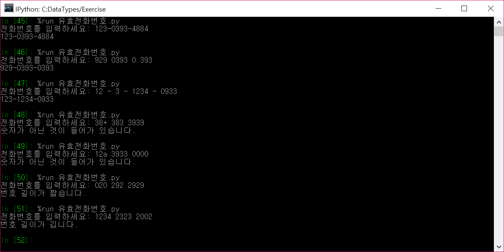
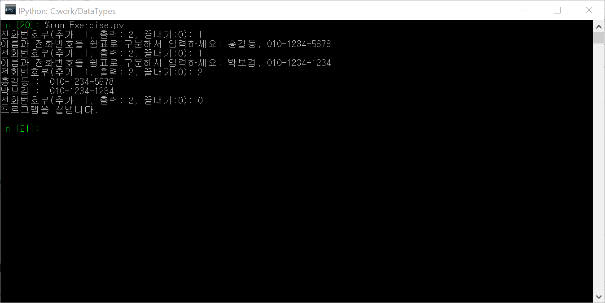

# <a name="데이터 형"></a>데이터 형

## 숫자형(int, float, complex)

파이썬 숫자형은 정수형, 부동 소수점형, 복소수형으로 나뉜다. 논리형(booleans)은 정수형의 부분형이다.

모든 숫자형은 다음과 같은 연산자를 공통으로 갖고 있다.

| 연산 | 결과 | 참고 | 참조 |
| ---- | ----- | ---- | ---- |
| `x + y`| `x`와 `y`의 덧셈 | | |
| `x - y` | `x`와 `y`의 뺄셈 | | |
| `x * y` | `x`와 `y`의 곱셈 | | |
| `x / y` | `x`와 `y`의 나눗셈 | | |
| `x // y` | `x`와 `y`의 바닥화된 몫 | (1) | |
| `x % y` | `x / y`의 나머지 |(2) | |
| `-x` | `x`의 부호 변경 | | |
| `+x` | `x` 자체 | | |
| `abs(x)` | `x`의 절대값 또는 크기 | | [`abs()`](https://docs.python.org/3/library/functions.html#abs) |
| `int(x)` | `x`를 정수형으로 변환 |(3)(6)| [`int()`](https://docs.python.org/3/library/functions.html#int) |
| `float(x)` | `x`를 부동 소수점형으로 변환 | (4)(6) | [`float()`](https://docs.python.org/3/library/functions.html#float) |
| `complex(re, im)` | 실수부분 `re`, 허수부분 `im`. `im`은 기본값은 `0`이다. |(6)| [`complex()`](https://docs.python.org/3/library/functions.html#complex) |
| `c.conjugate()` | `c`의 켤레복소수 | | |
| `divmod(x, y)` | 순서쌍 `(x // y, x % y)` | (2) | [`divmod()`](https://docs.python.org/3/library/functions.html#divmod) |
| `pow(x, y)` | `x`의 `y` 거듭제곰 | (5) | [`pow()`](https://docs.python.org/3/library/functions.html#pow) |
| `x ** y` | `x`의 `y` 거듭제곱 | (5) | |	 

참고:
1.  `x / y`해서 나온 값보다 작거나 같은 정수 중 최대 정수를 반환한다. 예를 들면 `1//2` 은 `0`, `(-1)//2` 은 `-1`, `1//(-2)` 은 `-1`, 그리고 `(-1)//(-2)` 은 `0`이다.
1. 복소수인 경우는 `abs()`를 이용해서 부동소수점으로 바꾼다. `13 % 3` 은 `1`을 반환한다. `-25.5 % 2.25` 는 `1.5` 를 반환한다. 나머지의 부호는 두 번째 피연산자의 부호를 따른다. 항상 `x == (x//y)*y + (x%y)`의 관계식을 만족한다.
1. 부동소수점형에서 정수형으로 변환될 때 어림 또는 절단이 발생할 수 있다. 자세한 것은 [`math.floor()`](https://docs.python.org/3/library/math.html#math.floor) 와 [`math.ceil()`](https://docs.python.org/3/library/math.html#math.ceil)를 참조하자.
1. `float()`는 `+-`부호와 함께 문자열 `'nan'`과 `'inf'`을 인자로 받아서 각각 `nan(Not a Number)` 및 `+-inf`를 나타낼 수 있다.
1. 파이썬은 `pow(0, 0)` 과 `0 ** 0`을 `1`로 정의한다.
1. 숫자형 리터럴 상수도 가능하다.

### 정수형(int)

[기초](Basics.html)에서 [리터럴 정수형](Basics.html#리터럴정수형)과 [정수형](Basics.html#기초_정수형)의 기본에 대해서 살펴봤다. 정수형 숫자의 크기는 무제한이다.

`int(x, base=10)`을 이용하여 정수형을 만들 수 있다. `x`는 숫자가 아니면 문자열, [bytes](https://docs.python.org/3/library/stdtypes.html#bytes), 또는 [bytearray](https://docs.python.org/3/library/stdtypes.html#bytearray) 객체이어야만 한다. `x`가 문자열이면 진법(`base`)에 맞는 문자열이 와야 한다.


```python
int('1ABF2', base=16)
```


    109554


진법에 맞지 않는 문자열이 나오면 에러가 난다.


```python
int('1201', base=2)
```


    ---------------------------------------------------------------------------

    ValueError                                Traceback (most recent call last)

    <ipython-input-4-5e64c4e0c44c> in <module>()
    ----> 1 int('1201', base=2)
    

    ValueError: invalid literal for int() with base 2: '1201'


2진법 문자열 중에 `2`가 나왔으므로 에러가 된다. 2진법은 `0` 또는 `1`로만 구성되어 있어야 한다.

`0b`, `0o`, `0x`로 시작해서 이진수, 8진수, 16진수로 사용할 수 있다.


```python
int(0b1001)
```


    9


```python
int(0o7321)
```


    3793


```python
int(0x1ab3)
```


    6835


** 직접 하기 **

- 이진수 `1001001`을 정수로 나타내시오.
- 8진수 `70372`를 정수로 나타내시오.
- 16진수 `1A3FE5`를 정수로 나타내시오.
- 위의 각각의 정수를 거꾸로 2진수, 8진수, 16진수로 바꾸어 보시오.(`bin()`, `oct()`, `hex()`를 사용하시오.)

### 부동소수점형(float)

부동 소수점의 정밀성에 대한 정보는 `sys.float_info`을 참고하자.


```python
import sys
print(sys.float_info)
```

    sys.float_info(max=1.7976931348623157e+308, max_exp=1024, max_10_exp=308, min=2.2250738585072014e-308, min_exp=-1021, min_10_exp=-307, dig=15, mant_dig=53, epsilon=2.220446049250313e-16, radix=2, rounds=1)
    

파이썬 부동소수점형으로 표현할 수 있는 가장 큰 수(max), 가장 작은 수(min), 2의 최대 거듭제곱(max_exp - 1), 10의 최대 거듭제곱(max_10_exp), 신뢰할 수 있는 최대 숫자길이(dig), 2진법으로 나타냈을 때 최대 숫자 표현 길이(mant_dig), 1과 1보다 큰 바로 윗 수와의 차(epsilon) 등을 나타낸다.

정수형과 비슷하게 `float()` 함수를 이용해서 부동소수점수를 만들 수 있다.


```python
float('1.23')
```


    1.23


```python
float('+1.23')
```


    1.23


```python
float('-1.23e4')
```


    -12300.0


```python
float('+1E3')
```


    1000.0


거듭제곱을 나타내는 문자 `e` 또는 `E`를 사용할 때는 반드시 숫자가 앞에 나와야 한다.


```python
float('E3')
```


    ---------------------------------------------------------------------------

    ValueError                                Traceback (most recent call last)

    <ipython-input-12-ebe7decc6256> in <module>()
    ----> 1 float('E3')
    

    ValueError: could not convert string to float: 'E3'


** 직접 하기 **

- $$10^{308}$$을 `float`를 이용해서 표시하시오.
- $$2^{1024}$$, $$1.99^{1024}$$를 float를 이용해서 나타내보시오.
- `inf`, `-inf`가 무엇인지 이야기해 보시오.

### 복소수(complex)

복소수는 실수부분과 허수부분으로 구성된다. 복소수 객체의 imag, real 속성을 이용해서 접근할 수 있다.


```python
복소수 = 2 - 5j

print("복소수 ", 복소수, "의 실수부분은 ", 복소수.real, "이고 허수부분은 ", 복소수.imag, "이다.", sep="")
```

    복소수 (2-5j)의 실수부분은 2.0이고 허수부분은 -5.0이다.
    

** 직접 하기 **

- $$z_1 = -1 + 3i$$, $$z_2 = 2 - 5i$$에 대해서 사칙연산을 수행해 보시오.

## 리스트(list)

[리스트](https://docs.python.org/3/tutorial/datastructures.html#more-on-lists)는 순서가 매겨진 객체들을 일렬로 나열한 데이터 형이다.

### 리스트 만들기

리스트 객체는 대괄호 `[]`를 이용하여 만들 수 있다. 대괄호 안에 객체들을 쉼표(`,`)로 구분해서 나열하여 리스트 형의 객체를 만들 수 있다. 쉼표 사이에 입력한 객체들을 리스트의 성분(element) 또는 원소 또는 요소라고 부른다.


```python
리스트1 = [1, 2, 3] # 숫자형 성분으로 이루어진 리스트
리스트2 = ['가', '나', '다'] # 문자열 성분으로 이루어진 리스트
리스트3 = ['가', 1, '나', 2] # 문자열과 숫자형 성분이 함께
리스트4 = [1, 2, '가나다', ['가', '나', '다']] # 리스트를 성분으로 갖는 리스트
```

- 4번째 줄에서 보는 바와 같이 리스트의 성분으로 또 다른 리스트를 포함할 수 있다.

리스트를 만드는 다른 방법으로는 [`list(<반복 객체>)`](https://docs.python.org/3/library/stdtypes.html#lists) 메소드를 사용하는 것이다. 인자로 사용되는 `<반복 객체>`는 열거형인 리스트, 튜플, `range()` 같은 객체들이 올 수 있다.


```python
print(list([1, 2, 3])) # 인자로 다른 리스트
print(list(('가', '나', '다'))) # 인자로 튜플
print(list(range(5))) # 인자로 range()
print(list("가나다라마바사")) # 문자열 인자
```

    [1, 2, 3]
    ['가', '나', '다']
    [0, 1, 2, 3, 4]
    ['가', '나', '다', '라', '마', '바', '사']
    

- 4번째 줄에서 `"가나다라마바사"` 문자열을 인자를 갖는 리스트는 각각의 문자열을 성분으로 갖는 리스트를 만든다.

덧셈 연산자 `+`를 이용해서 두 개의 리스트를 합칠 수 있다.


```python
[1, 2, 3] + ['ㄱ', 'ㄴ']
```


    [1, 2, 3, 'ㄱ', 'ㄴ']


** 직접하기 **

- "한글은아름다워!"라는 문자들을 성분으로 갖는 리스트를 `list()`를 이용해서 만드시오.

### 리스트 성분 접근

리스트는 열거형이기때문에 인덱스를 이용해서 원하는 위치의 성분을 접근할 수 있다.


```python
리스트 = list("가나다라마바사")
print("리스트:", 리스트)
print("첫번째 성분:",리스트[0]) # 첫번째 성분
```

    리스트: ['가', '나', '다', '라', '마', '바', '사']
    첫번째 성분: 가
    

열거형의 성질인 슬라이싱(slicing)을 이용해 성분들을 접근할 수 있다.


```python
리스트 = list("가나다라마바사")
print("리스트:", 리스트)
print("1부터 4까지 성분:",리스트[1:5]) # 인덱스 1부터 4까지 성분
```

    리스트: ['가', '나', '다', '라', '마', '바', '사']
    1부터 4까지 성분: ['나', '다', '라', '마']
    

슬라이싱이란 인덱스를 콜론을 구분으로 접근할 수 있는 방법이다.
```python
[시작:끝:간격]
```
과 같이 사용한다. 간격부분이 없으면 1씩 증가한다. 간격이 음수가 나오면 시작부터 끝까지 감소한다.


```python
리스트 = list("가나다라마바사")
print("리스트:", 리스트)
print("간격이 2일 때:",리스트[0:5:2]) # 간격 2
```

    리스트: ['가', '나', '다', '라', '마', '바', '사']
    첫번째 성분: ['가', '다', '마']
    

리스트는 가변(mutable) 열거형(sequence)이기 때문에 성분들의 값들을 변경할 수 있고 삭제, 추가 및 삽입할 수 있다.

### 리스트 추가

`append()` 메소드를 이용하여 기존 리스트 객체에 추가한다.


```python
리스트1 = ['가']
리스트1.append('나')
print(리스트1)
```

    ['가', '나']
    

** 직접하기 **

- 빈 리스트 `꽃`을 만들고 차례로 "개나리", "장미", "매화", "국화"를 추가하시오.

### 리스트 삭제

`del()` 내장 함수를 이용하여 원하는 성분 및 객체를 삭제할 수 있다.


```python
리스트2 = list("가나다라마바사")
print(리스트2)
del(리스트2[0])
print(리스트2)
```

    ['가', '나', '다', '라', '마', '바', '사']
    ['나', '다', '라', '마', '바', '사']
    

- 3번째 줄에서 `del(리스트2[0])`을 이용해서 첫번째 성분을 삭제했다.

리스트의 `pop(위치)` 메소드를 이용해 기존 리스트의 `위치` 성분을 삭제할 수 있다. `위치` 인자가 없으면 마지막 성분을 삭제한다. `pop()` 메소드의 반환값으로 삭제되는 객체가 반환된다.


```python
리스트 = list("가나다라마바사")
print(리스트)
리스트.pop(0) # 첫번째 성분 삭제
print(리스트)
반환값 = 리스트.pop() # 마지막 성분 삭제
print(리스트)
print('반환값:', 반환값)
```

    ['가', '나', '다', '라', '마', '바', '사']
    ['나', '다', '라', '마', '바', '사']
    ['나', '다', '라', '마', '바']
    반환값: 사
    

`remove()` 메소드를 이용해서 삭제할 수 있다.


```python
리스트 = list("가나다라마바사")
print(리스트)
리스트.remove("가") # 첫번째 성분 삭제
print(리스트)
```

    ['가', '나', '다', '라', '마', '바', '사']
    ['나', '다', '라', '마', '바', '사']
    

### 리스트 삽입

리스트 `insert(위치, 객체)` 메소드를 이용하여 원하는 `위치`에 `객체`를 삽입할 수 있다.


```python
리스트 = list("가다라")
print(리스트)
리스트.insert(1, "나")
print(리스트)
```

    ['가', '다', '라']
    ['가', '나', '다', '라']
    

`리스트.insert(1, "나")`에서 인덱스 1인 위치에 `"나"`를 삽입하고 기존에 있는 성분들은 하나씩 뒤로 밀린다.


```python
리스트 = list("가나다")
print(리스트)
리스트.insert(len(리스트), "라")
print(리스트)
```

    ['가', '나', '다']
    ['가', '나', '다', '라']
    

`리스트.insert(len(리스트), "라")`는 `리스트.append("라")`와 같다.

** 직접하기 **

- `(1, "하나")`, `(3, "셋")`, `(4, "넷")`을 성분으로 하는 리스트 `숫자`를 만들고 2번째 성분에  `(2, "둘")`을 삽입하시오.

### 정렬(sort)

리스트 `sort(key=None, reverse=False)` 메소드를 이용하여 리스트 성분들을 정렬할 수 있다. 키워드 인자 `key`에는 `<`를 이용해서 비교가능한 객체를 반환하는 함수를 건네줄 수 있다. 이 함수의 매개변수는 리스트의 성분을 받는다. 인자가 없을 때, 즉 `key=None` 일 때는 비교 연산자 `<`를 이용해서 리스트의 성분들을 정렬한다.


```python
리스트 = [3, 2, 4, 1, 5]
print("정렬전:", 리스트)
리스트.sort()
print("정렬후:", 리스트)
```

    정렬전: [3, 2, 4, 1, 5]
    정렬후: [1, 2, 3, 4, 5]
    

아래와 같이 리스트 성분을 숫자형과 문자열을 섞어 놓으면 비교 연산자 `<`를 사용해서 비교가 불가능하기 때문에 에러를 낸다.


```python
리스트 = ['a', 1, 2, 3, 'b']
리스트.sort()
```


    ---------------------------------------------------------------------------

    TypeError                                 Traceback (most recent call last)

    <ipython-input-74-e9edcbb4d628> in <module>()
          1 리스트 = ['a', 1, 2, 3, 'b']
    ----> 2 리스트.sort()
    

    TypeError: unorderable types: int() < str()


```python
def 순서함수(항목):
    return str(항목)

리스트 = ['a', 1, 2, 3, 'b']
리스트.sort(key=순서함수)
print(리스트)
```

    [1, 2, 3, 'a', 'b']
    

- `순서함수`의 인자로 리스트의 각 성분들이 건네 주면 반환값으로 그 성분의 문자열 형으로 반환을 한다.
- `sort()` 함수는 이 반환된 문자열을 비교 연산자 `<`를 이용해서 비교를 해서 정렬을 한다. 여기서는 반환값이 문자열이기 때문에 사전식으로 정렬을 하게 된다.

### 리스트 축약(list comprehension)

[리스트 축약](https://docs.python.org/3/tutorial/datastructures.html#list-comprehensions)은 이미 존재하는 열거형(리스트, 튜플 등)을 기반으로 새로운 리스트를 생성하는 간단한 방법을 제공한다. 기존의 열거형의 성분들에 원하는 연산을 해서 새로운 성분을 만들 때 사용할 수 있다. 또한 조건에 맞는 성분들에 대해서만 결과를 만들어 낼 수도 있다.

예를 들어 숫자로 이루어진 리스트가 하나 있을 때 이 리스트의 모든 항목에 대해 제곱해준 리스트를 생성하고 싶다고 하자.


```python
리스트 = [1, 2, 3, 4]

[항목 ** 2 for 항목 in 리스트]
```


    [1, 4, 9, 16]


리스트 축약 사용법은 대괄호 안에 수식, `for`절이 오고 다음으로 `0`개 이상의 `for` 또는 `if` 절이 나올 수 있다.

```python
[수식 for절 (for 또는 if절)]
```

for절이 수행될 때마다 `수식`이 평가되어 새로운 리스트의 성분에 추가된다. 위의 제곱의 예를 일반적인 `for`문으로 변경하면 다음과 같다.


```python
리스트 = [1, 2, 3, 4]
새리스트 = []
for 항목 in 리스트:
    새리스트.append(항목 ** 2)

print(새리스트)
```

    [1, 4, 9, 16]
    

이 밖에도 열거형 공통으로 할 수 있는 `+`, `*`, 슬라이싱 연산들을 할 수 있다. [열거형](#열거형)을 참조하자.

### 연습문제

- `리스트 = ['ㄱ', 'ㄴ', 'ㄱ', 'ㄷ', 'ㄱ', 'ㄹ']` 가 주어질 때 `리스트` 성분 `'ㄱ'`을 뒤쪽에서부터 차례로 제거하는 프로그램을 작성하시오. 즉, `리스트 = ['ㄱ', 'ㄴ', 'ㄱ', 'ㄷ', 'ㄹ']`, `리스트 = ['ㄱ', 'ㄴ', 'ㄷ', 'ㄹ']`, `리스트 = ['ㄴ', 'ㄷ', 'ㄹ']` 순으로 만드시오.
- 10가지 색깔을 담는 리스트를 만들고 마우스를 클릭하여 별을 그릴 때 별의 색깔을 리스트 중에서 무작위로 골라 칠하게 프로그램을 만드시오.
- [소행성 게임](Functions.html#소행성게임)에서 소행성을 10개 만들어 리스트에 저장하고 "꽝"과 동시에 소행성을 리스트에서 제거하는 프로그램을 만드시오.

## 튜플(tuple)

튜플도 리스트와 마찬가지로 객체를 담는데 사용하는 데이터형이다. 리스트 형과 다른 점은 리스트는 가변 객체이고 튜플은 불변(immutable) 객체라는 것이다. 불변이란 객체가 일단 만들어지면 안의 성분들을 바꿀 수가 없다는 것이다. 튜플도 열거형이기 때문에 [열거형](#열거형)의 공통 연산자 `+`, `*`, 슬라이싱을 사용할 수 있다.

### 튜플 만들기

튜플을 만드는 방법은 소괄호 `()`와 쉼표를 이용하여 성분들을 추가할 수 있다. 또는 [`tuple(<반복가능객체>)`](https://docs.python.org/3/library/stdtypes.html#tuple)를 이용해서도 튜플을 만들어 낼 수 있다.


```python
튜플 = (1, 2, 3) # 소괄호를 이용해서 튜플 생성
print(tuple(range(5))) # 반복가능 객체 range() 이용 튜플 생성
```

    (0, 1, 2, 3, 4)
    

튜플은 소괄호 없이도 쉼표만으로도 만들 수 있다.


```python
튜 = 1, 2, 3
튜
```


    (1, 2, 3)


튜플은 중첩될 수 있다.


```python
튜 = 1, 2, 3
플 = ("가", "나", "다")
튜플 = 튜, 플
튜플
```


    ((1, 2, 3), ('가', '나', '다'))


성분 한 개로 이루어진 튜플을 만들 때는 괄호를 닫기 전에 반드시 쉼표를 붙여야 한다. 왜냐면 붙이지 않으면 순서를 나타내는 괄호로 인식해서 객체 자체로 인식한다.


```python
정수 = (1) # 정수
print(type(정수))
튜 = (1,) # 튜플: 괄호 닫기 전에 쉼표 필요
print(type(튜))
```

    <class 'int'>
    <class 'tuple'>
    

### 튜플 불변성

튜플은 불변하기 때문에 성분을 바꿀 수 없다.


```python
튜플 = (1, 2, 3)
print('첫번째 성분:', 튜플[0])
튜플[0] = 100
```

    첫번째 성분: 1
    


    ---------------------------------------------------------------------------

    TypeError                                 Traceback (most recent call last)

    <ipython-input-82-18017e853851> in <module>()
          1 튜플 = (1, 2, 3)
          2 print('첫번째 성분:', 튜플[0])
    ----> 3 튜플[0] = 100
    

    TypeError: 'tuple' object does not support item assignment


하지만 가변 객체를 성분으로 가질 수 있다.


```python
리스트 = ['가', '나']
튜플 = ([1, 2, 3], 리스트)
print(튜플)
```

    ([1, 2, 3], ['가', '나'])
    

튜플의 성분 중 가변 객체 성분은 바꿀 수 있다.


```python
리스트 = ['가', '나']
튜플 = ([1, 2, 3], 리스트)
print("바뀌기 전:", 튜플)
튜플[1][0] = '다'
print("바뀐 후:", 튜플)
```

    바뀌기 전: ([1, 2, 3], ['가', '나'])
    바뀐 후: ([1, 2, 3], ['다', '나'])
    

`튜플[1]`은 리스트이므로 각각의 성분을 위에서와 같이 `튜플[1][0] = '다'`로 바꿔도 괜찮다. 하지만 튜플의 성분을 다음과 같이 다른 객체로 바꾸려고 하면 에러를 낸다.


```python
튜플[1] = 리스트
```


    ---------------------------------------------------------------------------

    TypeError                                 Traceback (most recent call last)

    <ipython-input-85-9afa352ac0b8> in <module>()
    ----> 1 튜플[1] = 리스트
    

    TypeError: 'tuple' object does not support item assignment


### 할당

튜플 할당문 `=`을 사용할 때 "튜플을 **싸기(packing)**" 또는 "튜플을 **풀기(unpacking)**" 두 가지로 생각할 수 있다. 우선 튜플을 싼다는 것은 튜플 객체를 하나의 변수에 넣을 때 사용한다.


```python
학생 = ("윤지수", 11, "초등")
```

튜플을 푼다는 것은 이미 만들어진 튜플의 성분들을 각각의 변수에 할당하는 것을 의미한다.


```python
학생 = ("윤지수", 11, "초등")
(이름, 나이, 학력) = 학생
print("이름:", 이름, ", 나이:", 나이, ", 학력:", 학력, sep="")
```

    이름:윤지수, 나이:11, 학력:초등
    

- 1번째 줄에서 `학생` 튜플 객체를 만든다.
- 2번째 줄에서 이미 만들어진 `학생 = ("윤지수", 11, "초등")` 튜플의 각 성분 `"윤지수"`, `11`, `"초등"`을 `이름`, `나이`, `학력` 변수에 할당한다.

두 객체의 값을 바꾸고 싶을 때 튜플 풀기를 이용하면 간단히 해결할 수 있다.


```python
나 = "아름다움"
너 = "기쁨"
print("나에게는 ", 나, ", 너에게는 ", 너, "이 있다.", sep="")
너, 나 = 나, 너
print("나에게는 ", 나, ", 너에게는 ", 너, "이 있다.", sep="")
```

    나에게는 아름다움, 너에게는 기쁨이 있다.
    나에게는 기쁨, 너에게는 아름다움이 있다.
    

### return 튜플

함수의 반환값은 오직 하나밖에 안된다. 그러나 여러 객체를 반환해야할 필요가 생긴다. 이럴 때 여러 객체를 하나의 튜플로 묶어서 반환하면 함수값을 받을 때 튜플을 풀어서 각각의 변수에 할당해서 사용할 수 있다.


```python
def 합평(점수들):
    합 = 0
    for 항목 in 점수들:
        합 += 항목
    평 = 합 / len(점수들)
    return 합, 평

합, 평 = 합평([90, 80, 95])
print("합계: {}, 평균: {:.1f}".format(합, 평))
```

    합계: 265, 평균: 88.3
    

- 6번째 줄에서 `return 합, 평` 과 같이 튜플로 함수값을 반환한다.
- 8번째 줄 `합, 평 = 합평([90, 80, 95])`에서 함수값을 `합, 평`으로 튜플을 풀어서 받는다.

### 연습문제

- 함수 `합평표(점수들)`를 만들어 점수를 리스트로 입력하면 합계, 평균, 표준편차를 반환하도록 프로그램을 작성하고 실행하시오.

## 문자열(str)

문자열을 만드는 방법은 리터럴 문자형을 이용해서 만들 수 있을 뿐 아니라 `str(객체)` 함수를 이용해서도 만들 수 있다. `str(객체)`는 `객체`가 `__str__()` 메소드를 구현했다면 `객체.__str__()`을 반환하고 그렇지 않으면 `repr(객체)`를 반환한다.


```python
리터럴 = "리터럴 문자열"
문자열 = str(123.12)
print(문자열, ", 타입:", type(문자열))
```

    123.12 , 타입: <class 'str'>
    

### 문자열 접근

[문자열](https://docs.python.org/3/library/stdtypes.html#textseq)은 [열거형](#열거형)의 일종이기 때문에 문자열에 있는 하나 하나의 문자들을 인덱스를 통해 접근할 수 있다. 파이썬에서 인덱스란 열거형 안에 있는 항목들의 순서를 나타내는 0부터 시작하는 양의 정수를 말한다.


```python
문자열 = "문자열은 열거형이라서 인덱스를 통해서 성분들을 접근할 수 있다."

print("인덱스 0인 문자:", 문자열[0])
```

    인덱스 0인 문자: 이
    

열거형은 슬라이싱도 가능하다. 즉, 원하는 부분만 추려낼 수 있다.


```python
문자열 = "문자열은 열거형이라서 인덱스를 통해서 성분들을 접근할 수 있다."

print("0부터 10까지 성분들:", 문자열[0:11])
```

    0부터 10까지 성분들: 문자열은 열거형이라서
    

열거형의 성분들의 갯수를 알 수 있는 `len()` 함수를 이용할 수 있다.


```python
문자열 = "문자열 성분의 갯수를 알수 있다."

len(문자열)
```


    18


문자열의 마지막 문자를 알아보기 위해서 다음과 같이 문자열의 크기로 접근하면 에러가 난다.


```python
문자열 = "문자열 성분의 갯수를 알수 있다!"
문자열크기 = len(문자열)
문자열[문자열크기]
```


    ---------------------------------------------------------------------------

    IndexError                                Traceback (most recent call last)

    <ipython-input-9-4a0a04600b71> in <module>()
          1 문자열 = "문자열 성분의 갯수를 알수 있다."
          2 문자열크기 = len(문자열)
    ----> 3 문자열[문자열크기]
    

    IndexError: string index out of range


왜냐하면 문자열의 인덱스는 0부터 시작하기 때문에 문자열의 마지막 인덱스는 `len(문자열)-1`이 된다.


```python
문자열 = "문자열 성분의 갯수를 알수 있다!"
문자열크기 = len(문자열)
문자열[문자열크기 - 1]
```


    '!'


`+` 연산자를 이용해서 2개의 문자열을 붙일 수 있다.


```python
"앞 문자열" + "뒷 문자열"
```


    '앞 문자열뒷 문자열'


그런데 숫자와 문자열을 붙일려고 `+` 연산자를 사용하면 다음과 같은 에러가 난다.


```python
"문자열" + 100
```


    ---------------------------------------------------------------------------

    TypeError                                 Traceback (most recent call last)

    <ipython-input-7-f639bbd3bb3b> in <module>()
    ----> 1 "문자열" + 100
    

    TypeError: Can't convert 'int' object to str implicitly


`100`은 숫자형이라서 문자열과 `+` 덧셈이 정의되지 않아서 에러를 내는 것이다. 이럴때는 숫자형을 문자형으로 변형하는 `str()` 메소드를 사용하면된다.


```python
"문자열" + str(100)
```


    '문자열100'


### 비교 연산

비교 연산자 `<, >, ==`를 이용하여 두 문자열을 비교할 수 있다. 두 문자열은 사전식 배열의 순서를 가지고 앞, 뒤를 비교한다. 문자열은 사전식 배열에서 뒤에 있을 수록 커진다.


```python
"나는" < "너는"
```


    True


```python
단어 = "한글"

if 단어 == "한글":
    print(단어+"을 사랑합시다.")
```

    한글을 사랑합시다.
    

모든 영문 대문자는 소문자보다 앞에 있다.


```python
'Z' < 'a'
```


    True


### `in`과 `not in` 연산

문자열 안에 부분 문자열이 있는지를 확인할 수 있는 연산자 `in` 또는 `not in`을 사용할 수 있다.


```python
"사" in "사과"
```


    True


```python
"소" in "사과"
```


    False


```python
"붕어" in "붕어빵에 붕어가 있다?"
```


    True


```python
"호두알" not in "호두과자"
```


    True


### for문 이용 문자열 순회


```python
성 = "윤김이정강박"
이름 = "예은"

for 문자 in 성:
    print(문자+이름)
```

    윤예은
    김예은
    이예은
    정예은
    강예은
    박예은
    

### 불변(immutable)

문자열은 불변이라서 한 번 만들어진 문자열 객체의 내용을 변경할 수 없다. 아래와 같이 문자열의 일부를 변경하려고 하면 에러를 발생시킨다.


```python
문자열 = "문자열의 내용은 변경할 수 없다."

문자열[0] = '글'
```


    ---------------------------------------------------------------------------

    TypeError                                 Traceback (most recent call last)

    <ipython-input-3-988d07a3466e> in <module>()
          1 문자열 = "문자열의 내용은 변경할 수 없다."
          2 
    ----> 3 문자열[0] = '글'
    

    TypeError: 'str' object does not support item assignment


그렇지만 새로운 객체를 기존의 변수에 대입하는 것은 아무 문제가 되질 않는다.


```python
문자열 = "문자열의 내용은 변경할 수 없다."

문자열 = "새로운 문자열 객체를 대입한다."

print(문자열)
```

    새로운 문자열 객체를 대입한다.
    

### format

형식 문자열(format string)에 대해서 [`format()`](https://docs.python.org/3/library/stdtypes.html#str.format) 메소드를 사용할 수 있다. 형식 문자열이란 중괄호 `{ }`를 포함하는 문자열을 말한다. 중괄호 기호를 제외한 모든 문자열은 리터럴 문자열로 간주하며 중괄호를 포함시키려면 중괄호를 두 번 `{{` 또는 ` }}`를 사용하면 된다.


```python
형식문자열 = "format 메소드에서는 중괄호 {}를 제외한 모든 문자열은 리터럴 문자열로 간주한다!. 중괄호를 표시하고 싶으면 {{ 와 같이 두 번 }} 쓴다."

형식문자열.format("(이곳이 중괄호가 있던 곳이다)")
```


    'format 메소드에서는 중괄호 (이곳이 중괄호가 있던 곳이다)를 제외한 모든 문자열은 리터럴 문자열로 간주한다!. 중괄호를 표시하고 싶으면 { 와 같이 두 번 } 쓴다.'


`형식문자열` 안에 중괄호가 포함되어 있기 때문에 형식 문자열이 된다. 형식 문자열 안의 중괄호에는 `format(인자)` 메소드에 인자를 넣어서 중괄호를 대체할 수 있다. 여기서는 `"(이곳이 중괄호가 있던 곳이다)"` 문자열 인자를 넣었다. 중괄호 안에 공백 문자가 있으면 `format()` 메소드 사용시 다음과 같은 에러가 나므로 중괄호 안에는 형식에 맞도록 사용해야 한다. 


```python
"중괄호 { } 안에 공백 문자가 있으면 에러가 난다".format("에러") # 중괄호 사이에 공백문자(스페이스)가 있어 에러
```


    ----------------------------------------------------------------------

    KeyError                             Traceback (most recent call last)

    <ipython-input-6-976823bf5657> in <module>()
    ----> 1 "중괄호 { } 안에 공백 문자가 있으면 에러가 난다".format("에러")
    

    KeyError: ' '


#### 예제

예제를 통해서 익혀보자


```python
"{0}번째, {1}번째, {2}번째".format("첫", "두", 3)
```


    '첫번째, 두번째, 3번째'


중괄호 안에 인자의 순서에 해당하는 인덱스를 넣어서 원하는 위치에 인자값을 표시할 수 있다.


```python
"순서를 바꿀 수 있다. {1}번째, {2}번째, {0}번째".format("첫", "두", 3)
```


    '순서를 바꿀 수 있다. 두번째, 3번째, 첫번째'


인자의 인덱스를 바꾸어 출력되는 값을 변경할 수 있다.


```python
"{}번째, {}번째, {}번째".format("첫", "두", 3)
```


    '첫번째, 두번째, 3번째'


중괄호 안을 비워두면 인자가 순서대로 대입된다. 중괄호 안에 인덱스가 부분적으로 들어가면 에러가 난다. 인자의 인덱스는 모두 들어가든지 아니면 모두 비워 두어야 한다. 단 키워드 인자의 이름은 어느 곳에 위치해도 상관없다.


```python
풀리는인자 = ("첫", "두", "3")

"{}번째, {}번째, {}번째".format(*풀리는인자)
```


    '첫번째, 두번째, 3번째'


함수에서 배웠던 `*` 연산자를 통해서 리스트 또는 튜플을 인자에서 풀어서 사용할 수 있다.


```python
"{0}번째, {2}번째, {0}번째".format("첫", "두", 3)
```


    '첫번째, 3번째, 첫번째'


인자의 인덱스를 중복해서 사용할 수 있고 사용하지 않아되 된다.


```python
"우리가 사용하는 {언어}은 {만든이}과 여러 학자들이 만들었다.".format(언어="한글", 만든이="세종대왕")
```


    '우리가 사용하는 한글은 세종대왕과 여러 학자들이 만들었다.'


`format()` 메소드 인자로 키워드 인자가 들어갈 수 있다. 키워드 인자의 이름 중괄호 안에 대입하여 원하는 결과를 만들어 낸다.


```python
복소수 = 2 - 5j

print("복소수의 실수부분은 {수.real}이고 허수부분은 {수.imag}이다.".format(수=복소수)) # 키워드 이용
print("복소수의 실수부분은 {0.real}이고 허수부분은 {0.imag}이다.".format(복소수)) # 인덱스 이용
```

    복소수의 실수부분은 2.0이고 허수부분은 -5.0이다.
    복소수의 실수부분은 2.0이고 허수부분은 -5.0이다.
    

객체의 속성을 표시할 수 있다. 복소수는 실수부분과 허수부분의 속성을 갖고 있다. 이 속성을 키워드와 인덱스를 이용하여 접근하여 표시한다.

형식 문자열 방식은 https://docs.python.org/3/library/string.html#formatstrings 을 참조하자.

### replace

`replace(찾을, 바뀔)` `찾을` 문자열을 `바뀔` 문자열로 모두 바꾸어 새로운 문자열을 반환한다.


```python
문자열 = "아찔아찔 현기증이 난다."
새문자열 = 문자열.replace("아", "어")
print("새문자열:", 새문자열)
```

    새문자열: 어찔어찔 현기증이 난다.
    

### startswith, endswith

`startswith(시작문자열)` `시작문자열`로 시작하면 `True`를 반환하고 그렇지 않으면 `False`를 반환한다. 마찬가지로 `endswith(끝나는문자열)` `끝나는문자열`로 끝나면 `True` 그렇지 않으면 `False`를 반환한다.


```python
문자열 = "반짝 반짝 작은 별"
print(문자열.startswith("반짝"))
print(문자열.endswith("별"))
print(문자열.startswith("번쩍"))
print(문자열.endswith("벌"))
print(문자열.startswith(("번쩍", "반짝"))) # 문자열 튜플이 올 수 있다.
```

    True
    True
    False
    False
    True
    

### count

`count(찾을문자열)` `찾을문자열`의 갯수를 반환한다.


```python
문자열 = "반짝 반짝 작은 별"
문자열.count("반짝")
```


    2


### find

`문자열.find(찾을문자열)` 문자열 안에 `찾을문자열`이 처음으로 발견되는 인덱스를 반환한다. 찾는 문자열이 없으면 `-1`을 반환한다.


```python
문자열 = "반짝 반짝 작은 별"
문자열.find("짝")
```


    1


참고: 문자열 안에 찾을 문자열이 있는 지 없는 지를 알고 싶으면 `in`을 사용한다.


```python
문자열 = "반짝 반짝 작은 별"
"짝" in 문자열
```


    True


### split

문자열 메소드 중에서 많이 사용되는 메소드 중의 하나가 `split`이다. 여러 단어로 이루어진 문자열을 여백을 기준으로 단어들을 분리해서 리스트를 만들어 반환한다. 리스트를 만들어 반환할 때 여백은 포함시키지 않는다. 여백(whitespace)이란 탭(tab), 새 줄(new line), 공백(space) 문자들을 의미한다.


```python
문자열 = "너의 마음은 나의 마음\n 나의 마음은 너의 마음"
문자열.split()
```


    ['너의', '마음은', '나의', '마음', '나의', '마음은', '너의', '마음']


`문자열.split(구분문자열)`을 이용하면 `구분문자열`을 기준으로 문자열을 분리한다.


```python
문자열 = "너의 마음은 나의 마음 나의 마음은 너의 마음"
문자열.split("의")
```


    ['너', ' 마음은 나', ' 마음 나', ' 마음은 너', ' 마음']


구분 문자열이 연속이 될 때는 빈 문자로 분리된다.


```python
"1,,2,3".split(',')
```


    ['1', '', '2', '3']


낱 글자로 분리하려면 `list()`를 이용한다.


```python
문자열 = "너의 마음은 나의 마음"
list(문자열)
```


    ['너', '의', ' ', '마', '음', '은', ' ', '나', '의', ' ', '마', '음']


### join

`문자열.join(반복가능객체)`은 `반복가능객체`의 각 성분 사이를 `문자열`로 연결한다.


```python
전화번호 = "010 1234 5678"
번호리스트 = 전화번호.split()
print("번호리스트:", 번호리스트)
번호 = "-".join(번호리스트)
print("연결된 번호:", 번호)
```

    번호리스트: ['010', '1234', '5678']
    연결된 번호: 010-1234-5678
    

반복가능 객체의 성분은 문자열이어야 한다.


```python
반복가능 = [("ㄱ", "ㄴ"), ("ㄷ", "ㄹ")]
"-".join(반복가능)
```


    ---------------------------------------------------------------------------

    TypeError                                 Traceback (most recent call last)

    <ipython-input-1-c6c1508dbd37> in <module>()
          1 반복가능 = [("ㄱ", "ㄴ"), ("ㄷ", "ㄹ")]
    ----> 2 "-".join(반복가능)
    

    TypeError: sequence item 0: expected str instance, tuple found


문자열에 대해서 더 세밀한 작업을 하려면 정규 표현식(regular expression) 모듈 [`re`](https://docs.python.org/3/library/re.html#module-re)을 살펴보면 된다.

### 연습문제

- 사용자로부터 `input()` 함수를 이용하여 숫자 5개를 쉼표로 구분해서 입력을 받아 `split()`을 이용하여 리스트로 만들어 각각의 수를 출력하시오.
- 사용자로부터 문자열을 입력받아 그 문자열 안에 "는"이라는 문자가 포함된 단어와 단어의 갯수를 출력하는 프로그램을 작성하시오.
- 문자열 `"너의 마음은 나의 마음 나의 마음은 너의 마음"`에서 `"너"`는 `"나"`로 `"나"`는 `"너"`로 바꾸는 프로그램을 작성하시오.
- 사용자로부터 휴대폰 전화번호를 입력받고 유효한 번호인지를 확인하는 함수 `전화번호확인(문자열)`를 작성하시오. 유효하면 입력한 번호를 xxx-xxxx-xxxx 형식으로 출력하시오. 입력 받는 문자 중에 `-`는 유효한 것으로 받아들이도록 한다. 아래 그림과 같은 결과가 나오도록 하시오.

- 새로운 암호를 만들 때 숫자, 문자, 특수문자가 반드시 한 문자 이상씩 포함되어야 하고 문자의 갯수는 적어도 8자 이상이어야 한다. 사용자가 문자열을 입력했을 때 조건에 맞는지를 확인하는 프로그램을 작성하시오. 공백문자는 포함하면 안된다. 특수문자는 다음을 사용한다.
 ```python
 '!"#$%&\'()*+,-./:;<=>?@[\\]^_`{|}~'
 ```

## 사전(dict)

국어사전이 단어와 단어의 뜻을 나타내는 형식으로 이루어지듯이 파이썬 [사전](https://docs.python.org/3/library/stdtypes.html#typesmapping)도 키(key)와 값(value)의 쌍으로 이루어진다. 키는 불변 객체만 될 수 있다. 따라서 문자열, 숫자형, 튜플 등이 될 수 있으나 가변 객체는 들어 갈 수 없다. 사전은 유일한 키에 대응되는 값들을 저장하고 키에 대응되는 값들을 불러올 필요가 있을 때 사용된다. 빈 사전은 `{}`을 사용하여 만들거나 `dict()` 메소드를 이용할 수 있다. 사전을 만드는 방법으로는 중괄호 `{}` 안에 키와 값을 콜론을 사용하여 쌍을 만들고 쉼표로 항목들을 구분한다. 사전을 사용하는 이유는 키 검색속도가 빠르기 때문이다. 사전 키의 순서는 해싱(hashing)에 의해서 결정되기 때문에 우리가 생각하는 것과 다르게 나올 수 있다.


```python
사전 = {1:'가', 2:'나'}
```

콜론 앞에 있는 객체들 `1`, `2`가 사전의 키이고 콜론 뒤에 있는 객체들 `가`, `나`가 값이다. 또한 `dict(키워드 인자)` 메소드를 이용해서도 사전 객체를 만들 수 있다. 여기서 키워드는 식별자 조건을 만족해야 한다. 즉, 숫자가 나올 수 없다.


```python
사전 = dict(a = 'a', b = 'b')
print(사전)
```

    {'a': 'a', 'b': 'b'}
    


```python
dict(1='a', 2='b') # 에러
```


      File "<ipython-input-103-197f3cfaae38>", line 1
        dict(1='a', 2='b')
            ^
    SyntaxError: keyword can't be an expression
    


숫자 `1`, `2`는 식별자로 사용할 수 없기 때문에 에러가 난다. 사전은 키를 통해서 접근을 할 수 있으며 값을 반환 받거나 변경할 수 있다. 사전의 키에 해당하는 값에 접근할 때는 `사전[키]`을 이용한다.


```python
단어장 = {} # 빈 사전 만들기
단어장['가'] = "가나다" # 키 '가'에 해당하는 값 "가나다" 새로 만들기
print(단어장) # 사전 출력
가 = 단어장['가'] # 키 '가'에 해당하는 값 반환
print(가) # 값 출력
```

    {'가': '가나다'}
    가나다
    

- 첫째 줄, `단어장 = {}`은 `단어장`이란 이름의 빈 사전을 만든다.
- 둘째 줄, `단어장['가'] = "가나다"`은 사전 객체에 대괄호 키를 입력하고 할당 연산자 `=`에 이어 값을 대입하면 `키`가 없으면 사전 객체에 새로운 키가 만들어 지고 기존에 이미 있으면 키에 해당하는 값이 바뀐다.

사전의 성분을 제거하고 싶으면 `del()` 함수를 사용하면 된다.


```python
전화부 = {'과장': 1234, '부장': 2345}
print('삭제전:', 전화부)
del(전화부['과장'])
print('삭제후:', 전화부)
```

    삭제전: {'과장': 1234, '부장': 2345}
    삭제후: {'부장': 2345}
    

[`keys()`](https://docs.python.org/3/library/stdtypes.html#dict.keys), [`values()`](https://docs.python.org/3/library/stdtypes.html#dict.values) 메소드를 이용해서 사전의 키와 값들을 얻을 수 있다. 두 메소드의 반환값은 [`view`](https://docs.python.org/3/library/stdtypes.html#dict-views) 객체로 반복가능 객체이다. 리스트와 `for`문에서 사용할 수 있다.


```python
과일가격 = {"사과": 1000, "배": 1500}

print(과일가격.keys()) # view 객체 반환

print("키:", list(과일가격.keys()))
print("값:", list(과일가격.values()))
```

    dict_keys(['사과', '배'])
    키: ['사과', '배']
    값: [1000, 1500]
    


```python
for 과일 in 과일가격.keys():
    print(과일, 과일가격[과일])
```

    사과 1000
    배 1500
    

[`items()`](https://docs.python.org/3/library/stdtypes.html#dict.items) 메소드를 이용하면 키와 값들의 튜플 형식의 반복 객체를 사용할 수 있다. `items()` 메소드도 `keys()`, `values()`와 마찬가지로 [`view`](https://docs.python.org/3/library/stdtypes.html#dict-views) 객체를 반환한다.


```python
전화부 = {'과장': 1234, '부장': 2345}

list(전화부.items())
```


    [('과장', 1234), ('부장', 2345)]


```python
for 직급, 번호 in 전화부.items():
    print(직급, 번호)
```

    과장 1234
    부장 2345
    

키가 사전에 있는지를 판단하기 위해서 `in`과 `not in` 연산자를 사용할 수 있다.


```python
전화부 = {'과장': 1234, '부장': 2345}

'과장' in 전화부
```


    True


이 메소드는 키가 사전에 없으면 다음과 같은 런타임 에러를 내기 때문에 미리 에러를 방지하기 위해서 필요하다.


```python
전화부['차장']
```


    ---------------------------------------------------------------------------

    KeyError                                  Traceback (most recent call last)

    <ipython-input-12-916d120d7b1a> in <module>()
    ----> 1 전화부['차장']
    

    KeyError: '차장'


```python
키들 = ['과장', '부장', '차장']
전화부 = {'과장': 1234, '부장': 2345}

for 직책 in 키들:
    if 직책 in 전화부:
        print(직책, 전화부[직책])
    else:
        print(직책+"은 전화부에 없습니다.")
```

    과장 1234
    부장 2345
    차장은 전화부에 없습니다.
    

### 연습문제

- 사용자로부터 이름과 전화번호를 입력받아 사전형으로 전화번호부를 만드시오. 아래 그림과 같이 추가, 출력, 끝내기 기능을 만드시오.


## 집합(set)

순서가 필요없고 중복되지 않는 원소들의 모임을 표현하기 위해서 파이썬에서는 [집합(set)](https://docs.python.org/3/tutorial/datastructures.html#sets)이란 데이터 형을 제공한다. 집합은 원소의 포함관계 및 중복된 원소들을 제거하는데 사용된다. 두 집합의 합집합, 교집합, 차집합 등의 연산을 할 수 있는 메소들들이 있다.

집합은 중괄호 `{}`와 쉼표를 이용하거나 [`set(<반복객체>)`](https://docs.python.org/3/library/stdtypes.html#set) 메소드를 사용해서 만들 수 있다. 빈 집합을 만들기 위해서는 `set()`만을 사용해야 한다. 중괄호 `{}`는 빈 사전(`dict`) 객체를 만든다.


```python
철수집 = {'거실', '부엌', '화장실', '사랑방'}
순이집 = set(['거실', '부엌', '화장실', '안방'])
```

집합의 원소의 갯수는 `len(집합)`을 이용한다.


```python
len(철수집)
```


    4


집합에 원소를 추가하기 위해서는 `add(원소)`를 이용한다.


```python
철수집.add('안방')
print(철수집)
```

    {'화장실', '거실', '사랑방', '안방', '부엌'}
    

### 합집합


```python
print(철수집.union(순이집))
# 또는
print(철수집 | 순이집)
```

    {'안방', '거실', '사랑방', '부엌', '화장실'}
    {'안방', '거실', '사랑방', '부엌', '화장실'}
    

### 교집합


```python
print(철수집.intersection(순이집))
# 또는
print(철수집 & 순이집)
```

    {'화장실', '거실', '부엌'}
    {'화장실', '거실', '부엌'}
    

### 차집합


```python
print(철수집.difference(순이집))
# 또는
print(철수집 - 순이집)
```

    {'사랑방'}
    {'사랑방'}
    

### 포함관계

집합의 원소인지 아닌지를 판단하는 연산자는 `in` 또는 `not in`을 사용한다.


```python
'부엌' in 철수집
```


    True


A가 B에 포함된다를 판단하는 메소드는 `A.issubset(B)` 또는 `A <= B`를 사용한다. 진부분집합을 판단할 때는 `A < B`를 이용한다. B가 A에 포함된다는 것을 판단할 때는 `A.issuperset(B)` 또는 `A >= B`를 사용한다. 


```python
바 = {'사과', '배'}
구 = {'사과', '배', '감'}
바 < 구
```


    True


## <a name="열거형"></a>열거형(Sequence)

리스트, 튜플, 문자열등과 같이 순서가 있는 항목들을 담고 있는 데이터 형을 [열거형](https://docs.python.org/3/library/stdtypes.html#typesseq)이라고 한다. 열거형의 항목은 인덱스를 통해서 접근할 수 있다.

### 공통 연산

아래 표에서 `s`와 `t`는 열거형 객체이다. `i`, `j`, `k`, `n`은 정수이다.

| 연산 | 결과 | 참고 |
| ---- | ----- | ----- |
|`x in s` | `x`가 `s`의 성분이면 `True` 그렇지 않으면 `False`|(1)|
|`x not in s` | `x`가 `s`의 원소이면 `False` 그렇지 않으면 `True`|(1)|
|`s + t` | `s`와 `t`를 합친다. |(6)(7)|
|`s * n` 또는 `n * s` | `s`를 `n`번 합친다. `n`은 정수이다. |(2)(7)|
|`s[i]` | `s`의 `i`번째 성분, 시작은 `0`부터이다. |(3)|
|`s[i:j]` | `s`의 `i`부터 `j`까지 성분들 |(3)(4)|
|`s[i:j:k]` | `i`부터 `j`까지 `k`간격의 `s`의 성분들 |(3)(5)|
|`len(s)` | `s`의 크기 ||
|`min(s)` | `s`의 가장 작은 성분 ||
|`max(s)` | `s`의 가장 큰 성분 ||
|`s.index(x[, i[, j]])` | `s`의 성분 중 `x`가 첫번째로 나오는 인덱스(`i`번째 이후 `j`번째 미만 인덱스 중) |(8)|
|`s.count(x)` | `s`의 성분 중 `x`가 나오는 횟수 ||

참고

1. 일반적으로 `in`, `not in` 연산은 성분이 포함되어 있는지를 판단할 때 사용하지만 `str`, `bytes` `bytesarray` 열거형 같은 경우에는 문자열이 포함되어 있는지를 판단할 때 사용될 수 있다.
```python
>>> "gg" in "eggs"
True
```
1. `n`이 `0`보다 작거나 같을 때는 빈 객체를 반환한다. `s`의 성분들이 복사되는 것이 아니라 참조가 되는 것에 주의해야 한다.
```python
>>> lists = [[]] * 3
>>> lists
[[], [], []]
>>> lists[0].append(3)
>>> lists
[[3], [3], [3]]
```
`[[]]`은 빈 리스트 `[]`를 성분으로 갖는 리스트이다. `[[]] * 3`은 빈 리스트 `[]`에 대한 3개의 참조를 성분으로 갖는다. 따라서 빈 리스트에 성분을 추가하면 `lists[0].append(3)` 모든 3개의 성분이 같이 바뀌는 것이다.
1. `i` 또는 `j`가 음수이면 `len(s) + i` 또는 `len(s) + j`로 대체된다. `-0`은 `0`이다. `len(s) + i` 또는 `len(s) + j`가 `0`보다 작으면 모두 `0`을 사용하는 것 같다.
1. `s[i:j]`란 `i`보다 크거나 같고 `j`보다 작은 인덱스에 대한 항목들을 나열한다. 만약 `i` 또는 `j`가 `len(s)` 보다 크면 `len(s)`를 사용한다. 만일 `i`가 빠져있거나 `None`이면 `0`을 사용한다. 만일 `j`가 빠져있거나 `None`이면 `len(s)`를 사용한다. 만일 `i`가 `j`보다 크거나 같은 빈 항목을 반환한다.
1. `s[i:j:k]` 은 `i + n*k` 항목들의 나열이다. `n`은 `0 <= n < (j-i)/k`을 만족하는 정수이다. 즉, `i`, `i + k`, `i + 2*k`, `i + 3*k` 인덱스에 해당하는 항목들의 나열이다. `k`가 양수일 때, `i`와 `j`가 `len(s)`보다 크면, `i`와 `j`는 `len(s)`를 사용한다. `k`가 음수일 때, `i`와 `j`가 `len(s)`보다 크면, `i`와 `j`는 `len(s) - 1`를 사용한다. 만일 `i` 또는 `j`가 빠져 있으면 각각 끝 값을 사용한다(`k`가 양수이면 `i`는 `0`, `j`는 `len(s) `이고, `k`가 음수이면 `i`는 `len(s) - 1`이고 `j`는 `-1`처럼 계산해야 한다). `k`는 `0`이 될 수 없고, `k`가 `None`이면 `1`로 간주한다.
1. 불변 열거형의 덧셈 연산 결과는 항상 새로운 객체이다.
1. `range` 열거형은 덧셈, 곱셈 연산을 지원하지 않는다.
1. `x`가 `s`안에 없으면 `index()` 함수는 `ValueError`를 발생 시킨다.

### 가변 열거형 연산

| 연산 | 결과 | 참고 |
| ---- | ----- | ----- |
|`s[i] = x` | `s`의 `i`번째 성분을 `x`로 바꾼다.||
|`s[i:j] = t` | `s`의 `i`부터 `j` 성분까지 반복가능한 객체 `t`로 바꾼다.|(1)|
|`del s[i:j]` | `i`부터 `j-1` 성분을 제거한다. ||
|`s[i:j:k] = t` | `s[i:j:k]` 성분들을 `t`로 바꾼다. |(2)|
|`del s[i:j:k]` | `s[i:j:k]` 성분들을 제거한다. ||
|`s.append(x)` | `s`의 마지막에 `x`를 추가한다. ||
|`s.clear()` | `s`의 모든 성분을 제거한다(`del s[:]`와 같다). ||
|`s.copy()` | `s`의 얕은 복사를 한다(`s[:]`와 같다). ||
|`s.extend(t)` 또는 `s += t` | `s`에 `t`를 추가한다. ||
|`s *= n` | `s`의 성분들을 `n`번 반복한 내용으로 바꾼다. ||
| `s.insert(i, x)` | `s`의 `i`번째 인덱스에 `x`를 삽입한다.||
| `s.pop([i])` | `s`의 `i`번째 성분을 반환하고 제거한다.||
| `s.remove(x)` | `s`의 성분 중 `x`와 같은 첫번째 성분을 제거한다. ||
| `s.reverse()` | `s`의 성분들의 순서를 뒤집는다. ||

참고

1. 반복가능 객체의 크기가 인덱스 갯수보다 작으면 `s`의 크기가 `t`의 갯수에 맞추어 작아진다. 반대로 크면 `s`의 크기가 늘어난다. 만일 `j`가 `i`보다 작으면 반복가능 객체가 `i`의 위치에 삽입된다. 버그?
1. `t`의 갯수와 `s[i:j:k]`의 갯수와 같아야 한다.

## 참조(reference)

객체를 생성하고 객체를 변수에 할당하는 것은 객체가 있는 메모리의 위치를 변수에 알려주는 것이다. 이 객체의 메모리의 위치를 참조라고 한다. 마찬가지로 하나의 변수를 다른 변수에 할당하는 것도 변수가 가르키고 있는 객체의 참조를 넘기는 것이다.


```python
a = 10
print(id(a))
b = 10
print(id(b))
```

    1575625680
    1575625680
    

`id(객체)` 함수는 `객체`의 주소를 반환한다. 위에서 같은 값을 반환한 것을 보니 `a`와 `b`는 같은 객체를 가리키고 있는 것이다.


```python
목록 = ['양배추', '파', '마늘', '고구마']

장바구니 = 목록
print("\n장바구니 내용 변경전")
print('목록:', 목록)
print('장바구니:', 장바구니)
print('목로 id:', id(목록), '\n장바구니 id:', id(장바구니))

print("\n장바구니 내용 변경")
장바구니[0] = '감자'
print('목록:', 목록)
print('장바구니:', 장바구니)
```

    
    장바구니 내용 변경전
    목록: ['양배추', '파', '마늘', '고구마']
    장바구니: ['양배추', '파', '마늘', '고구마']
    목로 id: 1396297360328 
    장바구니 id: 1396297360328
    
    장바구니 내용 변경
    목록: ['감자', '파', '마늘', '고구마']
    장바구니: ['감자', '파', '마늘', '고구마']
    

- 3번째줄, 장바구니 변수에 목록 변수를 할당하여 같은 객체를 가리키게 한다.
- 10, 11번째줄, 장바구니의 첫번째 성분을 감자로 바꾸면 목록도 함께 바뀐 것을 알 수 있다. 두 변수는 하나의 객체를 가리키고 있기 때문에 하나를 바꾸면 다른 것도 함께 바뀐다. 


```python
목록 = ['양배추', '파', '마늘', '고구마']

장바구니 = 목록[:]
print("\n장바구니 내용 변경전")
print('목록:', 목록)
print('장바구니:', 장바구니)
print('목로 id:', id(목록), '\n장바구니 id:', id(장바구니))

print("\n장바구니 내용 변경")
장바구니[0] = '감자'
print('목록:', 목록)
print('장바구니:', 장바구니)
```

    
    장바구니 내용 변경전
    목록: ['양배추', '파', '마늘', '고구마']
    장바구니: ['양배추', '파', '마늘', '고구마']
    목로 id: 1396297267592 
    장바구니 id: 1396297294600
    
    장바구니 내용 변경
    목록: ['양배추', '파', '마늘', '고구마']
    장바구니: ['감자', '파', '마늘', '고구마']
    

- 3번째줄, `목록[:]`은 목록의 내용과 같은 새로운 리스트를 만들어 `장바구니` 변수에 할당한다. 이렇게되면 `장바구니` 변수와 `목록` 변수는 서로 다른 객체를 가리키게 된다. 안에 있는 내용은 같으나 다른 객체를 가리키게 된다.
- 7번째줄, 출력된 각 객체의 `id`가 다른 것을 볼 수 있다.
- 10, 11번째줄, `장바구니`의 성분을 바꿨지만 `목록`은 변화가 없는 것을 알 수 있다. `장바구니`와 `목록`이 가리키는 것은 서로 다른 객체이기 때문에 아무런 영향을 미치지 못하는 것이다.

### 연습문제

- 다음 코드에서

```python
import turtle

태현 = turtle.Turtle()
아미 = 태현
아미.color("hotpink")
```
태현과 아미는 서로 다른 거북이 인스턴스인가? 아미의 색깔을 바꾸면 태현의 색깔도 바뀌나?
