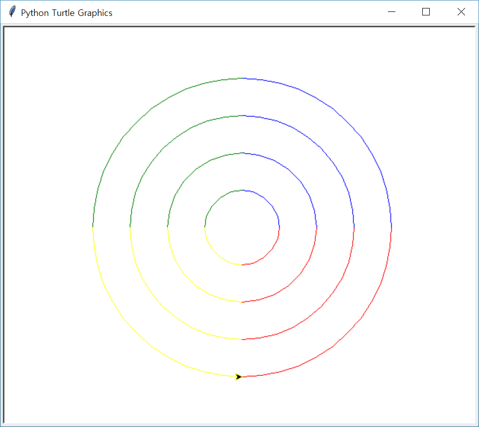
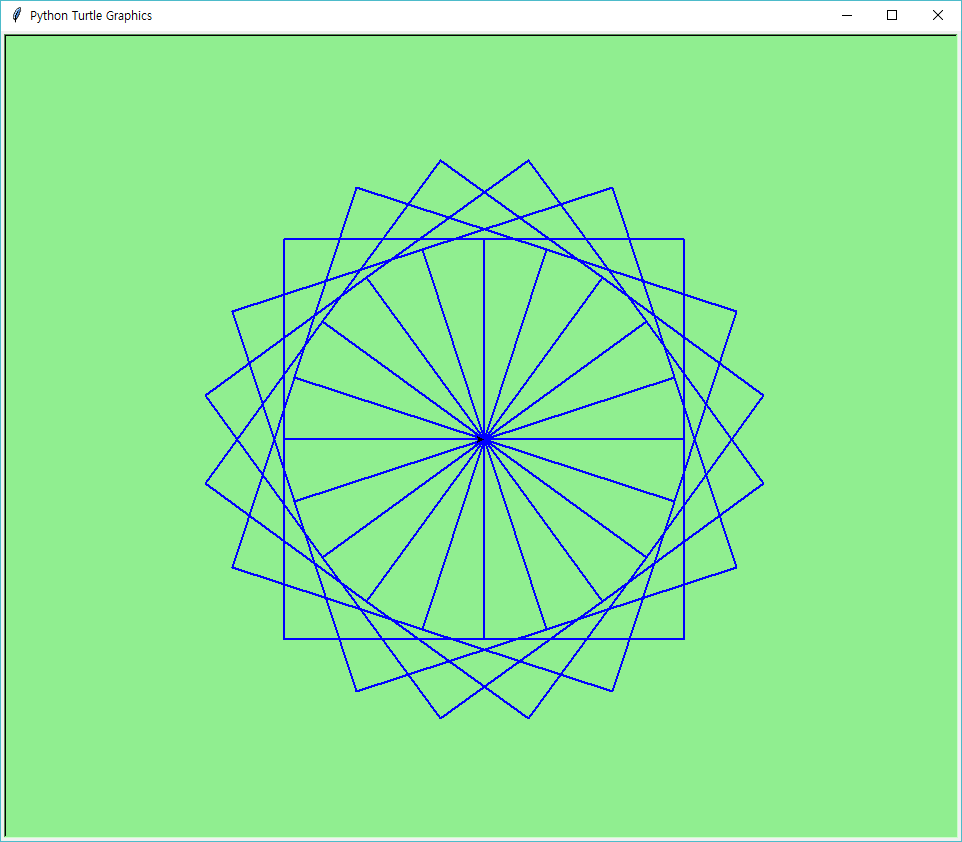
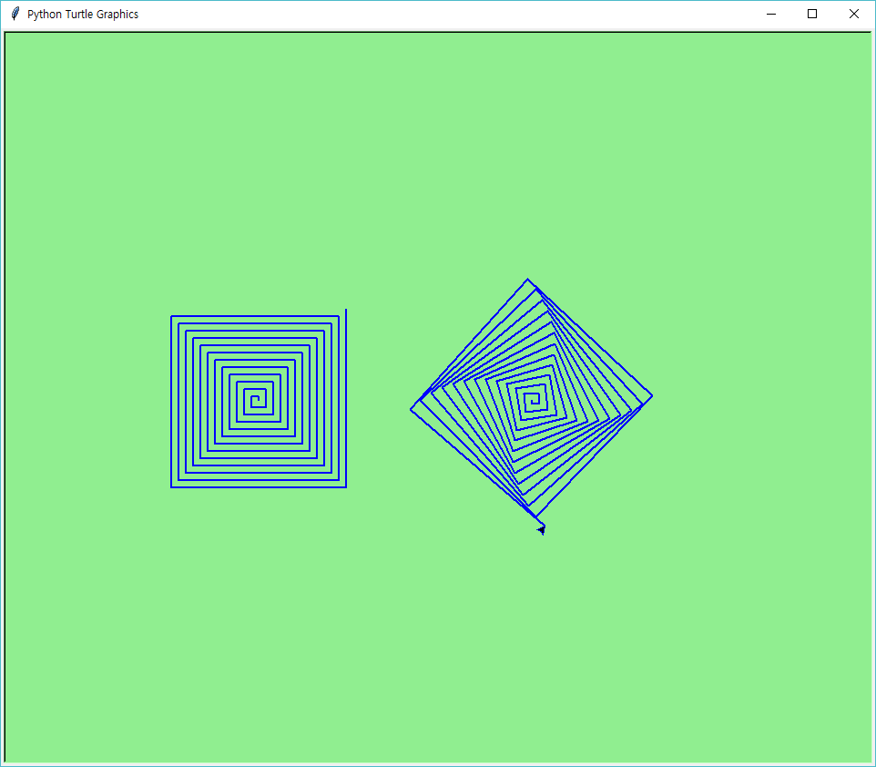
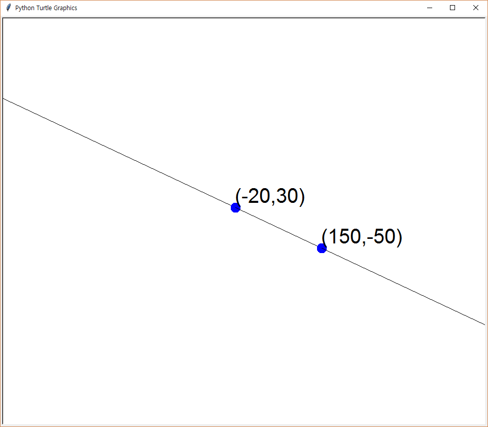

# 함수

함수는 여러 명령어들을 계속해서 반복 사용할 필요가 있을 때 사용한다. 가령 학생의 국어, 영어, 수학 시험 점수의 합계와 평균을 알고 싶으면 다음과 같이 프로그램을 작성할 수 있다.

```python
국어 = 90
영어 = 95
수학 = 92

합계 = 국어 + 영어 + 수학
평균 = 합계 / 3
print("합계:", 합계)
print("평균:", 평균)
```

하지만 다른 학생의 성적의 합계와 평균을 구하려고 하면 위의 코드를 반복해서 작성해 주어야 한다.

```python
# 지원 성적
지원국어 = 90
지원영어 = 95
지원수학 = 92

지원합계 = 지원국어 + 지원영어 + 지원수학
지원평균 = 지원합계 / 3
print("합계:", 지원합계)
print("평균:", 지원평균)

# 지수 성적
지수국어 = 93
지수영어 = 90
지수수학 = 96

지수합계 = 지수국어 + 지수영어 + 지수수학
지수평균 = 지수합계 / 3
print("합계:", 지수합계)
print("평균:", 지수평균)
```

이와 같이 코딩하는 것은 지루하고 힘든 작업이다. 반복 사용되는 구역을 하나의 단위로 묶어 달라지는 것만 입력하게 프로그램을 만들 수 있는 것이 함수이다.

## [정의](https://docs.python.org/3/reference/compound_stmts.html#function)

함수는 예약어 `def`를 쓰고 함수이름을 적고 콜론 `:`을 적고 다음 줄부터 들여쓰기를 해서 함수 구역을 작성한다. 함수는 함수이름과 괄호`()`를 사용하여 부를 수 있다. 괄호 안에는 함수에서 사용될 변수이름을 쉼표(`,`)를 이용하여 나열할 수 있다. 변수이름을 함수의 [**매개변수**](https://docs.python.org/3/glossary.html#term-parameter)(parameter)라고 부른다. 만일 함수에서 매개변수이름이 필요하지 않다면 적지 않아도 된다.

```python
def <함수이름>(<매개변수1, 매개변수2, ..., 매개변수n>): # 매개변수는 필요없으면 안 적어도 된다.
    <함수몸통>
```

간단하게 함수를 작성해보자.

```python
def say_hello():
    print("안녕하세요")

say_hello() # 함수를 부른다.
```

함수를 정의하기 위해서는 항상 `def`라는 예약어로 시작해야 한다. 그리고 함수이름 `say_hello`이 나오고 다음으로 반드시 괄호 `()`를 열고 닫고 콜론 `:`으로 함수 머리부분을 마친다. 함수의 몸통은 다음 줄 들여쓰기와 함께 시작되고 들여쓰기 구역이 끝나면 함수의 선언이 끝이 난다. 함수이름과 괄호를 이어서 입력 `say_hello()` 해서 함수를 실행할 수 있다.

https://docs.python.org/3/tutorial/controlflow.html#defining-functions 참조

### 성적 합계 평균 함수

위에서 작성했던 합계와 평균을 구하는 문제를 함수를 사용해서 바꿔보자. 위에서 학생들이 바뀌면 점수가 달라지고 합계와 평균을 구하는 방법과 출력하는 부분은 같은 것을 알 수 있다. 학생들에 따라 바뀌는 국어, 영어, 수학 점수를 함수의 매개변수로 설정하고 그 값에 따른 합계, 평균을 구하는 방법은 동일하므로 이 부분을 함수의 몸통에서 계산하게 한다.

```python
def 합계_평균(국, 영, 수):
    합 = 국 + 영 + 수
    평 = 합 / 3
    print("합계:", 합)
    print("평균:", 평)

print("지원")
합계_평균(90, 95, 92)
print("지수")
합계_평균(93, 90, 96)
```

- 함수이름은 `합계_평균`이고 매개변수는 각각 `국`, `영`, `수`이다. 이와 같이 함수이름, 매개변수와 같은 식별자(identifier)는 한글을 사용해도 된다.
- 함수를 사용하기 위해서는 함수이름과 함께 매개변수에 대응되는 값들을 괄호 안에 넣어주면 된다. 즉, `합계_평균(90, 95, 92)`와 같이 사용한다.
- 함수를 사용할 때 괄호 안에 들어가는, 매개변수에 대응되는 값들을 **인자**(argument)라고 부른다. 여기서는 인자들은 각각, `90`, `95`, `92`가 된다. [**매개변수**는 함수 정의할 때 괄호 안에 사용되는 식별자이고 **인자**는 함수를 부를 때 괄호 안에 넣는 값을 의미한다](https://docs.python.org/3/faq/programming.html#faq-argument-vs-parameter).
- 함수는 필요할 때 언제든지 부를 수 있다. 두 번째 부를 때 `합계_평균(93, 90, 96)` 함수의 인자에 다른 학생의 점수를 넣으면 그 학생의 합계와 평균이 출력이 된다.

위 코드에서 학생의 이름도 같이 보내주어 출력하게 하면 더 편리할 것이다.


```python
def 나은_합계_평균(이름, 국, 영, 수):
    합 = 국 + 영 + 수
    평 = 합 / 3
    print("{}의 성적:\n국어: {}, 영어: {}, 수학: {}".format(이름, 국, 영, 수))
    print("합계: {}".format(합))
    print("평균: {:.1f}".format(평))

나은_합계_평균("지원", 90, 95, 92)
나은_합계_평균("지수", 93, 90, 96)
```

    지원의 성적:
    국어: 90, 영어: 95, 수학: 92
    합계: 277
    평균: 92.3
    지수의 성적:
    국어: 93, 영어: 90, 수학: 96
    합계: 279
    평균: 93.0
    

- `print("평균: {0:.1f}".format(평))`에서`.1f`는 `평`을 보여줄 때 부동 소수점 아래 한 자리만 표시하라는 뜻이다.

** 직접 하기 **

- 국어, 영어, 수학 점수를 하나의 리스트로 입력받아 합계와 평균을 구하는 함수를 작성하고 실행하시오. 함수의 이름과 매개변수를 `리스트_합계_평균(국영수)`와 같이 하시오.

### 직사각형 그리기 예제

거북이를 이용하여 다양한 크기의 직사각형을 그리기를 원한다고 해보자. 가로, 세로의 길이가 변할 때마다 새로운 코드를 작성해 주어야 할 것이다.

```python
import turtle

연필 = turtle.Pen()

# 가로 300, 세로 200인 직사각형
연필.fd(300) # fd()는 forward()의 줄임말
연필.left(90)
연필.fd(200)
연필.left(90)
연필.fd(300)
연필.left(90)
연필.fd(200)
연필.left(90)

# 가로 200, 세로 100인 직사각형
연필.fd(200)
연필.left(90)
연필.fd(100)
연필.left(90)
연필.fd(200)
연필.left(90)
연필.fd(100)
연필.left(90)
```

가로, 세로의 길이를 입력받아 직사각형을 그리는 함수를 만들면 매번 코드를 만들 필요가 없어질 것이다.

```python
import turtle

연필 = turtle.Pen()

def 직사각형(가로, 세로): # 함수 이름은 직사각형
    for _ in range(2):
        연필.fd(가로)
        연필.left(90)
        연필.fd(세로)
        연필.left(90)
        
직사각형(300, 200)
직사각형(200, 100)
```

- 함수이름을 `직사각형`이라고 짓고 매개변수로 `가로`, `세로`를 설정한다.
- `for`문을 이용해서 가로, 세로 그리기를 2번 반복하여 직사각형을 그린다.

** 직접 하기 **

- 한 변의 길이를 매개변수로 하는 정삼각형을 그리는 함수를 만들어, 그 함수를 이용해 길이가 50, 100, 150 인 정삼각형을 만들자.
- 원 둘레를 네 가지 색깔(빨강, 파랑, 초록, 노랑)로 색칠하는 함수 프로그램을 만드시오. 함수는 반지름을 매개변수로 갖고 원의 중심은 (0,0)이 되게 작성하시오. 이 함수를 4번 반복실행하여 반지름이 50, 100, 150, 200인 다음과 같은 그림을 그리시오.


### 거북이 이벤트 함수

거북이는 마우스 클릭 또는 키보드의 키눌림 이벤트를 알아채서 뭔가를 할 수 있는 함수를 제공한다. 이벤트(event)란 프로그램에 의해서 감지되고 처리될 수 있는 동작이나 사건을 말한다. 키보드 또는 마우스 또는 휴대폰의 터치스크린 등은 사용자가 상응하는 동작을 하는 순간 이벤트를 감지하여 처리한다. 키보드를 누르는 순간, 마우스를 움직이거나 클릭하는 순간, 터치스크린을 터치하는 순간에 이벤트가 발생하는 것이다. 거북이는 사용자가 마우스 클릭을 했을 때 [`onclick(func)`](https://docs.python.org/3.6/library/turtle.html#turtle.onclick)이라는 함수가 실행되어 `onclick` 인자인 `func`를 작동시킨다. `func`는 클릭 한 곳의 좌표 `(x, y)`를 매개변수로 하는 함수이어야 한다. `onclick(func)`함수가 실행될 때, `func` 함수에 클릭한 곳의 좌표 `(x, y)`를 인자로 넘겨준다. 그러면 `func(x, y)` 함수가 실행되는 것이다.

```python
import turtle

창 = turtle.Screen()
펜 = turtle.Pen()

def 글씨쓰기(x, y):
    펜.pu()
    펜.goto(x, y)
    문자열 = "(" + str(x) + ', ' + str(y) + ")"
    펜.write(문자열)

창.onclick(글씨쓰기)
창.mainloop()
```

- `창.onclick(글씨쓰기)`를 실행하면 거북이는 마우스가 클릭 되기를 무한정 기다리다가 마우스가 창을 클릭하는 순간 `onclick` 인자인 `글씨쓰기` 함수를 부른다.
- `글씨쓰기` 함수를 부를 때 클릭한 곳의 `x, y` 좌표를 `글씨쓰기(x, y)`에 자동으로 넘겨주어 글씨쓰기 함수가 실행되는 것이다.
- `onclick` 함수는 마우스가 거북이 창을 클릭할 때마다 호출되어 실행된다.
- `창.mainloop()` 함수도 창의 종료 이벤트(창의 오른쪽 위 X 누르기 또는 Alt + F4 누르기)를 무한정 기다리는 이벤트 함수이다.

** 직접 하기 **

- 거북이를 이용하여 마우스를 클릭하면 "코딩은 즐거워!"라는 문자열을 클릭한 곳에 출력하는 프로그램을 작성하시오.
- 거북이를 이용하여 마우스를 클릭하면 클릭한 곳에 한변의 길이가 20인 정사각형을 그리는 프로그램을 작성하시오.

## 지역 변수와 global 문

함수 안에서 만들어진 변수는 함수를 벗어나서는 사용할 수 없다. 이러한 변수를 지역 변수(local variable)라고 한다. 다음 프로그램을 살펴보자.


```python
def 함수1():
    y = 5 # 함수 안에서 y값 만듦
    print("함수 안에서 만든 y 값:", y)

함수1() # 함수를 부른다.
print(y) # 함수 안에서 만든 지역 변수 y를 함수 밖에서 부른면 에러
```

    함수 안에서 만든 y 값: 5
    


    ---------------------------------------------------------------------------

    NameError                                 Traceback (most recent call last)

    <ipython-input-2-f3e3c410d9aa> in <module>()
          4 
          5 함수1() # 함수를 부른다.
    ----> 6 print(y) # 함수 안에서 만든 지역 변수 y를 함수 밖에서 부른면 에러
    

    NameError: name 'y' is not defined


위 코드를 실행하게 되면 `함수()`는 정상적으로 실행되지만, `print(y)`를 실행하는 순간 `NameError: name 'y' is not defined`에러가 발생하게 된다. 함수 안에서 선언된 변수 `y`는 함수가 실행될 때 만들어 졌다가 함수 실행을 끝내는 순간 사라지기 때문에 `y`변수 이름이 존재하지 않는다는 에러를 발생하게 된다. 매개변수를 갖는 함수인 경우 주의해야한다.

### 매개변수와 지역변수


```python
x = 10 # 전역변수

def 함수2(x):
    print("함수 안에 있는 x:", x) # 함수를 부를 때 넣은 x값 출력
    x = 5 # 함수 안에서 x값 변경과 동시에 지역변수로 변한다.
    print("함수 안에서 변경된 x 값:", x) #변경된 x값 출력

함수2(x) # 전역변수 x=10을 건네준다.
print("함수 밖에 있는 x:", x)
```

    함수 안에 있는 x: 10
    함수 안에서 변경된 x 값: 5
    함수 밖에 있는 x: 10
    

`x = 10`이라고 선언되었기 때문에 `함수2(x)`를 부를 때 `x`대신 `10`이 인자로 넘어간다. `print("함수 안에 있는 x:", x)` 에서는 `10`을 출력하게 되고 다음 문장 `x = 5`에서 위에 있던 `x`를 무시하고 새로운 지역 변수 `x`를 만들게 된다. `함수2()`가 끝나는 시점까지 `x`는 지역변수가 된다. 함수를 끝내고 다음 문장 `print("함수 밖에 있는 x:", x)`을 실행하면 함수 안에서 만들어졌던 지역변수 `x`는 사라지고 전역변수 `x=10`이 그대로 출력이 된다.

### global 문

함수 안에서 변경된 값이 계속해서 함수가 끝난 후에도 적용되게 하고 싶을 때는 `global` 예약어를 사용하면 된다.


```python
x = 10 # 전역변수

def 함수3():
    global x
    print("함수 안에서 변경되기 전 x:", x)
    x = 5 # 함수 안에서 x값 변경
    print("함수 안에서 변경된 후 x 값:", x) # 변경된 x값 출력

함수3()
print("함수 실행 끝낸 후 x:", x)
```

    함수 안에서 변경되기 전 x: 10
    함수 안에서 변경된 후 x 값: 5
    함수 실행 끝낸 후 x: 5
    

함수를 실행하기 전에 변수 `x=10`이 값을 가지고 있고 함수 실행을 하면 `global x`라는 문장을 통해서 이미 있는 변수 `x`는 전역변수로 간주를 한다. 따라서 함수 안에서 `x`의 값을 변경하면 함수가 끝난 후에도 변경된 값이 적용이 된다. 전역변수를 여러 개 선언하고 싶으면 `global x, y, z`와 같이 한다.

```python
import turtle

pen = turtle.Pen()

psize = 1

def 펜_굵게():
#     global psize
    pen.left(30)
    psize += 1
    pen.pensize(psize)
    pen.forward(50)

for i in range(5):
    펜_굵게()
```

### 가변 객체

[파이썬에서는 함수 안의 변수에 새로운 객체가 할당되기 전까지는 그 변수는 전역변수로 간주한다.](https://docs.python.org/3/faq/programming.html#what-are-the-rules-for-local-and-global-variables-in-python) 물론 그 변수는 이미 선언되어 있어야 한다. 그렇지 않고 새로운 객체를 변수에 할당하는 순간에 그 변수는 지역변수가 된다. 따라서 다음과 같이 가변 객체(mutable object)인 리스트 **성분**을 함수 안에서 변경한다고 해서 지역변수가 되는 것은 아니다.


```python
x = [1, 2, 3] # 가변 객체 리스트

def 함수4():
    print("함수 안에 있는 x:", x) # 전역변수 x값 출력
    x[0] = 5 # 함수 안에서 x의 첫번째값 변경
    print("함수 안에서 변경된 x 값:", x) # 함수 안에서 변경된 x값 출력

함수4()
print("함수 실행 후 x:", x) # 함수 안에서 변경된 값이 출력된다.
```

    함수 안에 있는 x: [1, 2, 3]
    함수 안에서 변경된 x 값: [5, 2, 3]
    함수 실행 후 x: [5, 2, 3]
    

리스트는 가변 객체이기 때문에 `함수4()` 안에서 `x[0] = 5` 문을 실행하면 함수 안에서 `x`의 성분을 변경할 수 있다. 함수 안에서 리스트 객체가 새로 만들어진 것이 아니기 때문에 함수 실행이 끝나도 `x`는 계속 전역변수를 유지하게 된다. 따라서 바뀐 값이 적용되어 출력된다. 가변 객체란 객체를 구성하는 성분을 변경할 수 있는 객체를 의미하고 성분을 바꿀 수 없는 객체를 불변 객체(immutable object)라고 한다. 자세한 것은 클래스 부분에서 다루게 된다. 대표적인 불변 객체로는 숫자형(`int`, `float`, `complex`), 문자열(`str`) 및 튜플(`tuple`)형이 있다.

## 기본 매개변수(default parameter)와 기본 인자(default argument)

어떤 경우에는 함수를 부를 때 인자를 선택적으로 넘겨주어 사용자가 값을 넘겨주지 않으면 자동으로 기본값을 사용하도록 하는 것이 편할 때가 있다. 이런 경우, **기본 매개변수**에 **기본 인자값**을 지정하면 된다. 함수를 선언할 때 원하는 기본 매개변수 뒤에 할당 연산자(`=`)와 기본값을 입력하여 기본 인자값을 지정한다.

```python
def 말하기(문장, 횟수=1): # 횟수는 기본 매개변수, 1은 기본값
    print(문장 * 횟수) # 문장을 횟수만큼 출력한다.

말하기("안녕하세요. 예은님!") # 기본 매개변수를 지정하지 않았기 때문에 기본값 1회 출력
말하기("예은", 5) # 기본 매개변수 부분에 5를 지정함으로 5회 출력
```

- `def 말하기(문장, 횟수=1):` 중에서 `횟수`이 기본 매개변수이고 기본 인자값은 `1`로 설정한다.
- `말하기("안녕하세요. 예은님!")`에서 `말하기()` 함수를 부를 때 매개변수 `횟수`에 해당되는 부분이 입력되지 않았으므로 `횟수`는 기본 인자값 `1`을 사용하게 되어 한 번만 출력한다.
- `말하기("예은", 5)`에서 `"예은"` 다음에 오는 `5`가 기본 매개변수 `횟수`에 해당하는 인자값으로 `5`회를 출력하게 된다.

### 매개변수 순서

기본 매개변수가 아닌 매개변수는 기본 매개변수 앞에 위치하여야 한다. 단, 가변 매개변수 사이에 오는 매개변수는 예외이다. 매개변수의 순서는 다음과 같다.

```python
기본 매개변수가 아닌 매개변수, 기본 매개변수, 가변 위치 매개변수, 기본 매개변수가 아닌 매개변수 또는 기본 매개변수, 가변 키워드 매개변수
```

가변 위치 매개변수 뒤에 오는 매개변수를 함수에서 인자로 부를 때는 반드시 키워드 인자 형식으로 불러야 한다.

** 직접 하기 **

- 직사각형 그리기에서 매개변수로 가로, 세로 길이와 기본 매개변수로 `선두께=1`, `선색깔="red"`을 기본 인자값으로 갖는 함수 프로그램을 작성하고 실행하시오.

## 키워드 인자(keyword argument)

함수를 부를 때 괄호 안에 사용되는 [인자(argument)](https://docs.python.org/3/glossary.html#term-argument)는 **키워드 인자**(keyword argument)와 **위치 인자**(positional argument)로 나눌 수 있다. 키워드 인자란 `매개변수(또는 식별자) = 인자값`과 같이 사용되는 인자를 말하고 그렇지 않은 모든 인자를 위치 인자라고 한다. `말하기()` 함수 예제를 약간 바꿔보자.


```python
def 말하기(문장, 횟수=1):
    print(문장 * 횟수)

말하기(문장="안녕하세요. 예은님!") # 키워드 인자
말하기("예은", 5) # 위치 인자
말하기(횟수=5, 문장="예은") # 키워드 인자를 사용하여 인자 순서 변경
```

    안녕하세요. 예은님!
    예은예은예은예은예은
    예은예은예은예은예은
    

- `말하기(문장="안녕하세요. 예은님!")` 에서 `문장="안녕하세요. 예은님!"`이 키워드 인자이다. `문장`이 매개변수 이름(식별자)이고 `"안녕하세요. 예은님!"`이 인자값이다.
- `말하기("예은", 5)`에서 인자 `"예은"`, `5`는 위치인자이다.
- `말하기(횟수=5, 문장="예은")`에서와 같이 키워드 인자를 사용하면 순서를 바꿀 수 있다.

위치 인자는 반드시 키워드 인자 앞에 위치해야 한다. 다음과 같이 키워드 인자 뒤에 위치 인자를 사용하면 에러가 발생한다.


```python
말하기(횟수=5, "예은")
```


      File "<ipython-input-16-a15529197e77>", line 1
        말하기(횟수=5, "예은")
                       
    ^
    SyntaxError: positional argument follows keyword argument
    


## 가변 매개변수

때때로 함수의 인자의 갯수가 상황에 따라서 달라져야 할 필요가 있다. 이 때 사용할 수 있는 매개변수가 가변 매개변수이다. 가변 매개변수는 가변 위치 매개변수와 가변 키워드 매개변수로 나눌 수 있다.

### 가변 위치 매개변수

가변 위치 매개변수는 별표(`*`)와 매개변수이름을 함께 적어 표시한다. 함수를 부를 때 위치 인자들이 차례로 가변 위치 매개변수 이름에 튜플로 할당된다. 가변 위치 매개변수를 갖는 함수를 예를 들어보자.


```python
def 합계(*항목들):
    합 = 0
    for 항목 in 항목들:
        합 += 항목
    print('합계 =', 합)

합계(1, 2, 3, 4, 5)
```

    합계 = 15
    

- `*항목들` 에서 `항목들`이 가변 위치 매개변수이다.
- `합계(1, 2, 3, 4, 5)`의 위치 인자들 `1, 2, 3, 4, 5`가 차례로 `항목들` 변수에 튜플로 할당된다. 즉, `항목들 = (1, 2, 3, 4, 5)`와 같이 할당된다.

가변 위치 매개변수 다음에 오는 매개변수는 키워드 인자로 입력해야 한다.

### 가변 키워드 매개변수

가변 키워드 매개변수는 별표 두 개(`**`)에 이어서 가변 키워드 매개변수 이름이 함께 온다. 예를 들면 `**kwargs`와 같이 사용한다. 함수를 부를 때 키워드 인자로 입력한 값들이 가변 키워드 매개변수이름에 사전(`dict`)형식으로 대입된다. 가변 키워드 매개변수는 매개변수들 중 맨 마지막에 위치해야 한다.


```python
def 영화(**키워드들):
    for 키워드 in 키워드들:
        print(키워드, ":", 키워드들[키워드])
        
영화(제목="클래식", 감독="곽재용", 각본="곽재용", 출연="손예진, 조인성, 조승우, 이기우", 개봉일="2003년 1월 30일")
```

    제목 : 클래식
    감독 : 곽재용
    개봉일 : 2003년 1월 30일
    출연 : 손예진, 조인성, 조승우, 이기우
    각본 : 곽재용
    

- 함수 `영화(제목="클래식", 감독="곽재용", 각본="곽재용", 출연="손예진, 조인성, 조승우, 이기우", 개봉일="2003년 1월 30일")`를 키워드 인자로 입력하면 `키워드들` 가변 키워드 매개변수에 사전(`dict`)형식으로 입력이 된다.

튜플과 사전형은 [데이터 형](DataTypes.html#데이터 형) 부분에서 좀더 자세히 설명한다.

## return 문

함수가 끝날 때 함수의 결과를 `return` 문을 이용해서 반환할 수 있다. 예를 들면 합계를 구하는 함수를 부르면 그 결과값으로 합계를 반환하면 그 반환값을 가지고 다른 곳에서 사용할 수 있을 것이다. `return` 문은 `return` 뒤에 객체를 적어 주면 그 객체가 함수의 종료와 함께 반환된다.


```python
def 합계(*항목들):
    합 = 0
    for 항목 in 항목들:
        합 += 항목
    return 합

국어합 = 합계(86, 90, 76)
영어합 = 합계(90, 64, 93)
print('총합 =', 국어합 + 영어합)
```

    총합 = 499
    

- `return 합`을 실행하면 함수가 종료가 되면서 `합`을 반환한다.

함수 실행 중에 `return`문을 만나면 그 즉시 함수는 종료된다. 즉, 함수 구역에서 `return` 아래 어떤 문장도 실행이 되질 않고 함수를 끝내고 `return` 문장과 함께 있는 객체가 반환이 된다. `return` 문 뒤에 아무것도 지정하지 않으면 `None`을 반환한다. `None`은 파이썬의 예약어로 아무것도 없다는 표시이다. 함수가 종료될 때 `return` 문이 없으면 암시적으로 `None`을 반환한다.

** 직접 하기 **

- 원의 반지름을 입력받아 원의 면적을 반환하는 함수를 작성하자.

## 함수 객체

함수도 객체이기 때문에 변수에 할당할 수 있다.


```python
def 함수():
    print("함수")

f = 함수
f()
```

    함수
    

함수 이름으로 변수에 할당하는 것과 `함수()`를 할당하는 것은 다르다. `함수()`은 함수의 반환값이기 때문에 반환값이 할당된다.


```python
def 함수():
    print("함수")

f = 함수()
print(f)
```

    함수
    None
    

## lamda 수식

이름이 없는 간단한 함수를 만들 때 `lambda` 식을 이용한다. 사용방법은 다음과 같다.

```python
lambda <매개변수> : <반환될 수식>
```


```python
f = lambda x : x ** 2
f(2)
```


    4


리스트 항목을 `sort()` 메소드를 이용해 정렬하는 예를 살펴보자.


```python
pairs = [(1, 'one'), (2, 'two'), (3, 'three'), (4, 'four')]
pairs.sort(key=lambda pair: pair[1])
pairs
```


    [(4, 'four'), (1, 'one'), (3, 'three'), (2, 'two')]


- 리스트의 sort 메소드는 key 인자값으로 하나의 매개변수만을 갖는 함수를 취한다. 이 함수의 반환값들을 이용해 비교 연산자 `<` 연산을 수행하여 리스트 항목을 정렬한다.
- `key=lambda pair: pair[1]`에서 `lambda pair: pair[1]` 부분이 함수이고 함수의 입력 매개변수는 `pair`이고 이 매개변수에 리스트의 항목이 하나씩 입력된다. 콜론 뒤에 수식 `pair[1]`이 함수의 반환값으로 가령  `pair = (1, 'one')`이면 `pair[1]`은 `'one'`이 되는 것이다.
- 따라서 각각 반환되는 함수값은 두번째 성분인 `'one', 'two', 'three', 'four'`가 되고 이것들을 `<` 연산을 가지고 정렬을 하면 결과와 같이 나오는 것이다.

## 리스트, 튜플, 사전 인자 풀기

리스트 또는 튜플의 성분들을 순서대로 위치 인자에 넘겨주기 위해서는 `*`를 이용하면된다. 리스트 또는 튜플 앞에 `*`를 붙여 인자에 대입하면 리스트 또는 튜플이 해체되어 성분들이 순서대로 인자로 대입된다. 일반적으로 `*<Iterable 객체>`이면 된다. 내장 함수 `range()` 는 시작, 끝, 간격을 인자로 입력 받을 수 있다.


```python
인자들 = (1, 10, 2) # 튜플

list(range(*인자들)) # 인자들 튜플을 풀어서 1, 10, 2를 인자로 넘긴다.
```


    [1, 3, 5, 7, 9]


마찬가지 방법으로, `**`를 이용하여 사전 객체를 풀어서 키워드 인자 형식으로 넘겨줄 수 있다.


```python
def 지저귀기(**새들):
    for 새 in 새들:
        print(새, "는 ", 새들[새], sep="")
        
새들 = {"참새": "짹짹", "갈매기":"끼룩끼룩", "매미":"맴맴"} # 사전 객체
지저귀기(**새들) # 사전 객체를 풀어 키워드 인자로 변경하여 넘겨준다.
```

    갈매기는 끼룩끼룩
    참새는 짹짹
    매미는 맴맴
    


** 직접 하기 **

- 가변 위치 매개변수만을 갖는 더하기 함수 `더하기(*숫자들)`를 만들고 그 함수를 이용하여 `1`부터 `1000`까지 더하기를 하시오.

## 문서화 문자열

파이썬은 문서화 문자열(documentation string)이라고 불리우는, 줄여서 docstring라 불리우는 편리한 기능을 가지고 있다. 문서화 문자열은 프로그램을 알아보기 쉽게 해 주고, 또 나중에 프로그램에 대한 설명서를 작성할 때 유용하게 사용될 수 있는 중요한 도구이다. 아래 예제와 같이, 문서화 문자열은 프로그램이 실행 중일 때도 읽어올 수 있다.


```python
def 함수():
    """이것은 함수를 간단히 설명하는 줄이다.
    
    한 줄을 띄우고 문서에 대한 설명을 적는다.
    문서화 문자열은 함수이름() 콜론 바로 다음 줄에 와야 한다.
    """
    
    pass

print(함수.__doc__)
```

    이것은 함수를 간단히 설명하는 줄이다.
        
        한 줄을 띄우고 문서에 대한 설명을 적는다.
        문서화 문자열은 함수이름() 콜론 바로 다음 줄에 와야 한다.
        
    

- 줄2, 문서화 문자열은 함수이름 선언 바로 다음 줄에서 따옴표 3개를 사용한 문자열을 이용한다.
- 줄2, 첫 줄은 보통 한 줄로 적으며 마침표로 끝낸다.
- 줄3, 둘째 줄은 빈 줄로 놓는다.
- 줄4, 셋째 줄부터 필요한 설명들을 적는다.
- 줄8, 문서화 문자열이 끝난 다음 줄부터 함수의 몸통이 시작된다.

## <a name="소행성게임"></a>소행성 게임

거북이를 이용하여 우주선이 움직이는 소행성과 부딪혀 소행성을 파괴하는 게임이다. 아래 코드는 게이머와 소행성의 움직임만 작성한 것이다.

```python
import turtle
import random
import math

창 = turtle.Screen() # 거북이 창

우주선 = turtle.Pen() # 게이머
우주선.color('blue')
우주선.shape('turtle')
우주선.penup()
우주선.speed(0)

소행성1 = turtle.Pen() # 소행성1
소행성1.color('red')
소행성1.shape('circle')
소행성1.penup()
소행성1.speed(0)
소행성1.goto(random.randint(-300, 0), random.randint(-300, 300))

소행성2 = turtle.Pen() # 소행성2
소행성2.color('red')
소행성2.shape('circle')
소행성2.penup()
소행성2.speed(0)
소행성2.goto(random.randint(-300, 0), random.randint(-300, 300))

def 왼쪽():
    우주선.goto(우주선.pos() + (-10, 0))

def 오른쪽():
    우주선.goto(우주선.pos() + (10, 0))

def 위():
    우주선.goto(우주선.pos() + (0, 10))

def 아래():
    우주선.goto(우주선.pos() + (0, -10))

창.onkeypress(왼쪽, "Left")
창.onkeypress(오른쪽, "Right")
창.onkeypress(위, "Up")
창.onkeypress(아래, "Down")
창.listen()

def 놀자():
    소행성1.forward(2)
    소행성2.forward(2)
    창.ontimer(놀자, 10)
창.ontimer(놀자, 10)

창.mainloop()
```

- 우주선은 게이머이고 `speed(0)`함수를 이용하여 움직이는 속도를 가장 빠르게 했다. `1`이 가장 느리고 숫자가 `10`까지 올라갈수록 더 빨라진다. 보통 속도는 `6`이고 가장 빠른 속도는 `0`이다.
- `소행성1.goto(random.randint(-300, 0), random.randint(-300, 300))`에서 `randint(x, y)`을 이용하여 소행성이 시작하는 위치를 x의 위치는 `-300`에서 `0`까지, `y`의 위치는 `-300`에서 `300`까지 무작위 수로 설정했다.
- `왼쪽`, `오른쪽`, `위`, `아래`로 이동하는 함수를 `onkeypress()` 함수에 건네주어 키보드의 왼쪽, 오른쪽, 위, 아래 키가 눌릴 때마다 작동하게 했다.
- `왼쪽`, `오른쪽`, `위`, `아래`로 이동하는 함수안에 `우주선.goto(우주선.pos() + (-10, 0))`을 이용하여 키가 눌릴 때의 우주선 위치 `우주선.pos()`에 `+10` 또는 `-10` 만큼을 더해서 우주선를 움직이게 했다.
- `창.ontimer(놀자, 10)`에서 `ontimer(함수, 시간)` 함수는 주어진 `시간`(ms 단위) 간격으로 `함수`를 실행한다. 시간의 단위는 ms(mille second)로 1/1000초를 의미한다. 따라서 `놀자()` 함수를 0.01초 간격으로 실행하면서 `forward(2)`가 실행되어 소행성들이 앞 쪽으로 2만큼 움직인다.


## 연습

1. 섭씨 온도를 화씨 온도로 바꾸는 함수 `섭씨2화씨(섭씨)`를 작성하고 실행하시오.
1. 위의 `섭씨2화씨(섭씨)` 함수의 문서화 문자열을 넣고 `help()`함수를 이용해서 함수의 설명을 확인해 보시오.
1. `정사각형()` 함수를 만들어 거북이를 이용하여 다음과 같은 그림을 그리시오.

1. 다음과 같은 그림을 그리시오.

1. 별의 시작 위치 `x`, `y`와 한 변의 길이를 매개변수로 하는 별 그리는 함수를 작성하고 실행하시오. 함수의 이름과 매개변수를 `별그리기(x, y, 한변)`로 하시오.
1. 위의 `별그리기(x, y, 한변)`함수를 이용하여 별의 시작 위치및 한 변의 길이를 무작위 수를 생성하여 10개를 그리시오. 반복문을 이용하시오.
1. 거북이를 이용하여 키보드 오른쪽 화살표를 누르면 오른쪽으로 회전하여 50만큼 이동하고, 왼쪽 화살표를 누르면 왼쪽으로 회전하여 50만큼 이동하도록 프로그램을 만드시오. 거북이 창 메소드 `onkeypress(func, key)`와 `listen()` 함수를 이용하시오. 여기서 `key`는 왼쪽은 `'Left'`, 오른쪽은 `'Right'`이다.
1. 거북이를 이용하여 창을 클릭한 곳에 별이 그려지는 프로그램을 작성하시오. `onclick()` 함수를 이용하시오. 위에서 작성한 `별그리기` 함수를 수정해서 사용하시오.
1. 위 소행성 게임 예제에서 소행성과 우주선과의 거리가 20보다 작으면 "꽝!"이라는 문자를 우주선의 위치에 출력하는 함수 `사정거리()`를 작성하시오. `놀자()` 함수에 `사정거리()` 함수를 넣어 우주선이 소행성 근처에 접근하면 "꽝!"이라는 문자가 출력되게 프로그램을 수정하시오.
1. 두 점 `(x1, y1)`, `(x2, y2)`를 사용자로부터 입력받아 두 점을 지나는 직선을 그리는 함수 `직선그리기(x1, y1, x2, y2)`를 만들고 실행하시오. 그래프 위에 두 점과 두 점의 좌표를 함께 표시하시오.

