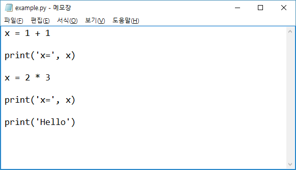

# 소개

이 장에서는 파이썬 특징 및 기본 설치에 대해서 소개하고, 파이썬 프로그래밍 하는데 많이 사용되는 패키지들을 함께 설치할 수 있는 아나콘다 설치에 대해서 알아본다. 또한 프로그래밍 소스를 편집하는데 필요한 편집기 설치에 대해서도 알아본다.

## 특징

- **배우기 쉽다.**

    초보자가 배우기에 다른 언어에 비해서 쉽고 문법도 간단하다.
    
    
- **오픈소스이고 무료이다**
    
    자유롭게 배포할 수 있고 원하는대로 수정할 수 있으며 사용할 수 있다.


- **높은 수준의 언어이다**
    
    메모리 관리와 같은 저수준의 프로그래밍을 할 필요가 없다. 저수준이라고해서 안좋다는 뜻이 아니고 초보자들이 접근하기 어려운 수준이라고 생각하면 될 것 같다.


- **호환 가능**

    윈도우즈, 리눅스, 맥 등 여러 운영체제에서 같은 코드를 실행할 수 있다.


- **인터프리터 형식**
    
    `C/C++` 같은 프로그래밍 언어는 소스코드를 컴파일한 후 실행하는 과정을 거치지만 파이썬은 소스코드를 컴파일하는 과정이 필요없고 한 줄, 한 줄씩 실행할 수 있다.


- **객체지향적이다**
    
    객체를 중심으로 데이터와 함수를 프로그래밍하기 편리하다.
    

- **방대한 라이브러리**
    
    정규 표현식, 문서 생성, 단위 테스트, 스레드, 데이터베이스, 웹브라우저, CGI, FTP, HTML, WAV 파일, GUI등 방대한 양의 표준 라이브러리들을 사용할 수 있다.


## 파이썬 설치

파이썬 홈페이지 [https://www.python.org/](https://www.python.org/)에서 파이썬 [최신 버전](https://www.python.org/downloads/)을 다운받아 설치하는 방법과 아나콘다 프로그램을 [다운(https://www.continuum.io/downloads)](https://www.continuum.io/downloads)받아 설치하는 방법이 있다.

- 파이썬 홈페이지로부터 다운받아 설치하면 프로그래밍할 때 필요한 패키지(모듈)들을 명령어창에서 그때 그때 다음과 같이 설치해야 한다.

```python
pip install 패키지이름
```

- 아나콘다를 설치하면 파이썬 프로그램뿐만 아니라 기본적으로 많이 쓰이는 패키지들이 함께 설치되기 때문에 처음 사용하는 사람들이 사용하는데 좀더 편리하다.


## 아나콘다 설치

아나콘다 설치후 명령어창을 열고 경로가 설정되었는지 다음과 같이 실행해보자.


## 명령어창에서 실행

파이썬 프로그램이 설치되었으면 실행창에서 간단한 파이썬 명령어들을 실행해보자. 아나콘다 실행창을 열어보자. 

1. 시작 버튼을 누르고
1. 프로그램 중에서 아나콘다를 찾아서 누른다. 
1. 부메뉴 중에서 Anaconda Prompt를 눌러서 실행창을 연다.


아나콘다 실행창에서 `python`을 실행한다.

<!---->


<!-- 만일 위와 같이 파이썬 실행 표시가 나오지 않는다면 파이썬 설치 경로를 시스템 환경에 설정해 줘야 한다. [시스템 경로 설정](#시스템 경로 설정)을 참고한다.

### <a name="시스템 경로 설정"></a> 시스템 경로 설정

제어판 -> 시스템 -> 고급 시스템 설정 -> 고급 탭 -> 환경변수를 클릭한다. 시스템 변수 항목 중에서 Path 변수를 선택 후 편집을 누른다. 새로 만들기를 눌러서 아나콘다(또는 파이썬) 설치 폴더 및 아나콘다(또는 파이썬) 설치 폴더/Scripts들을 새로 만든 후 확인을 계속 눌러서 창들을 닫는다. 그리고 명령어창을 ***새롭게*** 열어서 위의 명령어를 다시 실행해본다. -->

간단한 명령어들을 실행해보자.

<!---->


파이썬 실행을 끝내려면 `exit()`를 입력하고 엔터를 치든지 `Ctrl + Z`를 누르고 엔터를 치면 파이썬 프로그램을 닫는다.

<!---->


## 스크립트 파일 실행

명령어들을 한 줄 한 줄 입력해서 실행하기에 불편한 점이 많다. 여러 명령어들을 일괄적으로 실행하기위해서는 파일에 필요한 명령어들을 저장한다. 그리고 그 파일을 한꺼번에 실행할 수 있다. 또한 잘못된 곳이 있으면 그 파일 내용을 수정하여 다시 실행할 수 있다. 이러한 파일을 스크립트 파일이라고 부른다. 앞으로 실습을 위해서 폴더를 만들어 본다.

### 실습 폴더 만들기

아나콘다 실행창에서 다음과 같이 실행한다.

1. `cd \`를 해서 맨 위의 폴더로 간다. `cd`는 change directory로 폴더를 변경하는 명령어이다.
1. `mkdir work`를 해서 `work` 폴더를 새로 만든다. `mkdir`은 make directory로 새로운 폴더를 만든 명령어이다.
1. `cd work`를 해서 `work` 폴더로 들어간다.


### 스크립트 파일 만들기

간단한 실습을 위해서 다음과 같이 메모장(notepad.exe)을 열어서 파일을 만들어 저장한다.

아나콘다 실행창에 `notepad example.py`라고 입력하고 엔터를 친다. 그러면 메모장이 실행되면서 `example.py` 파일이 없으면 새롭게 만들거냐고 물어볼 것이다. 그러면 `예`를 누른다. 그렇지 않고 파일이 있으면 그 파일이 열린다.


열린 메모장에서 다음과 같이 입력한 후 저장한다.



아나콘다 실행창에서 `python example.py`를 입력하여 실행하면 다음과 같은 결과가 나온다.


메모장 `example.py` 내용을 숫자를 바꾸어 저장한 후, 아나콘다 실행창에서 `python example.py` 다시 실행하면 결과가 다르게 나오는 것을 확인할 수 있을 것이다.

간단한 실습을 위해서 메모장을 사용한 것이지 앞으로 프로그래밍을 할 때는 사용하지 않을 것이다. 파이썬 프로그래밍을 편하게 할 수 있는 전용 편집기 PyCharm을 사용할 것이다.

## 통합 개발환경 파이참(PyCharm)

파이썬 프로그래밍을 효율적으로 할 수 있게 도와주는 프로그램인 PyCharm 통합개발환경 Community Edition에 대해서 알아본다. PyCharm Community Edition은 무료이고 오픈소스이다. 파이참은 파이썬 편집을 할 때 필요한 함수들을 자동으로 완성해주는 기능 및 도움말도 쉽게 살펴 볼 수 있다. 또한 실행 및 디버깅도 쉽게 할 수 있고 파일의 버전 제어(svn, git) 기능도 사용할 수 있다.

### 설치

### 실행

파이참을 사용하기 위해서는 먼저 프로젝트를 생성해야 한다. 메뉴에서 File - New Project을 눌러서 새로운 프로젝트를 만든다.


새로운 프로젝트 위치와 이름을 다음과 그림과 같이 `C:\work\ProjectExample` 폴더로 정한다.


1. 오른쪽 `...`을 눌러서 원하는 폴더를 선택한다.
1. `c:\work` 폴더를 선택 후 확인을 누른다.
1. `Location:` 항목에서 `c:\work\ProjectExample`이라고 입력을 한다.

프로젝트에 새로운 파일을 만들어 보자.


1. 왼쪽편에 있는 프로젝트 이름을 마우스 오른쪽 클릭하고
1. New를 누른 후
1. Python File을 누르면 팝업창이 뜬다.
1. `Name` 항목에 `FirstEx`라고 쓰고 확인을 누른다.

간단한 프로그램을 작성하고 실행해 본다.


1. 편집창에 `print('Hello world, 안녕')`이라고 적는다.
1. 편집창에서 마우스 오른쪽 클릭하여 `Run FirstEx`를 누른다.
1. 편집창 아래에 결과 `Hello world, 안녕`이 보일 것이다.

프로젝트에 새로운 파일을 추가하고 싶으면 위와 같은 방법을 반복하면된다.
