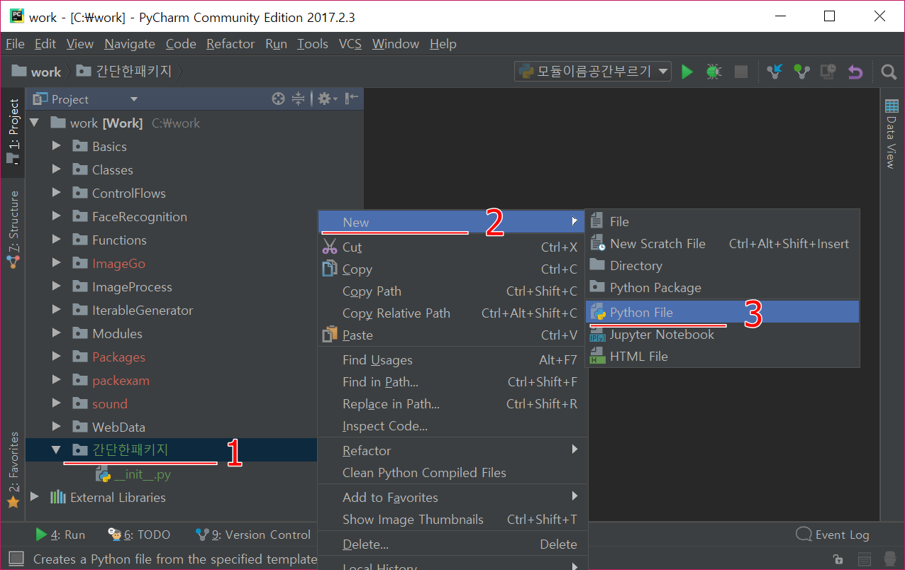

# Modules

파이썬 명령어창을 이용하여 프로그래밍을 하면 명령어창을 끝내면 입력했던 모든 것은 사라지게 된다. 따라서 파이썬을 다시 시작했을 때 이전에 하던 프로그래밍을 이어서 할 수 있도록 하려면 스크립트 파일을 만들어 다시 불러오면 작업을 계속해서 할 수 있다. 그런데 프로그래밍이 길어져서 하나의 파일에 담기에 어려운 경우가 생길 수 있다. 또는 프로그램들을 의미있는 단위로 저장하고 싶을 때가 있다. 예를 들어 그림 그리는 프로그램을 만들려고 한다고 하자. 우선 그림을 보여주는 부분이 필요할 것이다. 그런데 그림 파일 형식이 다양하기 때문에 형식에 따라 그림 파일을 여는 방법이 다를 수 있다. 그러므로 그림 파일을 열어 보여주는 부분을 담당하는 프로그램을 담당하는 파일을 만드는 것이 편리할 것이다. 그림을 그리는 부분만 담당하는 프로그램 파일을 만드는 것이 또한 편리할 것이다. 이렇듯 기능에 따라서 각각의 파일을 만들어 프로그래밍하면 이해하기에 편리하다. 또한 자주 사용하는 함수를 다른 파일에서 사용하고자 할 때 그 함수를 복사 붙이기를 하지 않고 사용하고 싶을 때도 있을 것이다. 이럴 때 함수들을 하나의 파일에 정의해놓고 필요할 때 그 파일을 불러와 원하는 함수를 사용할 수 있도록 한 것이 모듈이다. 파이썬 [모듈](https://docs.python.org/3/tutorial/modules.html)이란 파이썬 정의 및 문장들 포함하는 확장자가 `.py`인 파일이다.

## 모듈 만들기 및 부르기(`import`)

새로운 모듈을 만든다는 것은 `.py` 파일을 만드는 것이다. 예를 들어 `원.py`라고 파일이름을 저장했다면 `원`이라는 모듈이 하나 만들어진 것이며 모듈 이름은 `원`이 되는 것이다. 파일 이름이 모듈 이름이 된다. 모듈은 다른 모듈에서 필요할 때 불러서(`import`) 사용할 수 있다. 모듈을 부를 때는 `import` 예약어를 사용하며 `import <불러올 모듈 이름>`와 같이 사용한다. `원` 모듈을 사용하고 싶으면 `import 원`이라고 쓰면 된다. 모듈 파일에 있는 내용은 불러오기(`import`)할 때 단 한 번만 평가된다.

예를 들어 `원.py`라는 파일에 다음과 같은 내용을 넣었다고 하자.


```python
원주율 = 3.14

def 둘레(반지름):
    return 2 * 원주율 * 반지름

def 면적(반지름):
    return 원주율 * 반지름 ** 2
```

`원.py` 파일과 같은 폴더에 `원모듈부르기.py` 파일을 만들고 안에 다음과 같이 넣고 실행시키면 된다.


```python
import 원

print(원.원주율)
print(원.둘레(2))
```

실행시키는 방법은 두 가지로 살펴보자. 첫번째, 파이참에서 실행하는 방법은 다른 스크립트 파일 실행하는 방법과 똑같이 `원모듈부르기.py` 파일 편집창에서 마우스 오른쪽 클릭을 하여 `Run '원모듈부르기'`를 클릭하면 된다. 두번째, 파이썬 명령어창에서 실행하려면 Anaconda Prompt 창을 열고 `원.py` 파일이 있는 폴더로 이동한 후 `python`을 실행하고 위의 원모듈부르기.py 내용 명령어들을 실행하면 된다.

모듈은 함수 정의뿐만아니라 실행 문장들을 포함할 수 있다. 실행 문장은 모듈을 초기화하는데 사용된다.

모듈을 부를 때 모듈 안에 있는 식별자를 모듈이름.식별자와 같이 부르지 않고 직접 식별자만 불러서 사용할 수 있다. 예를 들면 `math` 모듈 안에 있는 함수 `sin()`을 사용하려고 할 때


```python
import math

math.sin(1)
```


    0.8414709848078965


과 같이 사용할 수 있었다. 

** from ... import ... **

그렇지 않고 다음과 같이 `from ... import ...`문을 이용해서 사용할 수 있다.


```python
from math import sin

sin(1)
```


    0.8414709848078965


이렇게 사용하면 모듈이름을 붙이지 않아서 간단하지만 `sin`함수가 다른 모듈에서도 정의되 있다면 다른 모듈에 있는 `sin` 함수를 사용할 수 없게 될 것이다. 따라서 위와 같이 사용하는 것은 **추천하지 않는다.**

** import ... as ... **

모듈을 불러올 때 간단한 이름(별칭)으로 바꿔서 사용할 수 있다. 사용법은 `import <모듈이름> as <별칭>`과 같이 `as`를 사용하면 된다. 그리고 모듈이름 대신 별칭을 사용한다.

```python
import turtle as t

거북 = t.Turtle()

t.mainloop()
```

모듈 이름이 길 때 사용하면 편리하다.

** 직접하기 **

- `나의모듈.py`를 만들어 다음과 같은 문장을 넣으시오.
```python
print("나의 첫 모듈입니다.")
```
- `나의모듈_실험.py`를 만들어 `나의모듈`을 불러오고 결과를 확인하시오.
- `나의모듈.py`에 다음과 같은 문장을 넣고 `나의모듈_실험.py`에서 `파이`를 불러서 원의 넓이를 구하시오.
```python
파이 = 3.14
```
- `나의모듈_실험.py`에서 `나의모듈`을 별칭 `나모`로 불러와서 별칭을 이용해서 원의 넓이를 구하시오.

## 모듈 검색 경로

가령 `spam`이라는 이름의 모듈을 부를 때, 인터프리터는 먼저 내장 모듈 이름 중에 있는지를 검색한다. 만일 없으면, [sys.path](https://docs.python.org/3/library/sys.html#sys.path) 리스트에 있는 디렉토리에서 검색을 한다. sys.path는 [PYTHONPATH](https://docs.python.org/3/using/cmdline.html#envvar-PYTHONPATH)와 현재 작업하고 있는 스크립트 파일이 있는 폴더의 리스트를 갖고 있다. PYTHONPATH는 기본 파이썬 설치 폴더 아래에 있는 모듈들의 경로를 포함하고 있다. 다음 그림과 같이 `import sys`를 한 후에 `sys.path`를 확인할 수 있다.


스크립트 파일을 실행할 때 스크립트를 포함하고 있는 폴더가 sys.path리스트의 첫번째 항목으로 등록이 된다. 그러므로 실행되고 있는 폴더에 있는 모듈들이 파이썬 표준 모듈들에 우선으로 불리게 된다. 따라서 표준 모듈과 같은 이름의 모듈이 스크립트가 실행되고 있는 폴더에 있다면 스크립트가 실행되고 있는 폴더에 있는 모듈이 불리게 된다. 그러나 내장 모듈은 다른 모듈에 우선해서 불리기 때문에 스크립트가 실행되고 있는 폴더에 내장 모듈과 같은 이름의 모듈이 있더라도 내장 모듈이 먼저 불리게 된다. 내장 모듈 리스트는 `sys.builtin_module_names`를 이용해 알 수 있다. 프로그램 실행 중에 `sys.path`를 이용해서 모듈 검색 경로를 변경하여 모듈들의 부르기 순서를 바꿀 수 있다.

** 직접하기 **

- 현 작업 폴더에 `turtle.py`라는 모듈을 만들고 다음과 같은 문장을 넣자.
```python
print("내가 만든 turtle.py 모듈이다.")
```
- `모듈검색_실험.py` 파일에서 `turtle`을 불러와 사용해 보자. 어떤 일이 발생하는가? 이유는?
- 현 작업 폴더에 `sys.py`라는 모듈을 만들고 다음과 같은 문장을 넣자.
```python
print("내가 만든 sys.py 모듈이다.")
```
위에서와 마찬가지로 `모듈검색_실험.py`에서 `sys` 모듈을 불러와서 어떤 일이 발생하는지를 보고 이유를 말해보자.

## `dir()` 함수

`dir()` 내장함수를 이용하여 모듈에 정의된 식별자 목록을 볼 수 있다. `dir(모듈이름)`을 하면 `모듈이름`에 속해있는 식별자들을 볼 수 있고 `dir()` 하면 현재 실행되고 있는 지역 또는 모듈의 식별자들을 볼 수 있다. 즉, `dir()`이 함수 안에서 불렸으면 함수의 이름공간에 속한 식별자들을 볼 수 있고 `dir()`이 전역 이름공간에서 불렸으면 전역 이름공간의 식별자들의 목록을 출력하게 된다.


```python
import sys

print(dir(sys))
```

    ['__displayhook__', '__doc__', '__excepthook__', '__interactivehook__', '__loader__', '__name__', '__package__', '__spec__', '__stderr__', '__stdin__', '__stdout__', '_clear_type_cache', '_current_frames', '_debugmallocstats', '_enablelegacywindowsfsencoding', '_getframe', '_git', '_home', '_xoptions', 'api_version', 'argv', 'base_exec_prefix', 'base_prefix', 'builtin_module_names', 'byteorder', 'call_tracing', 'callstats', 'copyright', 'displayhook', 'dllhandle', 'dont_write_bytecode', 'exc_info', 'excepthook', 'exec_prefix', 'executable', 'exit', 'flags', 'float_info', 'float_repr_style', 'get_asyncgen_hooks', 'get_coroutine_wrapper', 'getallocatedblocks', 'getcheckinterval', 'getdefaultencoding', 'getfilesystemencodeerrors', 'getfilesystemencoding', 'getprofile', 'getrecursionlimit', 'getrefcount', 'getsizeof', 'getswitchinterval', 'gettrace', 'getwindowsversion', 'hash_info', 'hexversion', 'implementation', 'int_info', 'intern', 'is_finalizing', 'maxsize', 'maxunicode', 'meta_path', 'modules', 'path', 'path_hooks', 'path_importer_cache', 'platform', 'prefix', 'ps1', 'ps2', 'ps3', 'set_asyncgen_hooks', 'set_coroutine_wrapper', 'setcheckinterval', 'setprofile', 'setrecursionlimit', 'setswitchinterval', 'settrace', 'stderr', 'stdin', 'stdout', 'thread_info', 'version', 'version_info', 'warnoptions', 'winver']
    

모듈 `sys`에 속해 있는 식별자들을 보여 준다.


```python
print(dir())
```

    ['In', 'Out', '_', '_3', '__', '___', '__builtin__', '__builtins__', '__doc__', '__loader__', '__name__', '__package__', '__spec__', '_dh', '_i', '_i1', '_i2', '_i3', '_i4', '_i5', '_i6', '_ih', '_ii', '_iii', '_oh', 'exit', 'get_ipython', 'quit', 'sys']
    

`dir()` 함수를 실행하고 있는 공간의 식별자들을 보여준다. `sys` 모듈이름도 포함되어 있는 것을 확인할 수 있다. 만일 다음과 같이 변수를 하나 추가하면 그 변수도 보여진다.


```python
x = 100
print(dir())
```

    ['In', 'Out', '_', '_3', '__', '___', '__builtin__', '__builtins__', '__doc__', '__loader__', '__name__', '__package__', '__spec__', '_dh', '_i', '_i1', '_i2', '_i3', '_i4', '_i5', '_i6', '_i7', '_ih', '_ii', '_iii', '_oh', 'exit', 'get_ipython', 'quit', 'sys', 'x']
    


```python
del(x)
print(dir())
```

    ['In', 'Out', '_', '_3', '__', '___', '__builtin__', '__builtins__', '__doc__', '__loader__', '__name__', '__package__', '__spec__', '_dh', '_i', '_i1', '_i2', '_i3', '_i4', '_i5', '_i6', '_i7', '_i8', '_ih', '_ii', '_iii', '_oh', 'exit', 'get_ipython', 'quit', 'sys']
    

`del` 함수를 이용해 변수 `x`를 제거하고 `dir()` 하면 변수 이름이 보이질 않게 되고 더 이상 `x`를 접근할 수 없게 된다. 또한 어떤 객체의 식별자도 확인할 수 있다.


```python
print(dir(str))
```

    ['__add__', '__class__', '__contains__', '__delattr__', '__dir__', '__doc__', '__eq__', '__format__', '__ge__', '__getattribute__', '__getitem__', '__getnewargs__', '__gt__', '__hash__', '__init__', '__init_subclass__', '__iter__', '__le__', '__len__', '__lt__', '__mod__', '__mul__', '__ne__', '__new__', '__reduce__', '__reduce_ex__', '__repr__', '__rmod__', '__rmul__', '__setattr__', '__sizeof__', '__str__', '__subclasshook__', 'capitalize', 'casefold', 'center', 'count', 'encode', 'endswith', 'expandtabs', 'find', 'format', 'format_map', 'index', 'isalnum', 'isalpha', 'isdecimal', 'isdigit', 'isidentifier', 'islower', 'isnumeric', 'isprintable', 'isspace', 'istitle', 'isupper', 'join', 'ljust', 'lower', 'lstrip', 'maketrans', 'partition', 'replace', 'rfind', 'rindex', 'rjust', 'rpartition', 'rsplit', 'rstrip', 'split', 'splitlines', 'startswith', 'strip', 'swapcase', 'title', 'translate', 'upper', 'zfill']
    

위와 같이 `dir(str)` 하면 `str` 객체의 식별자들을 확인할 수 있다.

## 이름공간(namespace) 및 영역(scope)

이름공간이란 주어진 이름이 모호하지 않고 유일하게 불릴 수 있게 하는 체계라고 할 수 있다. 예를 들어 파일시스템의 디렉토리 구조에서 같은 이름의 파일이름이더라도 다른 디렉토리에 존재할 수 있다. 각 파일은 경로명을 통해서 유일하게 불리고 사용될 수 있다. 파이썬에서 이름공간은 이름과 객체의 쌍으로 된 사전형으로 구현되어 있다. [이름공간](https://docs.python.org/3.6/glossary.html#term-namespace)은 모듈, 함수 또는 클래스에 속해 있는 식별자(identifier)들의 모임이다. 각 모듈은 자신만의 이름공간이 존재한다. 따라서 각 모듈이 같은 식별자 이름을 같더라도 서로 다른 것으로 인식한다. 예를 들면 `모듈1.py` 파일에는 다음과 같이 입력하고

```python
# 모듈1.py

질문 = "2 + 3는?"
답 = 5
```

`모듈2.py`에는 다음과 같이 입력한다.

```python
# 모듈2.py

질문 = " 2 * 3는?"
답 = 6
```

`모듈이름공간부르기.py`파일을 만들어 다음과 같이 입력한다.

```python
import 모듈1
import 모듈2

print(모듈1.질문)
print(모듈1.답)
print(모듈2.질문)
print(모듈2.답)
```

파이참에서 실행시키기 위해서는 다음과 같이 한다.


- `모듈1.py` 파일을 만들고 위의 내용을 적는다.
- `모듈2.py` 파일을 만들고 위의 내용을 적는다.
- `모듈이름공간부르기.py` 파일을 만들고 위의 내용을 적는다.
- `모듈이름공간부르기.py` 편집창을 오른쪽 클릭하여 `Run '모듈이름공간부르기'`을 선택한다.
- 아래 부분에 실행 결과가 보일 것이다.

`모듈1`, `모듈2`에 있는 식별자 `질문`, `답`은 이름이 같더라도 서로 다른 모듈이름을 이용해 서로 다른 식별자로 인식하여 사용된다.

함수도 자신만의 이름공간을 가지고 있다.


```python
def 함수1():
    ㄱ = 10
    print("함수1에 있는 ㄱ:", ㄱ)
    
def 함수2():
    ㄱ = 20
    print("함수2에 있는 ㄱ:", ㄱ)

ㄱ = 30
print("함수1을 부르기 전의 ㄱ:", ㄱ)
함수1()
print("함수1을 부른 후의 ㄱ:", ㄱ)
함수2()
print("함수2을 부른 후의 ㄱ:", ㄱ)
```

    함수1을 부르기 전의 ㄱ: 30
    함수1에 있는 ㄱ: 10
    함수1을 부른 후의 ㄱ: 30
    함수2에 있는 ㄱ: 20
    함수2을 부른 후의 ㄱ: 30
    

2, 6, 9번째 줄에 있는 3개의 `'ㄱ'`은 서로 다른 이름공간에 있기 때문에 별개의 것이 된다. 이름이 같은 3명의 다른 사람이 있는 것과 같은 것이다. 2번째 줄의 `ㄱ`은 `함수1`의 이름공간에 있고 6번째 줄의 `ㄱ`은 `함수2`, 9번째 줄의 `ㄱ`은 모듈의 이름공간에 있는 서로 다르게 인식되는 식별자이다.

### 식별자 유효범위(scope)

식별자 유효범위란 식별자가 불려질 수 있거나 식별자를 접근할 수 있는 코드의 범위를 의미한다. 파이썬에서는 3가지 식별자 유효범위가 있다.

- 지역(local scope): 함수 안에서 선언된 식별자를 말한다. 함수를 끝나는 순간 식별자를 찾을 수 없다.
- 전역(global scope): 모듈 안에서 선언된 식별자로서 변수, 클래스, 함수 이름들이 있다. 모듈을 종료하는 순간에 식별자 접근이 불가능한다.
- 내장 영역(built-in scope): 파이썬 인터프리터를 시작하면서 만들어지는 식별자로서 `abs()`, `dir()` 등이 있다. 파이썬 인터프리터를 종료하면서 함께 사라진다.

식별자를 찾는 순서는 가장 먼저 지역(**L**ocal)에서, 즉 함수 안에서 찾고 지역에 없으면 함수를 포함하고(**E**nclosing) 있는 함수 내에서 찾고(만일 함수를 포함하고 있는 함수가 존재한다면) 거기도 없으면 모듈 안에서(**G**lobal) 찾는다. 여기에서도 찾을 수 없으면 내장 영역(**B**uiltin)에서 찾게되고 찾지 못하면 NameError를 발생하게 된다. 이러한 검색 규칙을 LEGB 검색이라고 부른다.

#### 지역, 전역 변수(LG) 예제


```python
변수1 = '전역 값'

def 함수():
    print('함수() 안에서:', 변수1)

함수()
print('함수() 밖에서:', 변수1)
```

    함수() 안에서: 전역 값
    함수() 밖에서: 전역 값
    

- 줄1: `변수1`은 모듈에서 정의된 전역 변수이다. 따라서 모듈 내에서 접근할 수 있고 사용될 수 있다.
- 줄4: `함수()` 안에서 사용된 `변수1`은 먼저 함수 안에서 찾을 수 있는 이름(지역 변수)인지를 살펴본다. 그런데 `함수1()`에서는 정의되지 않았으므로 전역변수인지를 검색한다. 전역에서 정의되어 있으므로 전역 변수에서 객체를 가져와서 사용하게 된다.
- 줄7에 있는 `변수1`도 마찬가지로 전역에서 객체를 가져와서 사용하게 된다.

#### 지역 변수 예제


```python
변수1 = '전역 값'

def 함수():
    변수1 = '지역 값'
    print('함수() 안에서:', 변수1)

함수()
print('함수() 밖에서:', 변수1)
```

    함수() 안에서: 지역 값
    함수() 밖에서: 전역 값
    

- 줄5, `변수1` 식별자를 함수 안에서 먼저 찾아본다. 4번째 줄에서 `변수1`을 선언하고 있으므로 그 변수에 해당되는 객체인 `지역 값`를 가져와서 사용하게 된다.
- 줄8에 있는 `변수1`은 전역 변수이므로 `전역 값`를 가져와 사용한다.

#### global 변수 예제


```python
변수1 = '전역 값'

def 함수():
    global 변수1
    변수1 = '지역 값'
    print('함수() 안에서:', 변수1)

print('함수() 밖에서:', 변수1)
함수()
print('함수() 밖에서:', 변수1)
```

    함수() 밖에서: 전역 값
    함수() 안에서: 지역 값
    함수() 밖에서: 지역 값
    

- 줄4, `변수1`은 `global` 예약어를 이용해 전역 변수로 선언해다.
- 줄5, 전역 변수가 된 `변수1`의 값을 바꾸면 함수가 끝나도 바뀐 값이 유지가 된다.
- 줄6, 4번째 줄에서 전역 변수로 선언되었기 때문에 그 객체의 값을 그대로 사용한다. 즉, 5번째 줄에서 바뀐 값을 사용하게 된다.
- 줄8, `함수()`를 부르기 전이므로 `전역 값`이 출력이 되고
- 줄9에서 함수를 부르면 전역 변수로 선언되었으므로 값이 `지역 값`으로 바뀌게 되고 함수 안에서 출력이 된다.
- 줄10은 9번째 줄에서 바뀐 값을 그대로 출력하게 된다.

** 직접하기 **

- 위 코드 4번째, 5번째 줄을 서로 바꾸어 실행을 해보고 결과에 대해서 이야기해보자.

#### 에러 예제

다음과 같은 경우는 주의해야 한다.


```python
변수1 = 1

def 함수():
    변수1 = 변수1 + 1
    print('함수() 안에서:', 변수1)

print('함수() 밖에서:', 변수1)
함수()
```

    함수() 밖에서: 1
    


    ---------------------------------------------------------------------------

    UnboundLocalError                         Traceback (most recent call last)

    <ipython-input-10-af9404f28f21> in <module>()
          6 
          7 print('함수() 밖에서:', 변수1)
    ----> 8 함수()
    

    <ipython-input-10-af9404f28f21> in 함수()
          2 
          3 def 함수():
    ----> 4     변수1 = 변수1 + 1
          5     print('함수() 안에서:', 변수1)
          6 
    

    UnboundLocalError: local variable '변수1' referenced before assignment


- 8번째 줄에서 `함수()`를 부르면
- 4번째 줄에서 `변수1`이 지역에서 선언되어 있는지를 찾게 된다. 그런데 바로 같은 줄 할당문(`=`) 왼쪽에 `변수1`이 선언되어 있기 때문에 지역 변수로 인식한다. 그런데 변수1에 값이 할당되지 않은 상태이므로 `할당 전 참조(referenced before assignment)`라는 에러를 발생시킨다.

#### LEG

함수 안에 함수가 포함된 경우에는 가장 안에 있는 함수로부터 차례로 밖으로 나오면서 식별자 이름공간을 찾게 된다.


```python
변수1 = '전역 값'

def 외부함수():
    변수1 = '외부함수 값'

    def 내부함수():
        변수1 = '내부함수 값'
        print(변수1)

    내부함수()

외부함수()
```

    내부함수 값
    

- 줄8의 `변수1`은 내부함수에서 선언되어있는지를 먼저 찾게 된다. 그런데 7번째 줄에서 `지역 값`으로 정의되있으므로 그 값을 불러다 사용하게 되는 것이다.

** 직접하기 **

- 위 LEG 예제에서 7번째 줄을 주석 처리하고 실행하면 어떤 값이 출력되는지를 확인하고 이유를 말해보시오.

#### <a name="nonlocal변수예제"></a>nonlocal 변수 예제

함수 안에 함수가 정의 되어 있을 때 `nonlocal` 예약어를 이용하여 밖에 있는 함수에서 선언된 변수를 안에 함수 내에서 변경할 수 있도록 할 수 있다. 마치 함수 안에서 `global`을 이용하여 전역변수를 이용하는 것과 비슷한다. 다른 점은 포함된 함수 안에서 바로 밖의 함수에서 선언된 변수를 변경할 수 있게 한다는 점이 다르다. `nonlocal`은 전역변수도 지역변수도 아닌 변수를 의미한다.


```python
변수1 = '전역 값'

def 외부함수():
       변수1 = '외부함수 값'
       print('외부함수 안에서 내부함수 실행 전:', 변수1)
       def 내부함수():
           nonlocal 변수1
           변수1 = '내부함수 값'
           print('내부함수 안에서:', 변수1)
       내부함수()
       print("외부함수 안에서 내부함수 실행 후:", 변수1)
외부함수()
print("외부함수 실행 후:", 변수1)
```

    외부함수 안에서 내부함수 실행 전: 외부함수 값
    내부함수 안에서: 내부함수 값
    외부함수 안에서 내부함수 실행 후: 내부함수 값
    외부함수 실행 후: 전역 값
    

- 7번째 줄에서 `변수1`을 `nonlocal`로 선언했기 때문에 `외부함수()` 4번째 줄에서 선언된 `변수1`을 변경할 수 있게 된 것이다.
- 줄11, 따라서 10번째 줄에서 `내부함수()`를 불러서 `변수1`의 값을 `내부 값`으로 변경된 값이 그대로 출력되는 것을 볼 수 있다.

** 직접하기 **

- 위 `nonlocal`변수 예제에서 4번째 줄을 주석 처리한 후 실행된 결과를 보고, 이유를 말해보시오.
- 같은 예제에서 3번째와 4번째 줄 사이에 `global 변수1`을 추가한 후 실행해보고 결과에 대한 이유를 말해보시오.

#### LEGB 예제


```python
변수1 = '전역 값'

def len(매개):
    print('len() 함수 실행.')
    ㄱ = 0
    for ㄴ in 매개:
        ㄱ += 1
    return ㄱ

def 함수(매개):
    매개_길이 = len(매개)
    print('매개변수의 길이:', 매개_길이)

함수('안녕하세요!')
```

    len() 함수 실행.
    매개변수의 길이: 6
    

- 줄11, `len()`함수를 부르면 우선 지역에서 찾고 없으므로 전역에서 찾는다. 3번째 줄에 전역 공간에서 정의가 되어 있으므로 이 함수를 사용하게 된다.
- `len()` 함수는 내장함수로 정의가 되어 있지만 식별자 검색 순서에서 전역변수로 정의가 되어 있으므로 내장함수의 `len()`함수는 불리지 않게 된다.
- 이와 같이 내장함수의 이름과 같은 이름으로 사용하는 것은 좋지 않은 방법이다. 이것은 단지 예를 들기 위해서 사용한 것이지 내장함수 이름과 같은 것을 사용하지 않도록 하자.

**직접 하기**

- 다음 코드의 결과를 말해 보시오.

```python
ㄱ = '전역'

def 외부함수():

    def len(매개):
        print('len() 함수 실행: ', end="")
        ㄴ = 0
        for ㄷ in 매개:
            ㄴ += 1
        return ㄴ

    ㄱ = '지역'

    def 내부함수():
        global len
        nonlocal ㄱ
        ㄱ += ' 변수'
    내부함수()
    print('ㄱ은?', ㄱ)
    print(len(ㄱ))


외부함수()

print(len(ㄱ))
print('ㄱ은?', ㄱ)
```

## 패키지

여러 개의 모듈들과 `__init__.py` 파일을 모아놓은 폴더를 [패키지](https://docs.python.org/3/tutorial/modules.html#packages)라고 한다(파이썬 3.3부터는 `__init__.py`파일이 없어도 된다. 파이썬 개선 제안서 [PEP 420](https://www.python.org/dev/peps/pep-0420/)을 참조하라. 파이썬 하위 버전과 호환하기 위해서는 사용하는 것이 좋다.). 예를 들어 음악 프로그램을 만들려고 할 때 효과(effects)를 담당하는 부분과 필터(filters)을 담당하는 부분들, 파일 형식들을 담당하는 부분(formats)의 기능들이 필요할 것이다. 이렇게 각각의 기능을 담당하는 모듈들을 각각의 폴더에 모아놓으면 개발을 할 때 이해하기가 좋고 편리할 것이다. 따라서 sound라는 폴더 밑에 effects, filters, formats 하위 폴더를 만들고 각 폴더에 필요한 모듈들을 만들어 개발하게 된다. sound 패키지 밑에 effects, filters, formats 하위 패키지가 존재하게 된다.
```python
sound
|-- effects
|   |-- echo.py
|   |-- __init__.py
|   |-- reverse.py
|   `-- surround.py
|-- filters
|   |-- equalizer.py
|   |-- __init__.py
|   |-- karaoke.py
|   `-- vocoder.py
|-- formats
|   |-- aiffread.py
|   |-- aiffwrite.py
|   |-- auread.py
|   |-- auwrite.py
|   |-- __init__.py
|   |-- wavread.py
|   `-- wavwrite.py
`-- __init__.py
```

### 간단한 패키지

다음과 같이 패키지 이름이 `간단한패키지`로 하고 `모듈1`, `모듈2` 모듈들을 갖는 패키지를 만들어 보자. 파이참에서 아래 그림과 같이 실행하자.


- Project 창에서 work 폴더 마우스 오른쪽 클릭한다.
- New를 누르고
- Python Package를 누른다.

그리고 패키지 이름을 `간단한패키지`라고 입력한다.


- 패키지 이름을 `간단한패키지`라고 입력하고 엔터를 친다.
- 아래 그림과 같이 `간단한패키지` 폴더에 `__init__.py` 파일이 만들어진 것을 볼 수 있다.

다음은 모듈들을 만들어 본다.



- `간단한패키지`를 오른쪽 클릭하고
- `New`를 누른 후
- `Python File`를 클릭하여 모듈 파일들을 두 개 만든다. 각각의 이름을 `모듈1.py`, `모듈2.py`라고 만들자.


`모듈1.py` 안에 다음과 같은 문장을 넣자.

```python
print('이곳은 "{}" 입니다.'.format(__name__))

def 함수1():
    print('모듈1 안에 있는 함수1 입니다')
```

** 직접 하기 **

- `sound` 패키지를 만들어 보자.

### 패키지 부르기

패키지 안의 모듈을 부르기 위해서는 `from`과 `import`를 사용한다.

```python
from <패키지이름> import <모듈이름>
```

`간단한패키지` 안의 `모듈1`을 사용하기 위해서는 다음과 같이 한다.

```python
from 간단한패키지 import 모듈1

모듈1.함수1()
```

`sound` 패키지 예와 같이 하위패키지 `effects`, `filters`, `formats`등이 있을 때는 

```python
from <패키지이름>.<하위패키지> import <모듈 이름>
```

과 같이 부른다. 따라서 하위 패키지 `effects` 안에 있는 `echo.py` 모듈을 부르기 위해서는 다음과 같이 사용한다.

```python
from sound.effects import echo
```

`from <패키지> import <항목>` 구문에서 `<항목>`은 `<패키지>`의 하위 모듈(또는 하위 패키지)이거나 `<패키지>`에서 정의된 이름이 될 수 있다. `<항목>`이 `<패키지>`에 정의되어 있는지를 먼저 확인하고, 없으면 `<항목>`을 모듈이라고 가정하고 `<항목>` 모듈을 부르려고 시도한다. 모듈을 찾을 수 없으면 [ImportError](https://docs.python.org/3/library/exceptions.html#ImportError)가 발생한다.

** 직접하기 **

- `간단한패키지` 아래의 `모듈2.py`에 다음과 같은 문장을 넣고 파이썬 명령창에서 `모듈2`를 불러보자.

```python
print('이곳은 "{}" 입니다.'.format(__name__))

def 함수():
    print('{} 안에 있는 함수 입니다'.format(__name__))
```
- `모듈2`에 있는 `함수()`를 불러보자.

#### <a name="파이썬명령창에서패키지부르기"></a> 파이썬 명령창에서 패키지 부르기

패키지를 부르기 전에 패키지 폴더가 포함된 디렉토리가 `sys.path` 안에 등록되어 있어야 한다. 따라서 파이썬 명령창을 이용해서 패키지를 부르기 위해서는 먼저 `sys.path`에 등록을 한다.

예를 들어, `C:\work` 안에 `간단한패키지`라는 패키지가 있다고 가정하자. 먼저 `sys.path`에 `C:\work` 디렉토리를 다음과 같이 추가한다.


1. `sys` 모듈을 `import` 한다.
1. `c:\work` 디렉토리를 `sys.path`에 추가한다.
1. `sys.path`에 추가된 것을 확인한다.

`간단한패키지`안의 모듈들을 불러오기(import) 위해서는 `from ... import ...` 문장을 사용한다.


```python
import sys
sys.path.append('c:\work')

from 간단한패키지 import 모듈1
```

    이곳은 "간단한패키지.모듈1" 입니다.
    

** 직접 하기 **

- `sound` 패키지의 하위패키지 `effects` 패키지 안의 `echo` 모듈 안에 다음과 같은 함수를 만들고 그 함수를 불러보자.
```python
def 함수1():
    print("effects 하위패키지 안의 모듈 echo 안에 있는 함수1()이 불렸습니다.")
```

## 자주 사용되는 모듈

### os

운영체제 자원과 관련된 자원들을 관리하거나 접근할 수 있게 해준다. 환경변수, 디렉토리, 경로, 파일등을 관리할 수 있게 한다.

#### 환경 변수

`os.environ`은 현재 시스템의 환경변수들을 보여준다.

```python
>>> import os
>>> os.environ
environ({'ALLUSERSPROFILE': 'C:\\ProgramData', 'APPDATA': 'C:\\Users\\dyoon\\AppData\\Roaming', ... 생략 ...})
>>>
```

환경변수들을 사전형으로 보여주고 있다. 어떤 키가 있는지 살펴보고 원하는 정보를 찾아 볼 수 있다.


```python
import os

for key in os.environ:
    print(key, end=", ")
```

    ALLUSERSPROFILE, APPDATA, COMMONPROGRAMFILES, COMMONPROGRAMFILES(X86), COMMONPROGRAMW6432, COMPUTERNAME, COMSPEC, CONFIGSETROOT, DOCKER_TOOLBOX_INSTALL_PATH, HOMEDRIVE, HOMEPATH, LOCALAPPDATA, LOGONSERVER, NUMBER_OF_PROCESSORS, ONEDRIVE, OS, PATH, PATHEXT, PROCESSOR_ARCHITECTURE, PROCESSOR_IDENTIFIER, PROCESSOR_LEVEL, PROCESSOR_REVISION, PROGRAMDATA, PROGRAMFILES, PROGRAMFILES(X86), PROGRAMW6432, PSMODULEPATH, PUBLIC, SESSIONNAME, SYSTEMDRIVE, SYSTEMROOT, TEMP, TMP, USERDOMAIN, USERDOMAIN_ROAMINGPROFILE, USERNAME, USERPROFILE, VBOX_MSI_INSTALL_PATH, WINDIR, CONDA_PREFIX, JPY_INTERRUPT_EVENT, IPY_INTERRUPT_EVENT, JPY_PARENT_PID, TERM, CLICOLOR, PAGER, GIT_PAGER, MPLBACKEND, 

```python
>>> os.environ['path']
'C:\\Users\\dyoon\\Anaconda3;C:\\Users\\dyoon\\Anaconda3\\Library\\mingw-w64\\bin; ... 생략 ...'
```

#### 작업 디렉토리 위치 변경하기

`os.chdir()`를 이용해서 현재 작업 디렉토리를 변경할 수 있다.

```python
os.chdir('c:\work')
```

`c:\work` 폴더로 작업 디렉토리를 변경한다.

#### 현재 디렉토리 보기

`os.getcwd()`를 이용해서 현재 디렉토리를 보여준다.

```python
>>> os.chdir('c:\work')
>>> os.getcwd()
'c:\\work'
>>>
```

#### 시스템 명령어 실행

`os.system()`를 이용해서 시스템의 명령어를 파이썬 내부에서 실행할 수 있다.

```python
>>> os.chdir('c:\work')
>>> os.getcwd()
'c:\\work'
>>> os.system("dir /w")
```

시스템 명령어인 `dir /w`를 실행한다.

### time

### sys

### pickle

## 연습문제

1. `calendar`에 대한 온라인 문서를 보고 다음을 푸시오.
    - 다음을 실행하시오.
        ```python
        import calendar
        cal = calendar.TextCalendar() # 캘린더 인스턴스를 만든다.
        cal.pryear(2017) # 어떻게 되는가?
        ```
    - 출력된 달력의 시작은 월요일부터인 것을 알 수 있다. 일요일부터 출력되게 바꾸시오.
    - 올 해 자신의 생일이 있는 달만 출력하도록 하는 함수를 찾아 출력하시오.
1. `내모듈1.py` 모듈을 만들고 `내나이` 속성과 `년도` 속성에 자신의 나이와 올 해를 설정한다. `내모듈2.py`를 만들고 마찬가지로 `내나이`, `년도` 속성에 `0`과 자신이 태어난 해를 적는다. 다음으로 `이름공간_실험.py`를 만들고 `내모듈1`과 `내모듈2`를 `import` 한 후, 다음과 같은 문장을 넣는다.
```python
print((내모듈2.내나이 - 내모듈1.내아이) == (내모듈2.년도 - 내모듈1.년도))
```
그리고 실행해서 `True` 또는 `False` 결과를 확인해보자.
1. `내모듈1.py`, `내모듈2.py` 및 `이름공간_실험.py` 안에 다음 문장을 넣자.
```python
print("내 이름은", __name__)
```
`이름공간_실험.py`를 실행해보고 결과에 대해서 말해보시오.
1. `내모듈1.py`에 다음 문장을 삽입하자.
```python
if __name__ == "__main__":
    print("이 글은 import를 하면 볼 수가 없습니다.")
```
`내모듈1.py`와 `이름공간_실험.py` 를 각각 실행해보고 결과에 대해서 말해보시오.
1. [nonlocal 변수 예제](#nonlocal변수예제) 코드의 `내부함수()` 안에 다음과 같은 `맨안함수()`를 추가하자.

    ```python
    변수1 = '전역 값'

    def 외부함수():
           변수1 = '외부함수 값'
           print('외부함수 안에서 내부함수 실행 전:', 변수1)
           def 내부함수():
               nonlocal 변수1
               변수1 = '내부함수 값'
               print('내부함수 안에서:', 변수1)

               def 맨안함수():
                    nonlocal 변수1
                    변수1 = '맨안함수 값'
                    print('맨안함수 안에서:', 변수1)

               맨암함수()
               print("내부함수 안에서 맨안함수 실행 후:", 변수1)

           내부함수()
           print("외부함수 안에서 내부함수 실행 후:", 변수1)
    외부함수()
    print("외부함수 실행 후:", 변수1)
    ```
위 코드를 실행 결과를 보고 `nonlocal`이 작동하는 방식에 대해서 이야기해 보시오.
1. 위 코드 7번째 줄 `nonlocal 변수1`을 주석 처리 한 후 실행해보고 결과에 대해서 이야기해 보시오.
